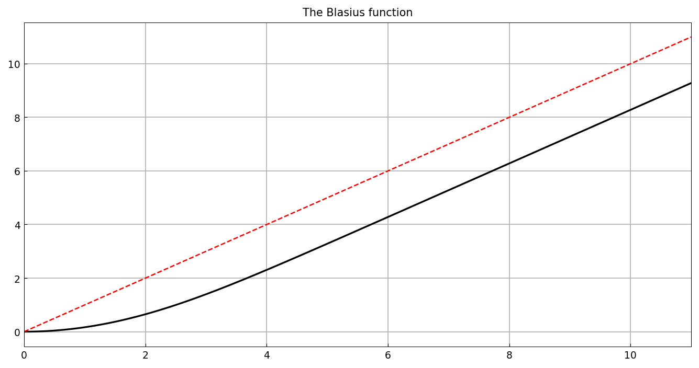

# The Blasius function

*Hrothgar, October 2013*

[Original MATLAB Chebfun example](https://www.chebfun.org/examples/ode-nonlin/Blasius.html)

(Chebfun example ode-nonlin/Blasius.m)

The Blasius boundary-layer equation of fluid mechanics is

$$ 2u''' + u u'' = 0, \qquad u(0) = u'(0) = 0, \quad u'(L) = 1, $$

posed here with $L = 11$ and the mixed conditions supplied through the
general `.bc` field:

```python
N = Chebop(lambda u: 2*u.diff(3) + u*u.diff(2), domain=(0, 11))
N.bc = lambda x, u: [u(0), u.diff()(0), u.diff()(11) - 1]
u = N.solve(0)
```

```text
u =
   chebfun column (1 smooth piece)
       interval       length     endpoint values  
[       0,      11]       42   4.2e-15      9.3 
vertical scale = 9.3 
op_residual =
     4.981043508588946e-10
bc_residuals =
  3.552714e-15
  -4.137246e-13
  5.950795e-14
```

(Published: length 38, residuals 2.4e-8 / ~1e-11 — same solution with
slightly tighter residuals here.)



The wall shear $a = u''(0)$ against Boyd's 17-digit value:

```text
ans =
    -5.134059843925343e-11
```

(Published: `-1.793e-09`.) The displacement constant
$b = \lim(u - x)$:

```text
ans =
    -2.294142653624931e-10
```

(Published: `-2.280e-10` — nearly identical.) The Taylor coefficients
at 0 reveal the known structure — $u(x) = \frac{a}{2}x^2 + O(x^5)$
with $a/2 = 0.16602866810\ldots$:

```text
ans =
   0.000000000000003
  -0.000000000000414
   0.166028668133268
  -0.000000000415502
   0.000000004667554
  -0.000459457994874
```

## The singularity

The Blasius function has a singularity at $x \approx -5.69$, so a solve
on $[-5.6, 11]$ cannot converge — exactly as on the published page,
Newton fails with a warning:

```text
v =
   chebfun column (1 smooth piece)
       interval       length     endpoint values  
[    -5.6,      11]       48        16      8.4 
vertical scale =  16 
Warning: chebop system Newton: max iterations reached (residual 2.82e-10)
```

---

*Replica script: [`examples/ode-nonlin/blasius_replica.py`](https://github.com/ma-gilles/chebfunjax/blob/main/examples/ode-nonlin/blasius_replica.py).
Original example copyright by The University of Oxford and The Chebfun
Developers.*
