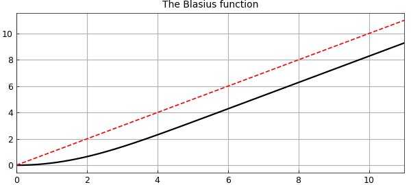
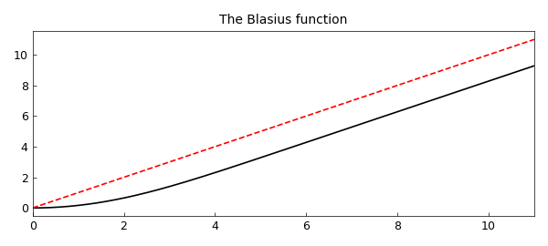
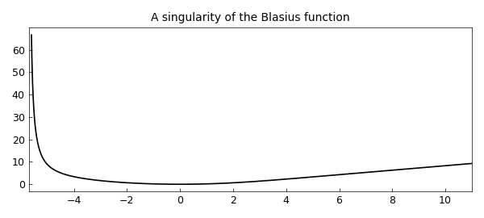

# Blasius function

*Hrothgar, June 2014*

[Original MATLAB Chebfun example](https://www.chebfun.org/examples/ode-nonlin/Blasius.html)

Python translation: [`examples/ode-nonlin/blasius.py`](https://github.com/ma-gilles/chebfunjax/blob/main/examples/ode-nonlin/blasius.py)

The Blasius function is the unique solution to the boundary value problem

$$ 2u''' + u u'' = 0, \qquad u(0) = u'(0) = 0,\ u'(\infty) = 1 $$

on the domain $x \in [0, \infty)$. The solution is a smooth monotonically increasing function that converges rapidly to a linear polynomial away from the origin.

This problem was first considered by its namesake Heinrich Blasius in 1908 and has received much attention from Weyl, von Neumann, Boyd, and others since. Why? One reason is that it is one of the simplest examples of a nonlinear problem with a boundary layer. Another is that the Blasius function, being smooth and monotonic, seems that it must have a simple analytic representation. Yet over a century of effort has not produced one.

In order to solve the problem in Chebfun we'll need to truncate the domain to something suitable, say $[0, 11]$. We can set up the chebop and solve the differential equation with only a few lines of code.

```matlab
dom = [0, 11];
op  = @(u) 2*diff(u,3) + u*diff(u,2);
bc  = @(x,u) [u(0); feval(diff(u),0); feval(diff(u),dom(2))-1];
N   = chebop(op, dom, bc);
u   = N\0
```

```text
u =
   chebfun column (1 smooth piece)
       interval       length     endpoint values
[       0,      11]       43  -7.8e-16      9.3
vertical scale = 9.3
```

Here is what the solution looks like.

```matlab
plot(u, 'k')
title('The Blasius function')
```



We can check that the residuals are small:

```matlab
op_residual = norm(op(u))  % Residual of the differential equation
bc_residuals = bc(0,u)     % Residuals of boundary conditions
```

```text
op_residual =
     4.510332583906023e-10
bc_residuals =
  -1.776357e-15
  3.108624e-15
  -3.462786e-13
```

One quantity of interest is the second derivative of the solution $u$ at the origin. The exact value to sixteen decimal places is supplied by Boyd [1]. Let's test Chebfun's accuracy for this quantity.

```matlab
a_exact    = 0.33205733621519630;
a_computed = feval(diff(u,2), 0);
a_exact - a_computed
```

```text
ans =
    -1.824740358813415e-11
```

Noticing that the Blasius function approaches a linear polynomial away from the origin, the reader may wonder, what is the limiting value $u(x) - x$ as $x \to \infty$? The answer again is supplied to high accuracy by Boyd, so let us see how Chebfun performs.

```matlab
x = chebfun('x', dom);
hold on, plot(x, 'r--')
```



```matlab
b_exact    = -1.720787657520503;
b_computed = feval(u-x, dom(2));
b_exact - b_computed
```

```text
ans =
    -2.294195944330113e-10
```

A special property of the Blasius function is that its power series representation only includes every third term, that is,

$$ u(x) = \frac12 \kappa x^2 - \frac1{240} \kappa^2 x^5 + \frac{11}{161280} \kappa^3 x^8 - \cdots, $$

with $\kappa = u''(0)$ is the quantity `a_exact` above [1]. We can compute these coefficients using the Chebfun command `poly`. Chebfun's solution is accurate to about eight digits, which is why the other coefficients appear zero only to that many places.

```matlab
coeffs = poly(u);
coeffs(end:-1:end-5)'
```

```text
ans =
  -0.000000000000002
   0.000000000000003
   0.166028668116722
  -0.000000000109674
   0.000000001429651
  -0.000459436109385
v =
   chebfun column (1 smooth piece)
       interval       length     endpoint values
[    -5.6,      11]      768        67      9.3
vertical scale =  67
```

The nonzero coefficients in the power series expansion alternate in sign, which suggests that convergence is limited by a singularity on the negative $x$-axis. Indeed this is the case, and the singularity's location is known to be approximately $x_0 = -5.6900380545$. We can see the singularity in Chebfun by extending the domain of the chebop to somewhere near $x_0$, whereupon the boundary conditions at $x=0$ become interior point conditions. (The resulting function is not fully accurate, as Chebfun warns.)

```matlab
N2 = chebop(op, [-5.6, 11], bc);
v = N2\0
hold off, plot(v, 'k-'), xlim([-5.7 11])
title('A singularity of the Blasius function')
```

```text

```



## References

1. John P. Boyd, "The Blasius function in the complex plane," *Experimental Mathematics*, 8 (1999), 381-394.

---

*Translated with [chebfunjax](https://github.com/ma-gilles/chebfunjax); prose and MATLAB code from the original example, copyright The University of Oxford and The Chebfun Developers.  Printed outputs and figures are chebfunjax's.*
