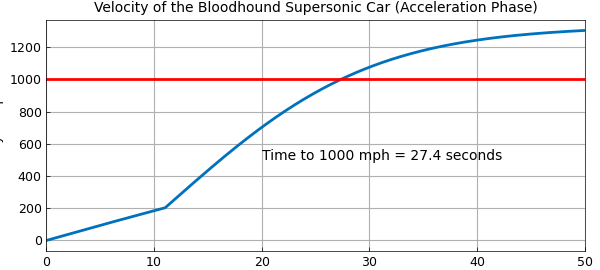
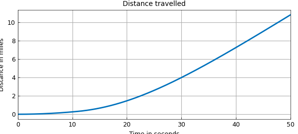

# Bloodhound supersonic car

*Tanya Morton, January 2013*

[Original MATLAB Chebfun example](https://www.chebfun.org/examples/ode-nonlin/Bloodhound.html)

Python translation: [`examples/ode-nonlin/bloodhound.py`](https://github.com/ma-gilles/chebfunjax/blob/main/examples/ode-nonlin/bloodhound.py)

This script solves the equation of motion for the acceleration phase of the Bloodhound supersonic car using Chebfun.

The car is powered by a jet engine and a rocket and aims to reach a speed in excess of 1000 mph. More details on the project can be found at the website [http://www.bloodhoundssc.com/](http://www.bloodhoundssc.com/).

Mathematically, the problem takes the form of an initial value ODE

$$ a(t)v' + b(t)v + cv^2 = d(t), \qquad t \in [0,50],~~ v(0) = 0 . $$

Here $a$ is a piecewise linear function and $b$ and $d$ are piecewise constants. The break occurs at the discontinuity caused by the rocket ignition.

One can vary the parameters of the run, such as the rocket start time or the mass of the car, to see the effect on the time taken to reach 1000 miles per hour.

Define the domain.

```matlab
dom = [0 50];
RocketStart = 11;      % in seconds
```

Compute the mass.

```matlab
MassOriginal = 6500;   % in kg
JetThrust = 80;        % in kN
RocketThrust = 115;    % in kN
JSFC = 0.0005*102;     % in kg/(kN*h) Jet Specific Fuel Consumption
RSFC = 102/220;        % Rocket Specific Fuel Consumption
```

The mass satisfies

$$ \mathrm{mass} = \mathrm{original} - \mathrm{(jet~fuel~burned)} - \mathrm{(rocket~fuel~burned)} $$

```matlab
mass = @(t) MassOriginal - (JSFC*JetThrust*t) - ...   % in kg, t in seconds
    (RSFC*RocketThrust.*(t-RocketStart).*(t>RocketStart));
```

Create a chebfun for mass to capture the piecewise linear behaviour.

```matlab
cmass = chebfun(mass, dom, 'splitting', 'on');
```

Create chebfuns or anonymous functions for the forces.

```matlab
thrust = @(t) 1000*(JetThrust + RocketThrust.*(t>RocketStart)); % in N
```

Create a chebfun for thrust to capture the piecewise constant behavior.

```matlab
cthrust = chebfun(thrust, dom, 'splitting', 'on');
```

Drag:

```matlab
aerodrag = @(v) (175./289).*v.^2; % in N
surfacedrag = (2/5)*cmass*9.81;   % in N
```

Create a chebop to represent the differential equation. Newton's 2nd law (variable mass):

$$ \frac{d(mv)}{dt} = \mathrm{thrust} - \mathrm{drag}, $$ $$ m \frac{dv}{dt} + \frac{dm}{dt} v = \mathrm{thrust} - \mathrm{drag}. $$

```matlab
N = chebop(@(t,v) cmass.*diff(v) + diff(cmass).*v - cthrust + ...
    aerodrag(v) + surfacedrag, dom);
```

Set up the right-hand side of the differential equation so that $ N(v) = \mathrm{rhs} $.

```matlab
rhs = 0;
```

Assign boundary conditions to the chebop.

```matlab
N.bc = @(t,v) v(0);
```

Define an initial solution.

```matlab
N.init = chebfun(@(t) t, dom);
```

Solve the problem using backslash.

```matlab
u = N\rhs;
u_mph = u/0.44704; % convert to mph for plotting
```

```text
pieces = 1   len = 2048
residual: [0,11) 4.56e+03   (11,50] 7.84e+04
t1000 = 27.3585 s   (published figure: 27.4 s)
```

Find where the solution is equal to 1000 mph.

```matlab
t1000 = find(u == 447); % number of seconds when we hit 1000 mph
```

Plot the solution.

```matlab
figure
plot(u_mph,'LineWidth',2);
hold on
plot([0 50],[1000 1000],'r', 'LineWidth', 2); % 1000 mph line
hold on;
text(20, 500, ['Time to 1000 mph = ' num2str(t1000, 3) ' seconds']);
title('Velocity of the Bloodhound Supersonic Car (Acceleration Phase)')
ylabel('velocity in mph')
```



Integrate to find the distance.

```matlab
s = cumsum(u);
s_miles = s/1609;     % convert to miles to plot
figure
plot(s_miles,'LineWidth',2); title('Distance travelled')
xlabel('Time in seconds'),   ylabel('Distance in miles')
```



---

*Translated with [chebfunjax](https://github.com/ma-gilles/chebfunjax); prose and MATLAB code from the original example, copyright The University of Oxford and The Chebfun Developers.  Printed outputs and figures are chebfunjax's.*
