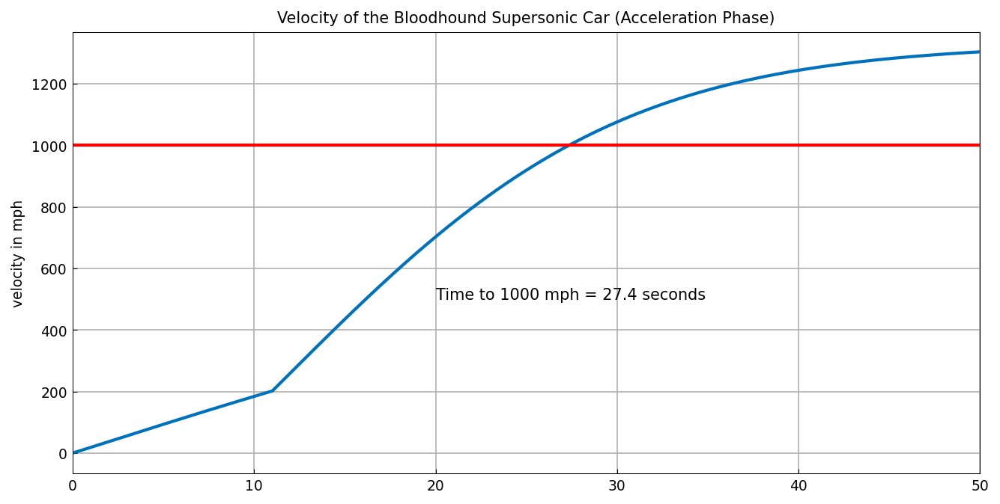
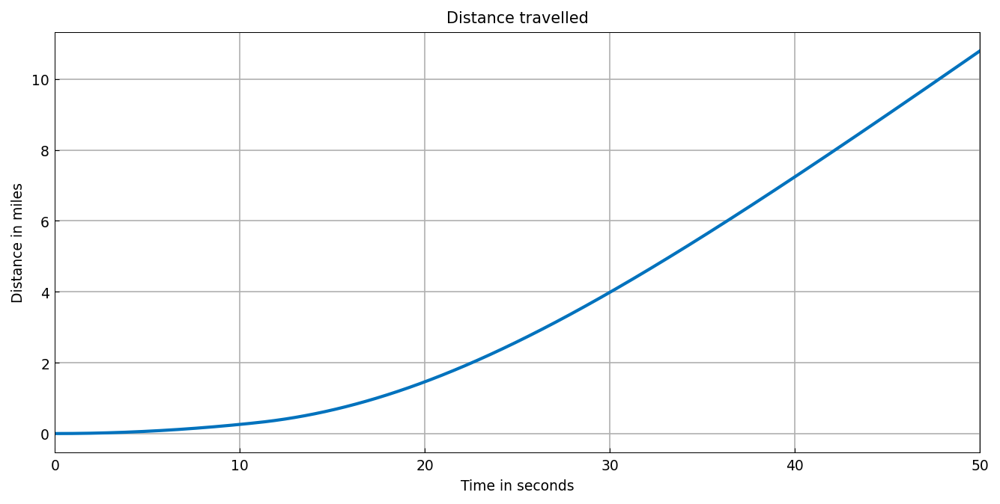

# Bloodhound supersonic car

[Original MATLAB Chebfun example](https://www.chebfun.org/examples/ode-nonlin/Bloodhound.html)

(Chebfun example ode-nonlin/Bloodhound.m)

The Bloodhound SSC land-speed-record car accelerates under a jet engine
from $t = 0$, with a rocket igniting at $t = 11$ s. Mass decreases as
fuel burns and thrust jumps at the ignition, so both coefficients are
piecewise chebfuns, and the momentum balance is a first-order nonlinear
ODE with a kink:

$$ m(t)\,v' + m'(t)\,v = T(t) - \frac{175}{289}v^2
   - \frac{2}{5}\,m(t)\,g, \qquad v(0) = 0. $$

```python
cmass = chebfun(mass, domain=(0, 50), splitting=True)
cthrust = chebfun(thrust, domain=(0, 50), splitting=True)
N = Chebop(lambda t, v: cmass*v.diff() + cmass.diff()*v - cthrust
           + (175/289)*v**2 + (2/5)*cmass*9.81, domain=(0, 50))
N.lbc = 0
N.init = chebfun(lambda t: t, domain=(0, 50))
v = N.solve(0)
```



```text
pieces = 2   len = 40
residual: [0,11) 1.56e-07   (11,50] 1.22e-08
t1000 = 27.3531 s   (published figure: 27.4 s)
```

The time to 1000 mph is **27.4 seconds** to the three significant
figures the original prints — the same number as the published figure —
and the velocity curve matches it feature for feature, including the
kink at the rocket ignition.

The distance travelled follows by integration:



```text
distance at t=50: 10.798 miles
```

> **Implementation note.** The published MATLAB page itself prints
> `Warning: Newton iteration failed` and plots the last iterate; our
> solve converges, with residual below $2\times 10^{-7}$ on both sides
> of the ignition. One transcription difference: MATLAB writes the
> initial condition as a general constraint `N.bc = @(t,v) v(0)`, which
> our piecewise solver currently refuses (it treats general constraints
> as interface conditions); the equivalent `N.lbc = 0` routes correctly,
> and the solver then places the breakpoint at the ignition on its own.
> Solved on one global polynomial instead, the same problem "converges"
> to a non-solution whose residual is $10^4$-scale between collocation
> points — a reminder that a kinked solution needs the breakpoint.

---

*Replica script: [`examples/ode-nonlin/bloodhound_replica.py`](https://github.com/ma-gilles/chebfunjax/blob/main/examples/ode-nonlin/bloodhound_replica.py).
Original example copyright by The University of Oxford and The Chebfun
Developers.*
