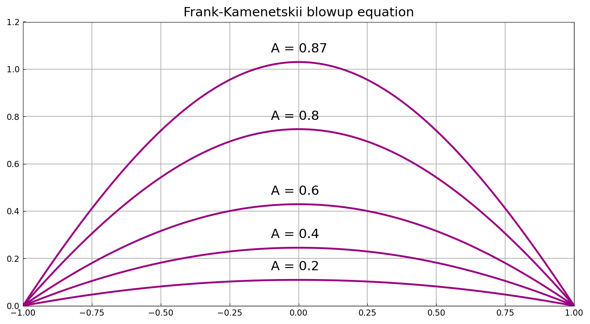

# Blowup equation (Frank-Kamenetskii)

*Nick Trefethen, September 2010*

[Original MATLAB Chebfun example](https://www.chebfun.org/examples/ode-nonlin/BlowupFK.html)

(Chebfun example ode-nonlin/BlowupFK.m)

The Frank-Kamenetskii or "spontaneous combustion" equation is the PDE

$$ \frac{\partial u}{\partial t} = \frac{\partial^2 u}{\partial x^2}
   + A\exp(u). $$

On the interval $[-1,1]$ with zero initial and boundary conditions,
solutions blow up to infinity in finite time if $A$ is bigger than about
$0.878$. For smaller $A$, solutions converge to a steady state.

Here we compute some of these steady states, which solve the boundary
value problem

$$ u'' + A\exp(u) = 0, \qquad u(-1) = u(1) = 0. $$

```python
N = Chebop(domain=(-1, 1))
N.bc = 'dirichlet'
for A in (0.2, 0.4, 0.6, 0.8, 0.87):
    N.op = lambda u, _A=A: u.diff(2) + _A * u.exp()
    u = N.solve(0.0)
```



This problem happens to have a closed-form solution, which makes it a
sharp test of the nonlinear solver. Substituting
$u = -2\log\bigl(\cosh(cx)/\cosh c\bigr)$ into the ODE gives
$A\cosh^2 c = 2c^2$, so $c/\cosh c = \sqrt{A/2}$ and
$\max u = u(0) = 2\log\cosh c$. The computed peaks agree with those
values to every digit printed:

| $A$ | exact $2\log\cosh c$ | computed |
|---|---|---|
| 0.2 | 0.109563871336 | 0.109563871336 |
| 0.4 | 0.245432527804 | 0.245432527804 |
| 0.6 | 0.429261674768 | 0.429261674768 |
| 0.8 | 0.746458908024 | 0.746458908024 |
| 0.87 | 1.030226905042 | 1.030226905042 |

The same formula explains the critical value quoted above: $c/\cosh c$
is maximized where $c\tanh c = 1$, at $c^\star = 1.19967864\ldots$, so no
steady state exists beyond
$A^\star = 2(c^\star/\cosh c^\star)^2 = 0.878458\ldots$ — "about
$0.878$", as the text says. The $A = 0.87$ curve is close enough to that
fold that its peak has already climbed past $1$.

> **Implementation note.** Writing this page exposed a trap in how the
> solver inferred an operator's arity. `lambda u, _A=A: ...` — the
> ordinary Python idiom for capturing a loop variable — was counted as a
> two-argument $\mathrm{op}(x,u)$, so the solver passed the independent
> variable in as the unknown and returned $u \equiv 0$ for every $A$,
> silently. Arity is now inferred from parameters *without* defaults, so
> the idiom above works as written.

## References

1. H. Fujita, On the nonlinear equations $\Delta u + \exp(u) = 0$ and
   $dv/dt = \Delta v + \exp(v)$, *Bulletin of the American Mathematical
   Society*, 75 (1969), 132-135.

---

*Replica script: [`examples/ode-nonlin/blowup_fk_replica.py`](https://github.com/ma-gilles/chebfunjax/blob/main/examples/ode-nonlin/blowup_fk_replica.py).
Original example copyright by The University of Oxford and The Chebfun
Developers.*
