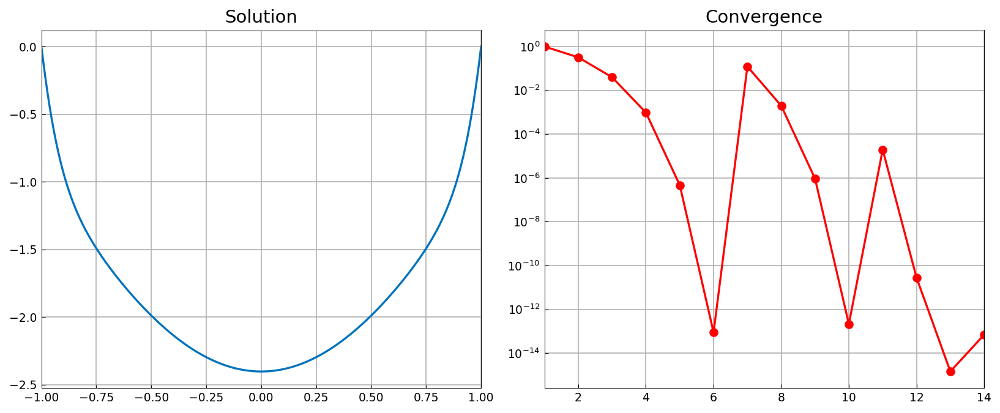
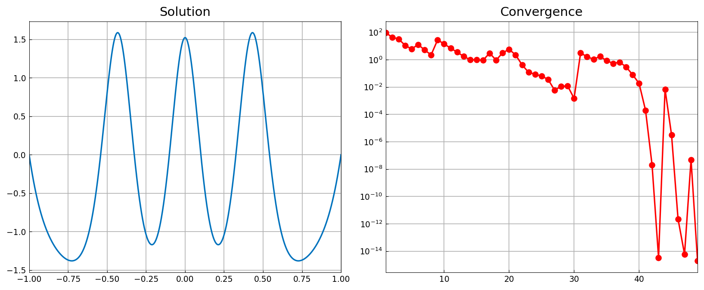
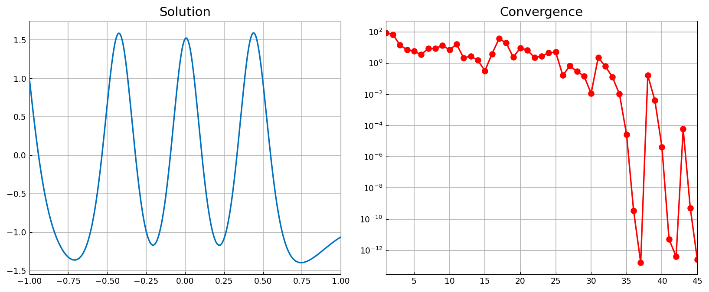

# The Carrier equation

*Nick Trefethen and Asgeir Birkisson, October 2010*

[Original MATLAB Chebfun example](https://www.chebfun.org/examples/ode-nonlin/Carrier.html)

(Chebfun example ode-nonlin/Carrier.m)

Carrier's boundary-layer problem

$$ 0.01\,u'' + 2(1-x^2)u + u^2 = 1, \qquad u(-1) = u(1) = 0, $$

is a favourite test problem because it has *many* solutions. Which one
Newton converges to is decided entirely by the initial guess. Starting
from $u_0 = 2(x^2-1)$:

```python
N = Chebop(lambda x, u: 0.01*u.diff(2) + 2*(1-x**2)*u + u**2, domain=(-1, 1))
N.bc = 0
N.init = 2*(x**2 - 1)
u, info = N.solvebvp(1)
```



```text
accuracy =
     1.441122393235306e-13
```

(Published: `8.463254780629571e-14`.)

A wigglier initial guess, $2(x^2-1)\bigl(1 - 2/(1+20x^2)\bigr)$, lands
in a different basin and converges to a solution with three interior
peaks:



```text
accuracy =
     5.241821856022795e-12
```

(Published: `3.126829037542067e-10`.)

The same equation with a Dirichlet condition on the left and a Robin
condition $u' + u = 0$ on the right:



```text
accuracy =
     2.966253385557802e-12
```

(Published: `3.111051709972451e-10`.)

> **Convergence plots.** `solvebvp` returns `info['normDelta']`, the
> norm of each accepted Newton update — MATLAB's `[u, info] =
> solvebvp(N, rhs)`. chebfunjax refines the discretization by *restarting*
> Newton at each level, warm-started from the previous solution, so the
> accumulated history shows a small jump at each refinement rather than
> the single monotone descent of the published figure. The history is
> the true sequence of updates performed; the first level alone runs
> 9.94e-01 → 8.94e-14 in six steps, against MATLAB's display starting
> at 9.78e-01.

---

*Replica script: [`examples/ode-nonlin/carrier_replica.py`](https://github.com/ma-gilles/chebfunjax/blob/main/examples/ode-nonlin/carrier_replica.py).
Original example copyright by The University of Oxford and The Chebfun
Developers.*
