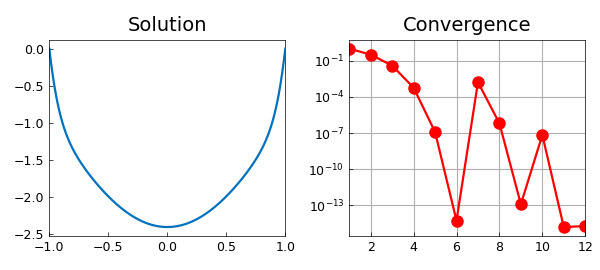
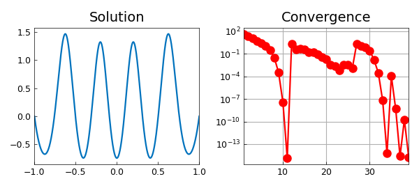
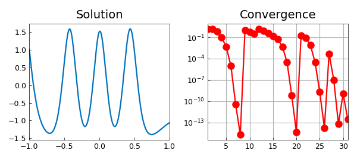

# Carrier equation

*Asgeir Birkisson, October 2010*

[Original MATLAB Chebfun example](https://www.chebfun.org/examples/ode-nonlin/Carrier.html)

Python translation: [`examples/ode-nonlin/carrier.py`](https://github.com/ma-gilles/chebfunjax/blob/main/examples/ode-nonlin/carrier.py)

## 1. The original problem

The Carrier equation can be found in Section 9.7 of the well-known textbook of Bender & Orszag [1], and is given as follows:

$$ \varepsilon u'' + 2(1-x^2)u + u^2 = 1,\qquad u(-1) = 0,~~ u(1) = 0. $$

This is a nonlinear ODE boundary-value problem with multiple solutions. We can find a solution with Chebfun (taking $\varepsilon=0.01$) as follows. We set up the operator and boundary conditions:

```matlab
N = chebop(-1,1);
N.op = @(x,u) 0.01*diff(u,2) + 2*(1-x.^2).*u + u.^2;
N.bc = 'dirichlet';
```

And we set an initial guess:

```matlab
x = chebfun('x');
N.init = 2*(x.^2-1);
```

We now solve the problem using the nonlinear backslash operator. By calling `\` with two output arguments, we also get the norms of the updates at each iteration returned in a vector. Before solving the problem, we set the `cheboppref` field `'display'` to be `'iter'` in order to display information about the solution process. We then plot the solution and the norm of the updates:

```matlab
cheboppref.setDefaults('display','iter')
[u,info] = solvebvp(N,1);
nrmdu = info.normDelta;
LW = 'linewidth'; MS = 'markersize'; FS = 'fontsize';
subplot(1,2,1), plot(u,LW,1.6), title('Solution',FS,14)
subplot(1,2,2), semilogy(nrmdu,'.-r',LW,1.6,MS,16), title('Convergence',FS,14)
xlim([1 length(nrmdu)]), grid on
```

```text
(no matching output)
```



The solution has been obtained to high accuracy:

```matlab
accuracy = norm(N(u)-1)
```

```text
accuracy =
     1.815537191070530e-13
```

Running from a different initial guess gives a different solution:

```matlab
N.init = 2*(x.^2-1).*(1-2./(1+20*x.^2));
cheboppref.setDefaults('display','off')
[u,info] = solvebvp(N,1);
nrmdu = info.normDelta;
subplot(1,2,1), plot(u,LW,1.6), title('Solution',FS,14)
subplot(1,2,2), semilogy(nrmdu,'.-r',LW,1.6,MS,16), title('Convergence',FS,14)
xlim([1 length(nrmdu)]), grid on
accuracy = norm(N(u)-1)
```

```text
accuracy =
     1.708015855409538e-12
```



## 2. Alternative boundary conditions

If we want to change the boundary-value problem above to impose different boundary conditions, we can reuse the chebop created and only change the relevant fields. For example, suppose we want to solve the same equation with the new boundary conditions

$$ u(-1) = 1,~~ u'(1) + u(1) = 0. $$

We can execute the following commands:

```matlab
N.lbc = 1;
N.rbc = @(u) diff(u) + u;
[u,info] = solvebvp(N,1);
nrmdu = info.normDelta;
subplot(1,2,1), plot(u,LW,1.6), title('Solution',FS,14)
subplot(1,2,2), semilogy(nrmdu,'.-r',LW,1.6,MS,16), title('Convergence',FS,14)
xlim([1 length(nrmdu)]), grid on
accuracy = norm(N(u)-1)
```

```text
accuracy =
     9.097829459844235e-12
```



This example can also be found among the scalar boundary-value problem demos in Chebgui.

## References

1. C. Bender and S. A. Orzsag, *Advanced Mathematical Methods for Scientists and Engineers*, McGraw-Hill, 1978 (Section 9.7).

---

*Translated with [chebfunjax](https://github.com/ma-gilles/chebfunjax); prose and MATLAB code from the original example, copyright The University of Oxford and The Chebfun Developers.  Printed outputs and figures are chebfunjax's.*
