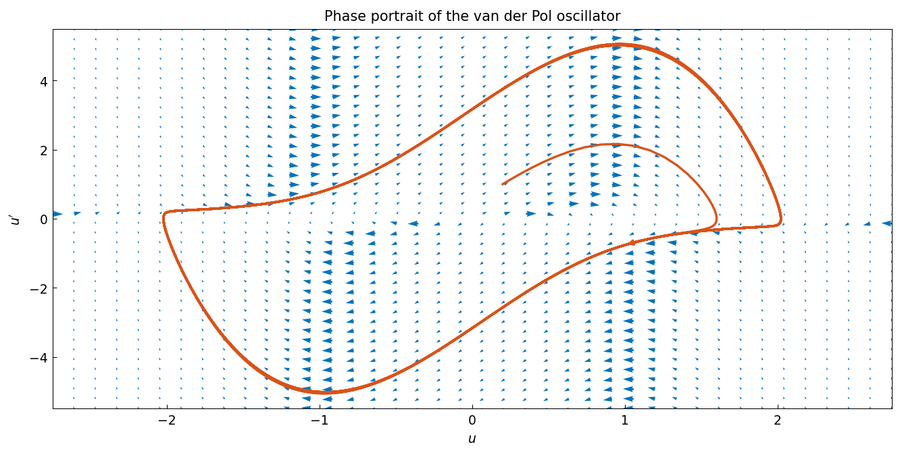
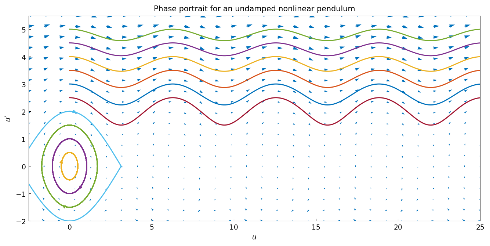
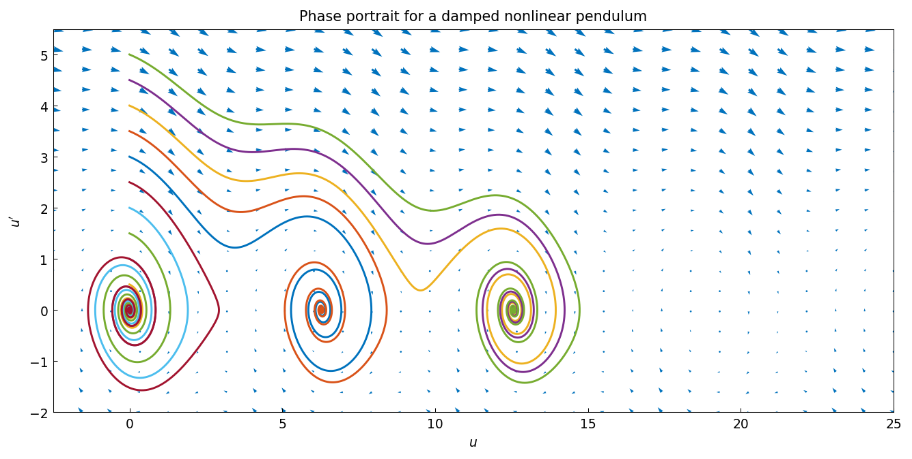
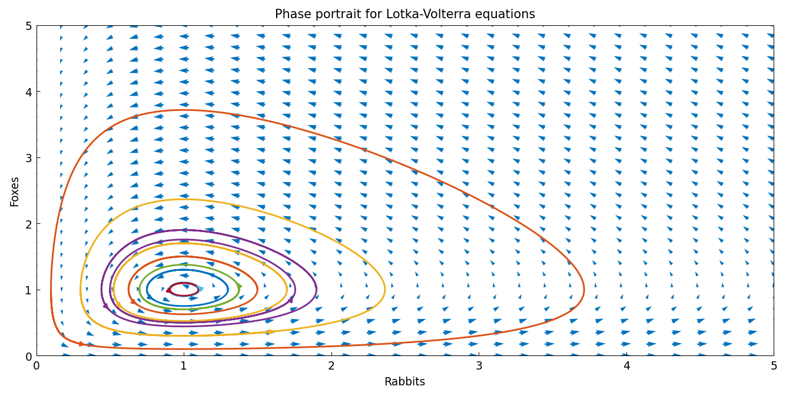
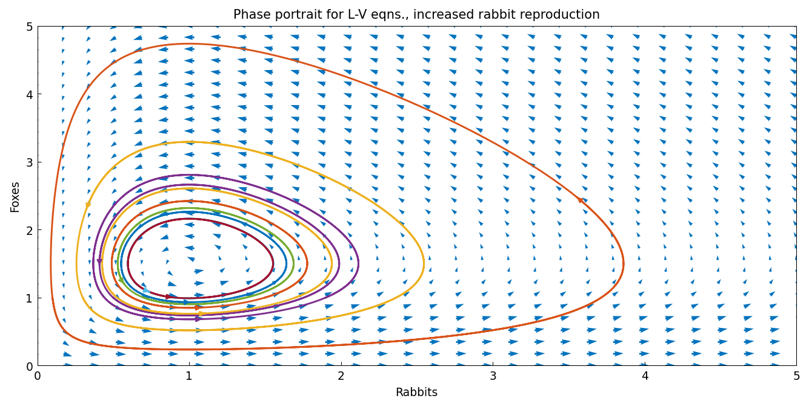

# Phase portraits with chebop/quiver

*Asgeir Birkisson, November 2015*

[Original MATLAB Chebfun example](https://www.chebfun.org/examples/ode-nonlin/ChebopQuiver.html)

(Chebfun example ode-nonlin/ChebopQuiver.m)

## Phase portraits

Phase portraits are geometric representations of the trajectories of a
dynamical system in the phase plane, and are an important tool in the
study of dynamical systems [1]. They consist of plots of trajectories in
the state space, which frequently corresponds to plotting the derivative
of a solution against the solution (for second-order ODEs), or one
solution variable against another (for coupled first-order systems).

When drawing phase portraits it is useful to draw vector fields, to see
the rate of change of solutions at a particular point in the phase
plane. The chebop class has a `quiver` method that draws such fields. It
works for coupled first-order systems with two unknown functions (where
the second is plotted against the first) and for second-order scalar
problems (which are reformulated as first-order systems, so the phase
plane plots the derivative of the solution against the solution).

## The van der Pol equation

The first ODE we consider is the van der Pol equation [2], a second-order
nonlinear ODE:

$$ u'' - \mu(1-u^2)u' + u = 0. $$

We define a chebop for it, taking $\mu = 3$, and call `quiver` with a
vector giving the lower and upper limits on the $x$ and $y$ axes. Once we
have the field we overlay phase-plane portraits of particular solutions —
notice how they follow the arrows and are attracted to the same limit
cycle, whether they start inside or outside it.

```python
N = Chebop(lambda t, u: u.diff(2) - 3*(1 - u**2)*u.diff() + u,
           domain=(0, 100))
N.quiver([-2.75, 2.75, -5.5, 5.5], ax=ax, xpts=40, ypts=40,
         scale=.5, normalize=True)
N.lbc = [0.2, 1]
u = N.solve(0)
arrowplot(u, u.diff(), ax=ax)
```



## A mathematical pendulum

The next ODE controls the trajectory of a nonlinear pendulum,

$$ u'' + \sin(u) = 0, $$

with trajectories starting from the stable equilibrium $u = 0$ at
different initial velocities.



For small enough initial velocities the pendulum swings back and forth
around the equilibrium $u = 0$; for larger ones it swings over and over
the top position. Introduce damping, however, and every trajectory
eventually comes to rest:



## Lotka-Volterra predator-prey model

The final equations are the Lotka-Volterra equations, which model the
populations of predators (foxes) and prey (rabbits) [3]. In the absence
of predators the prey population grows exponentially, while the predator
population shrinks if the prey population is too small:

$$ u' = au - buv, \qquad v' = -cv + duv. $$

Setting all parameters to 1, here are solutions from different initial
rabbit populations, with the initial fox population held fixed:

```python
N = Chebop(lambda t, u, v: [u.diff() - u + u*v,
                            v.diff() + v - u*v], domain=(0, 10))
N.quiver([0, 5, 0, 5], ax=ax, xpts=30, ypts=30, normalize=True, scale=.4)
for rabbits in np.arange(0.1, 1.91, 0.2):
    N.lbc = lambda u, v, _r=rabbits: [u - _r, v - 1]
    u, v = N.solve(0)
    arrowplot(u, v, ax=ax)
```



The cyclical behaviour of the populations is evident. What happens if we
increase the reproduction rate of the rabbits by 50%?



Comparing the phase portraits, the maximum rabbit population increased by
much less than 50%. In fact the maximum population of foxes grew more
than that of rabbits.

> **Implementation note.** `Chebop.quiver` handled only the second-order
> scalar case and raised on everything else, so the two Lotka-Volterra
> figures above were unreachable, as was the slope field MATLAB draws for
> a first-order scalar problem. It also accepted `xpts`, `ypts`,
> `normalize` and `scale` in name only — `scale` was documented and then
> ignored. Fixing the field revealed a chain behind it: the order sniffer
> raised on any operator containing an elementwise call, so `u'' + sin(u)`
> could not even be classified, and the proxy used to extract the
> right-hand side had no elementwise methods at all. The Lotka-Volterra
> field is now checked against the exact right-hand side, and the MATLAB
> test `tests/chebop/test_quiver.m` — previously a blanket-skipped stub
> here — is ported in full, including the two error cases its author left
> commented out.

## References

1. <http://en.wikipedia.org/wiki/Phase_portrait>
2. <http://en.wikipedia.org/wiki/Van_der_Pol_oscillator>
3. <http://en.wikipedia.org/wiki/Lotka%E2%80%93Volterra_equations>

---

*Replica script: [`examples/ode-nonlin/chebop_quiver_replica.py`](https://github.com/ma-gilles/chebfunjax/blob/main/examples/ode-nonlin/chebop_quiver_replica.py).
Original example copyright by The University of Oxford and The Chebfun
Developers.*
