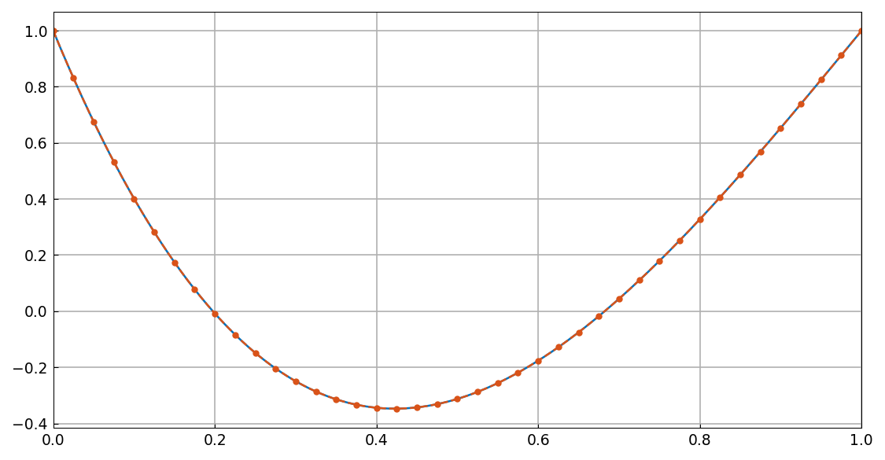
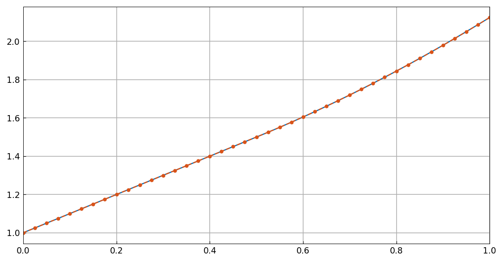
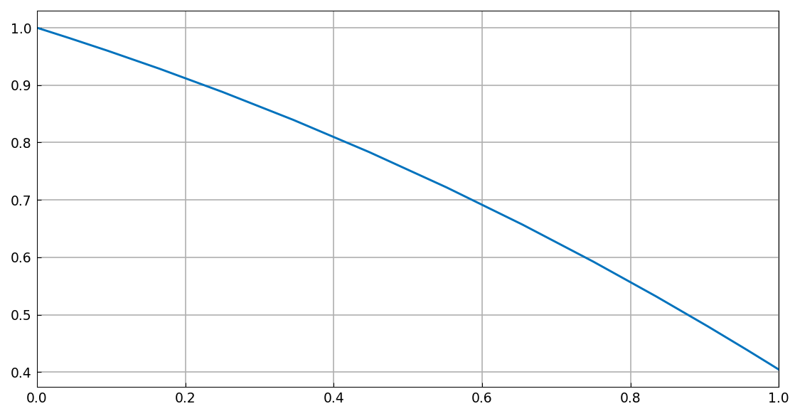
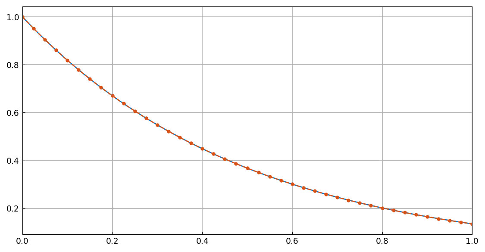

# Delay differential equations in Chebfun

[Original MATLAB Chebfun example](https://www.chebfun.org/examples/ode-nonlin/DelayDifferentialEquations.html)

(Chebfun example ode-nonlin/DelayDifferentialEquations.m)

A tour of delay, pantograph, state-dependent and integro-differential
equations — first by explicit spectral discretization with `chebpts`,
`diffmat` and `barymat`, and then through chebop, whose operators may
evaluate the unknown at mapped arguments: `x(q*t)`,
`x((t-p).maximum(0))`, even `x(x)`.

The replica reproduces the original section by section. A selection of
its figures:






## Every checkable number, against MATLAB's

| section | quantity | chebfunjax | MATLAB |
|---|---|---|---|
| 1 | exponential, discretized | 3.8e-15 | 1.0e-14 |
| 2 | pantograph, `barymat` | 1.2e-14 | 9.6e-15 |
| 3 | pantograph, chebop | len **4**, err 8.4e-15 | len 4, err 1.6e-15 |
| 4 | two pantograph delays | len 12, res 4.2e-14 | len 11, res 1.1e-13 |
| 5 | two-interval exponential | 1.9e-14 | 5.9e-14 |
| 6 | constant delay, discretized | 3.9e-15 | 1.0e-14 |
| 7 | constant delay, chebop | 2 pieces len 5, err 5.5e-10 | len 5, err 1.2e-15 |
| 8 | six-piece delay | res 2.5e-11 | res 3.8e-15 |
| 10 | Volterra, discretized | 3.8e-15 | 2.5e-15 |
| 11 | Volterra, chebop `volt` | len **13**, err 2.2e-14 | len 13, err 2.2e-15 |
| 12 | state-dependent Newton `ndu` | **digit-for-digit** | (see below) |
| 12 | residual of `x' + x(x)` | 3.4e-15 | 3.8e-15 |
| 13 | `x(x)` through chebop | len 16, res 3.9e-15 | len 13, res 1.3e-12 |
| 14 | `y(qt)^2`, exact 1/(1+t²) | len 24, err **1.3e-15** | len 21, err 2.4e-14 |
| 15 | delayed system, exact (sin, cos) | 1.7e-13 | ~1e-14 |
| 16 | `y(y)`, exact t³ | len **4**, err 3.3e-16 | len 4, err 1.4e-14 |
| 18 | delay + `cumsum` + `volt` | len **14**, err 1.9e-14 | len 14, err 6.9e-15 |
| 19 | second-order with delays | len 15, err 9.4e-12 | len 14, err 9.8e-16 |
| 20 | interval condition u(0)=u(1/3) | len 12, res **8.8e-15** | len 11, res 3.4e-13 |
| 22 | state-dependent system | len 35, err **1.2e-15** | len 32, err 5.5e-14 |

The hand-rolled Newton iteration of section 12 is the sharpest check of
the discretization tools: its update norms match MATLAB **to twelve
digits at every step** —

```text
ndu = 2.30960247147036     (MATLAB 2.309602471470345)
ndu = 0.631236336901686    (MATLAB 0.631236336901693)
ndu = 0.0994971908120973   (MATLAB 0.099497190812100)
ndu = 0.000357774713549831 (MATLAB 3.577747135495569e-04)
ndu = 2.79143041040969e-08 (MATLAB 2.791430414256566e-08)
ndu = 6.20026836750792e-16 (MATLAB 6.212628751095523e-16)
```

— identical `chebpts`, `diffmat` and `barymat` arithmetic down to
rounding.

## What is not replicated, and why

Three sections are skipped, all for one reason: their domains carry six
to twelve breakpoints, and every probe column of our assembly applies
delayed composition to a many-piece chebfun. MATLAB solves them in
seconds; our piecewise-composition evaluation is orders of magnitude too
slow (section 9 did not finish in 78 minutes), a ledgered performance
gap. They are sections 9 (two constant delays on the union grid), 17
(the state-dependent `1/t` cascade on the golden-ratio domain) and 21
(the three-variable constant-delay system compared against `ddesd`).

> **Implementation note.** This page is why the system marcher gained
> its delay guard: the first-order march extracts its right-hand side
> from values at the current time, so a delayed term evaluated on the
> constant probe *is* the constant, and the delayed system of section 15
> originally came back with O(1) error, exact boundary conditions and no
> warning — silently solving the undelayed equations. The guard detects
> nonlocal dependence and reroutes to collocation, whose probe-based
> assembly handles composition exactly.

---

*Replica script: [`examples/ode-nonlin/delay_differential_equations_replica.py`](https://github.com/ma-gilles/chebfunjax/blob/main/examples/ode-nonlin/delay_differential_equations_replica.py).
Original example copyright by The University of Oxford and The Chebfun
Developers.*
