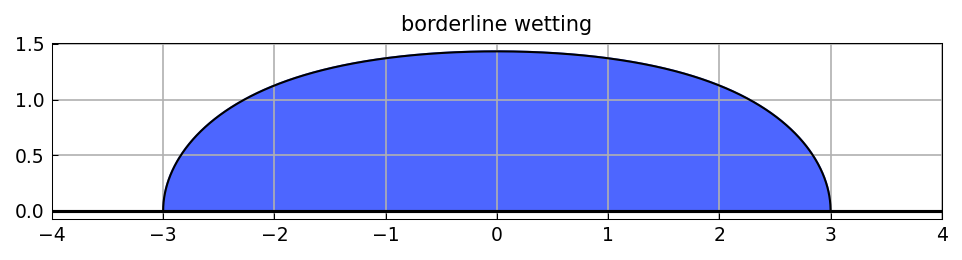
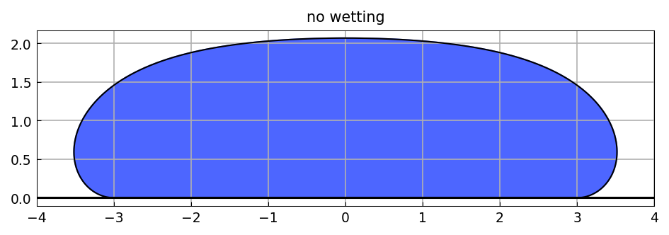
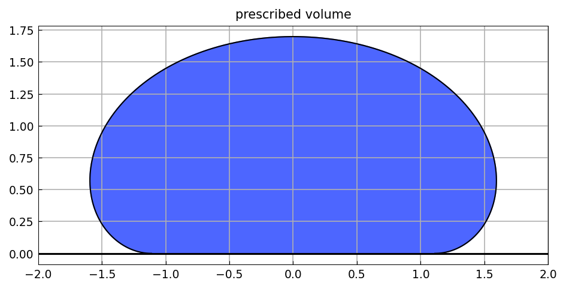

# A droplet sitting on a surface

[Original MATLAB Chebfun example](https://www.chebfun.org/examples/ode-nonlin/Droplets.html)

(Chebfun example ode-nonlin/Droplets.m)

The shape of an axisymmetric sessile drop follows from the
Young-Laplace equation. Written in arclength form it becomes a
first-order system for the radius $R$, the height $U$, the surface angle
$\Psi$ and the arclength scale $L$ (a constant, hence $L' = 0$):

$$ R' = L\cos\Psi, \quad U' = L\sin\Psi, \quad
   R\Psi' = R L U - L\sin\Psi, \quad L' = 0. $$

The boundary conditions pin the contact radius and the surface angle at
both ends, and are written as conditions on values at points rather than
as separate left and right conditions:

```python
N = Chebop(lambda t, R, U, Psi, L: [
    R.diff() - L*Psi.cos(),
    U.diff() - L*Psi.sin(),
    R*Psi.diff() + L*Psi.sin() - R*L*U,
    L.diff()], domain=(-1, 1))
N.bc = lambda t, R, U, Psi, L: [R(-1) + b, R(1) - b,
                                Psi(-1) + Psib, Psi(1) - Psib]
N.init = [b*t, 1 + 0*t, t*Psib, 2*b + 0*t]
R, U, Psi, L = N.solve(0)
```

With $\Psi_b = -\pi/2$ the drop meets the surface at a right angle —
borderline wetting:



With $\Psi_b = -\pi$ it does not wet the surface at all:



```text
ans =
      48    48    48
```

(MATLAB reports `50 51 50`; the shapes agree, our representation is a
few coefficients shorter.)

The volume of the drop follows from the shape at the contact line,
$\pi b\,(2\sin\Psi_b - b\,U(1))$:

```text
ans =
  62.621687652001377
```

MATLAB gives `62.621687652005107` — agreement to twelve digits, which is
the sharp check here since the lengths differ.

## A drop of prescribed volume

Turning the question around: fix the volume at $v_0 = 10$ and let the
contact radius $b$ be *unknown*. It enters as a fifth unknown that is a
scalar rather than a function, with the volume constraint as a fifth
boundary condition:

```python
N.bc = lambda t, R, U, Psi, ell, b: [
    R(-1) + b, R(1) - b, Psi(-1) + Psib, Psi(1) - Psib,
    np.pi*b*(2*np.sin(Psib) - b*U(1)) - v0]
```



```text
contact radius b = 1.111692423027
recovered volume = 9.999999999999   (prescribed 10.0)
```

and $b$ comes back constant to the last bit, as $b' = 0$ requires.

> **Implementation note.** This page needed two fixes. The volume
> constraint is written `pi*b*(2*sin(Psib) - b*U(1)) - v0`, and
> `np.sin` returns a numpy scalar, so evaluating it put a numpy scalar
> on the left of a chebfun — which raised, because `Chebfun` did not
> declare `__array_ufunc__` and numpy tried to broadcast it. That is a
> general defect, not one specific to this page, and is fixed
> separately.
>
> Then the unknown parameter itself: `_solve_nonlinear_system` built one
> residual block per *equation* while sizing the right-hand side by
> *unknowns*, so five unknowns against four equations could not be
> subtracted. The parameter is now carried as the constant unknown
> $b' = 0$ that `_n_params` already documented, pinned by the extra
> boundary condition.
>
> One honest difference: the whole page takes about 450 seconds against
> MATLAB's 6.6. These are four- and five-variable nonlinear systems
> solved by a finite-difference Jacobian assembled by column probing,
> which is the slow part.

---

*Replica script: [`examples/ode-nonlin/droplets_replica.py`](https://github.com/ma-gilles/chebfunjax/blob/main/examples/ode-nonlin/droplets_replica.py).
Original example copyright by The University of Oxford and The Chebfun
Developers.*
