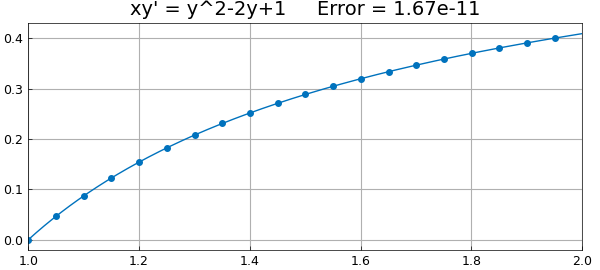
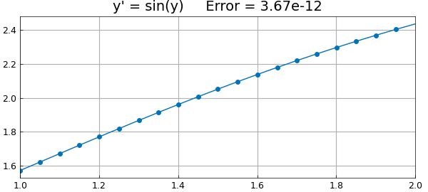
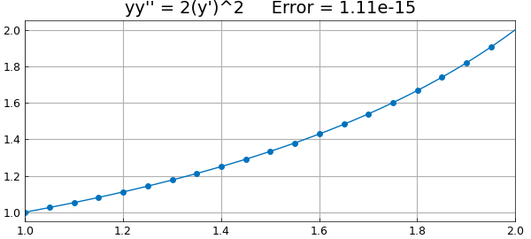
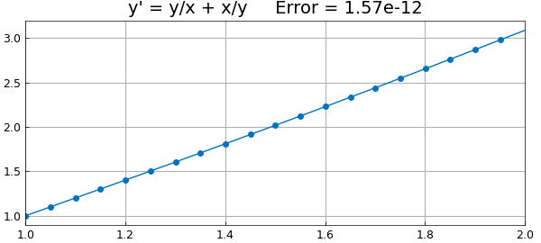

# Exact solutions of nonlinear ODEs from Bender and Orszag

*Nick Trefethen, December 2010*

[Original MATLAB Chebfun example](https://www.chebfun.org/examples/ode-nonlin/ExactSolns.html)

Python translation: [`examples/ode-nonlin/exact_solns.py`](https://github.com/ma-gilles/chebfunjax/blob/main/examples/ode-nonlin/exact_solns.py)

Chapter 1 of the textbook by Bender and Orszag [1] contains an intense review of a number of methods for solving ODEs exactly. Here are some examples illustrating techniques presented in that chapter. In each case we solve an ODE with Chebfun and compare with the exact solution. For simplicity we pose all the equations on the domain $[1,2]$:

```matlab
d = [1 2];
x = chebfun('x',d);
N = chebop(d);
```

## Example 1: Separation of variables (I)

Consider first the problem

$$ xy' = y^2 - 2y + 1,\qquad y(1) = 0. $$

We can separate variables to get

$$ {dy\over (1-y)^2} = {dx\over x}, $$

which can be integrated to give the exact solution

$$ y = 1 - {1\over C+\log(x)} $$

for some constant $C$. For the given boundary condition the constant is $C=1$, so we have

```matlab
exact = 1 - 1./(1+log(x));
```

A Chebfun solution goes like this:

```matlab
N.op = @(y) x.*diff(y) - y.^2 + 2*y;
N.lbc = 0;
y = N\1;
err = norm(y-exact,inf);
```

Here is a plot of the solution, using `'.-'` to show the grid needed to resolve the solution.

```matlab
LW = 'linewidth'; FS = 'fontsize'; MS = 'markersize';
plot(y,'.-',LW,1,MS,18), grid on
title(sprintf('xy'' = y^2-2y+1     Error = %6.2e',err),FS,14)
```



## Example 2: Separation of variables (II)

As another example, consider

$$ y' = \sin(y),\qquad y(1) = {\pi\over 2}. $$

Separating variables now gives

$$ {dy\over \sin(y)} = dx, $$

which implies

$$ \log(\tan({y\over 2}) = x + C, $$

which leads to

$$ y = 2 \tan^{-1}(C\exp(x)) $$

for some constant $C$. We can satisfy the boundary condition with $C=1/e$, so the exact solution is

```matlab
exact = 2*atan(exp(x-1));
```

A Chebfun solution is as follows:

```matlab
N.op = @(y) diff(y) - sin(y);
N.lbc = pi/2;
y = N\0;
err = norm(y-exact,inf);
```

Here is a plot:

```matlab
plot(y,'.-',LW,1,MS,18), grid on
title(sprintf('y'' = sin(y)     Error = %6.2e',err),FS,14)
```



## Example 3: Order reduction for an autonomous equation

Consider the autonomous problem

$$ yy' = 2(y')^2,\qquad y(1) = 1,~~ y(2) = 2, $$

where we think of $y$ as a function of $x$, i.e., $y' = dy/dx$. Now introduce the new variable $u = y'$, which we think of as a function of $y$, i.e., $u' = du/dy$. The equation becomes a new equation in $u$ and $y$ of first order,

$$ yuu' = 2u^2. $$

Separating variables gives $u'/u = 2/y$, which leads to $\log(u) = 2\log(y)+C$ for some constant $C$, i.e., $u = Cy^2$, i.e.

$$ y' = Cy^2. $$

Separating variables again and integrating gives

$$ y = {1\over Cx+D} $$

for constants $C$ and $D$. We can satisfy the boundary conditions with $D=3/2$, $C=-1/2$, giving the exact solution

```matlab
exact = 2./(3-x);
```

A Chebfun solution is as follows:

```matlab
N.op = @(y) y.*diff(y,2) - 2*diff(y).^2;
N.lbc = 1; N.rbc = 2;
y = N\0;
err = norm(y-exact,inf);
```

Here is a plot:

```matlab
plot(y,'.-',LW,1,MS,18), grid on
title(sprintf('yy'''' = 2(y'')^2     Error = %6.2e',err),FS,14)
```



## Example 4: Bernoulli equation

An equation of the form $y' = a(x)y +b(x)y^p$, known as a *Bernoulli equation*, can be made linear by the change of variables $u=y^{1-p}$. Consider for example the problem

$$ y' = {y\over x} + {x \over y}, \qquad y(1) = 1. $$

Setting $u=y^2$ reduces the problem to

$$ u'/2 = u/x + x. $$

Multiplying by the integrating factor $x^{-2}$ gives

$$ {u'\over x^2} - {2u\over x^3} = {2\over x}, $$

that is,

$$ \left({u\over x^2}\right)' = {2\over x}, $$

which can be integrated to give

$$ y = x(C+2\log(x))^{1/2}. $$

For our boundary conditions the solution is accordingly

```matlab
exact = x.*sqrt(1+2*log(x));
```

For a Chebfun solution, we get an error message if we specify no initial guess as the default guess of the zero function causes division by zero. Accordingly here is a solution in which an initial guess is specified.

```matlab
N.op = @(y) diff(y) - y./x - x./y;
N.lbc = 1; N.rbc = [];
N.init = 1;
y = N\0;
err = norm(y-exact,inf);
```

And here's the plot:

```matlab
plot(y,'.-',LW,1,MS,18), grid on
title(sprintf('y'' = y/x + x/y     Error = %6.2e',err),FS,14)
```



## References

1. C. Bender and S. A. Orszag, *Advanced Mathematical Methods for Scientists and Engineers*, McGraw-Hill, 1978.

---

*Translated with [chebfunjax](https://github.com/ma-gilles/chebfunjax); prose and MATLAB code from the original example, copyright The University of Oxford and The Chebfun Developers.  Printed outputs and figures are chebfunjax's.*
