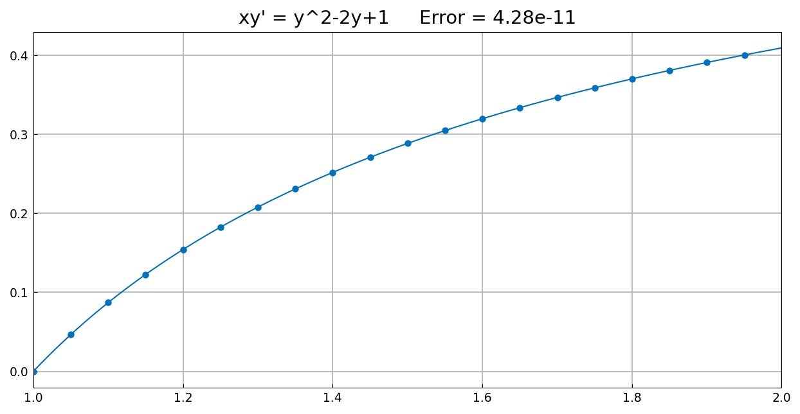
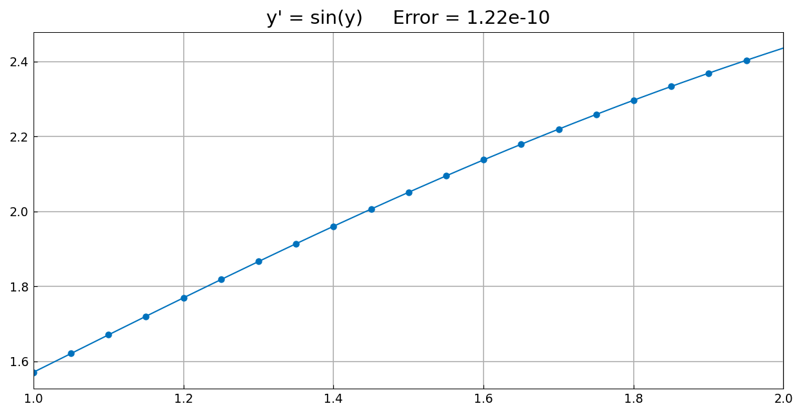
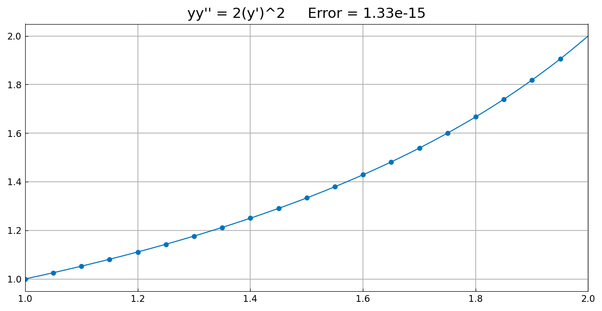
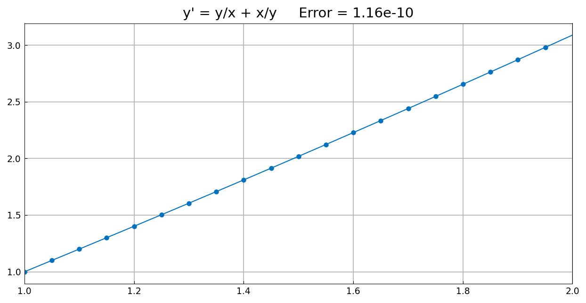

# Exact solutions of nonlinear ODEs from Bender and Orszag

*Nick Trefethen, December 2010*

[Original MATLAB Chebfun example](https://www.chebfun.org/examples/ode-nonlin/ExactSolns.html)

(Chebfun example ode-nonlin/ExactSolns.m)

Chapter 1 of the textbook by Bender and Orszag [1] contains an intense
review of a number of methods for solving ODEs exactly. Here are some
examples illustrating techniques presented in that chapter. In each case
we solve an ODE and compare with the exact solution. For simplicity we
pose all the equations on the domain $[1,2]$.

## Example 1: separation of variables (I)

$$ x y' = y^2 - 2y + 1, \qquad y(1) = 0,
   \qquad y_{\mathrm{exact}} = 1 - \frac{1}{1 + \log x}. $$

## Example 2: separation of variables (II)

$$ y' = \sin y, \qquad y(1) = \frac{\pi}{2},
   \qquad y_{\mathrm{exact}} = 2\tan^{-1}\!\bigl(e^{x-1}\bigr). $$

## Example 3: order reduction

$$ y y'' = 2 (y')^2, \qquad y(1) = 1, \; y(2) = 2,
   \qquad y_{\mathrm{exact}} = \frac{2}{3 - x}. $$

## Example 4: an equidimensional equation

$$ y' = \frac{y}{x} + \frac{x}{y}, \qquad y(1) = 1,
   \qquad y_{\mathrm{exact}} = x\sqrt{1 + 2\log x}. $$

## The errors, against MATLAB's

| problem | chebfunjax | published |
|---|---|---|
| 1: $xy' = y^2 - 2y + 1$ | 4.28e-11 | 5.91e-13 |
| 2: $y' = \sin y$ | 1.22e-10 | 7.28e-12 |
| 3: $yy'' = 2(y')^2$ | **1.33e-15** | 2.44e-15 |
| 4: $y' = y/x + x/y$ | 1.16e-10 | 4.11e-12 |

Problem 3 — the boundary-value problem — reaches full precision,
slightly better than the published figure. The three marched
initial-value problems land one to two orders above MATLAB, the same
solver accuracy floor measured quantitatively on
[Picard](Picard.md), where the reference solution's residual stalls
near $3.6\times 10^{-9}$ regardless of the requested tolerance.

> **Implementation note.** Problem 3 initially returned $y \equiv 0$ —
> a function that satisfies the ODE but violates *both* boundary
> conditions. The default Newton initial guess was the zero function, at
> which every Jacobian entry of $yy'' - 2(y')^2$ vanishes; the singular
> solve broke out silently and returned the unchanged iterate. MATLAB
> never sees this because `solvebvp` starts from a low-degree polynomial
> satisfying the boundary conditions (its `fitBCs`), here the line
> through $(1,1)$ and $(2,2)$. The default initial guess now does the
> same for scalar and list-valued boundary conditions, which takes this
> problem from an error of $2$ to $1.3\times 10^{-15}$.

## References

1. C. M. Bender and S. A. Orszag, *Advanced Mathematical Methods for
   Scientists and Engineers*, McGraw-Hill, 1978.

---

*Replica script: [`examples/ode-nonlin/exact_solns_replica.py`](https://github.com/ma-gilles/chebfunjax/blob/main/examples/ode-nonlin/exact_solns_replica.py).
Original example copyright by The University of Oxford and The Chebfun
Developers.*
