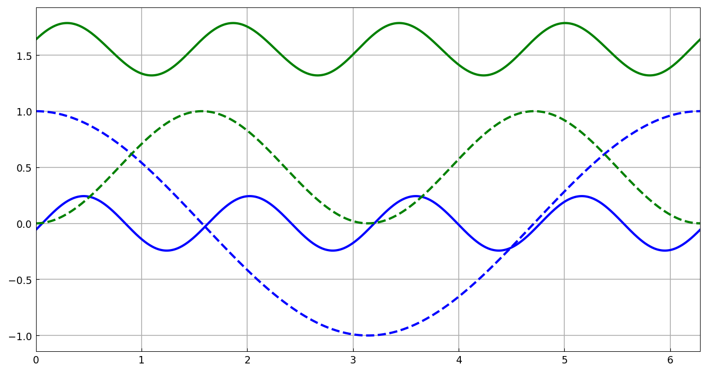

# Fourier collocation for nonlinear periodic ODEs

*Hadrien Montanelli, December 2014*

[Original MATLAB Chebfun example](https://www.chebfun.org/examples/ode-nonlin/FourierCollocationNonLin.html)

(Chebfun example ode-nonlin/FourierCollocationNonLin.m)

Nonlinear ODEs with periodic boundary conditions are solved with a
Fourier discretization and Newton iteration. Consider

$$ u' - u\cos(u) = \cos(4x), \qquad x \in [0, 2\pi], $$

which has more than one periodic solution — the initial guess selects
the branch. Starting from $\cos x$:

```python
N = Chebop(lambda u: u.diff() - u*u.cos(), domain=(0, 2*pi))
N.bc = 'periodic'
N.init = chebfun(cos, (0, 2*pi))
u = N.solve(f)
```

```text
u =
   chebfun column (1 smooth piece)
       interval       length     endpoint values trig
[       0,     6.3]       73    -0.058   -0.058 
vertical scale = 0.24 
ans =
     7.634146282916488e-14
```

(Published: endpoint values −0.058, residual 3.4e-12 — same branch,
lengths 73 vs 89.)

Starting instead from $\sin^2 x$, Newton converges to a *different*
solution:

```text
v =
   chebfun column (1 smooth piece)
       interval       length     endpoint values trig
[       0,     6.3]       81       1.6      1.6 
vertical scale = 1.8 
ans =
     7.809077729375943e-13
```

(Published: endpoint values 1.6, vscale 1.786, length **81** — an exact
length match; residual 1.8e-12. Preserving this basin required the
affine-invariant Deuflhard damping in the Newton iteration —
residual-monotone backtracking slides into the first branch.)

Both initial guesses (dashed) and solutions (solid):



---

*Replica script: [`examples/ode-nonlin/fourier_collocation_nonlin_replica.py`](https://github.com/ma-gilles/chebfunjax/blob/main/examples/ode-nonlin/fourier_collocation_nonlin_replica.py).
Original example copyright by The University of Oxford and The Chebfun
Developers.*
