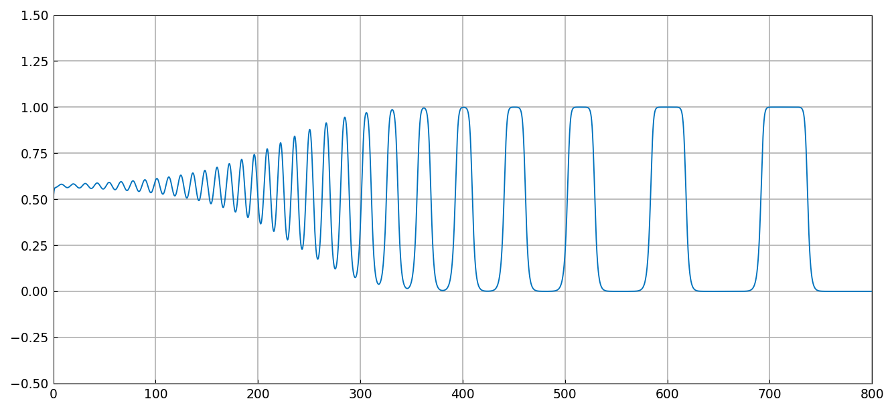
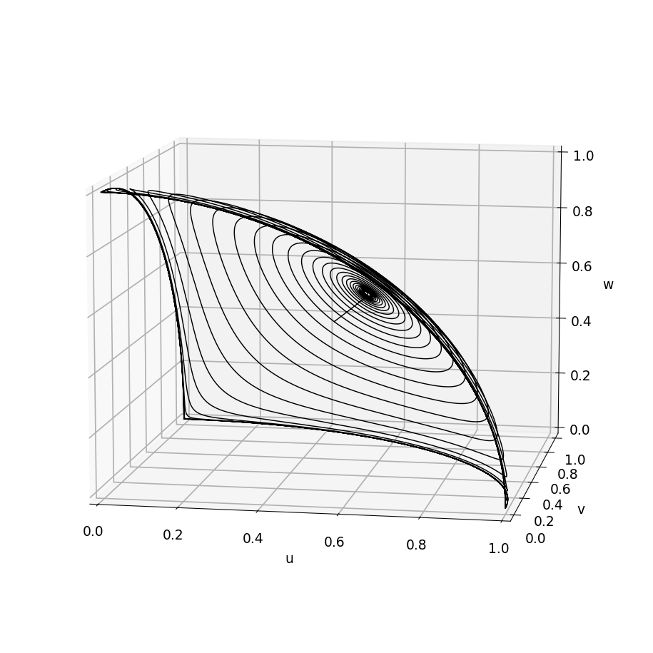
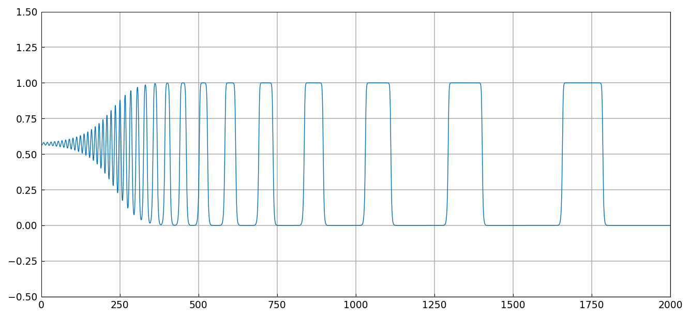
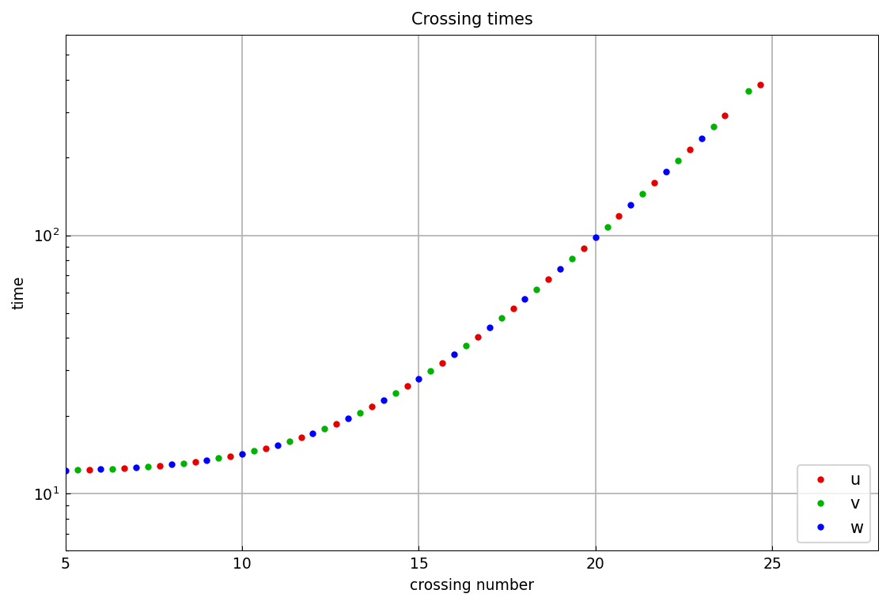

# A nonlinear system of Guckenheimer and Holmes

*Nick Trefethen, February 2015*

[Original MATLAB Chebfun example](https://www.chebfun.org/examples/ode-nonlin/GuckenheimerHolmes.html)

(Chebfun example ode-nonlin/GuckenheimerHolmes.m)

Guckenheimer and Holmes studied the three-variable nonlinear system

$$ u' = u\,(1 - u^2 - b v^2 - c w^2), \quad
   v' = v\,(1 - v^2 - b w^2 - c u^2), \quad
   w' = w\,(1 - w^2 - b u^2 - c v^2), $$

here with $b = 0.55$ and $c = 1.5$. The trajectory is attracted to a
*heteroclinic cycle* connecting the three saddle points $(1,0,0)$,
$(0,1,0)$, $(0,0,1)$: the solution visits each in turn, lingering ever
longer as it comes in ever closer.

```python
N = Chebop(lambda t, u, v, w: [
    u.diff() - u*(1 - u**2 - b*v**2 - c*w**2),
    v.diff() - v*(1 - v**2 - b*w**2 - c*u**2),
    w.diff() - w*(1 - w**2 - b*u**2 - c*v**2)], domain=(0, 800))
N.lbc = lambda u, v, w: [u - 0.5, v - 0.49, w - 0.49]
u, v, w = N.solve(0)
```

Here is $v(t)$ up to $t = 800$ — oscillation about the symmetric state
giving way to ever-widening square pulses:



The published figure shows the same pulses at the same positions
(plateaus near $t \approx 360, 400, 450, 520, 600, 710$), which is close
agreement considering the trajectory has spent hundreds of time units
being repelled from saddle points by then.

In three dimensions the cycle is visible directly:



Carrying the computation to $t = 2000$:



The quantitative signature of the heteroclinic cycle is that the times
between successive visits grow *geometrically*. Collecting the times at
which each component crosses $0.5$ on the way up and plotting the gaps
on a log scale gives near-straight lines:



```text
[nu nv nw] = [24 24 23]
late gap ratios (v): [1.3276 1.3385 1.3469 1.3525 1.3804]
```

The late gaps grow by a factor of about $1.33$–$1.38$ per cycle,
matching the slope of the published figure, and the final gap reaches
$\approx 450$ time units by crossing $25$ just as in the original.

Past this point the computation cannot be continued meaningfully in
double precision: the trajectory approaches the saddles more closely
than rounding error, the same floor documented for
[SquareCycle](SquareCycle.md).

## References

1. J. Guckenheimer and P. Holmes, Structurally stable heteroclinic
   cycles, *Math. Proc. Camb. Phil. Soc.* 103 (1988), 189-192.

---

*Replica script: [`examples/ode-nonlin/guckenheimer_holmes_replica.py`](https://github.com/ma-gilles/chebfunjax/blob/main/examples/ode-nonlin/guckenheimer_holmes_replica.py).
Original example copyright by The University of Oxford and The Chebfun
Developers.*
