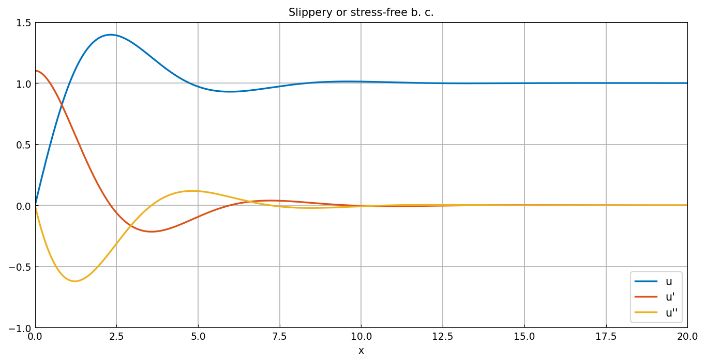
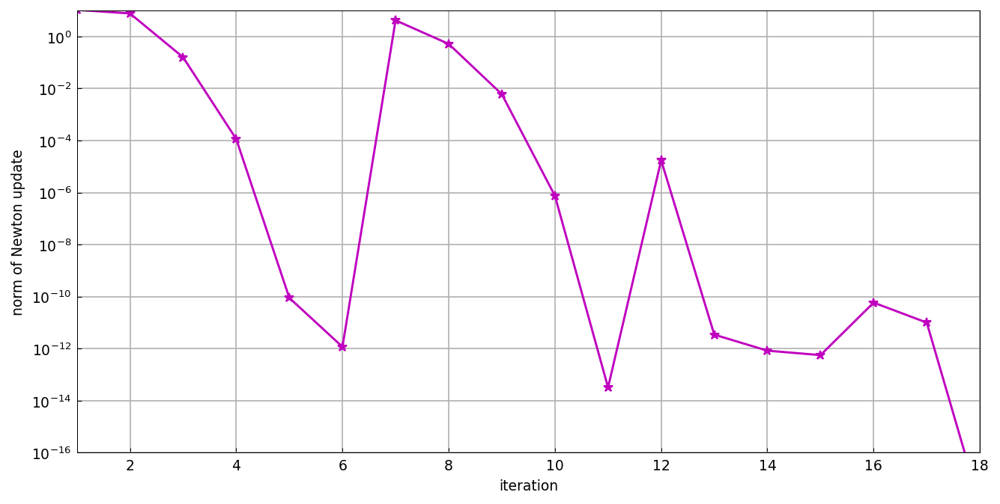
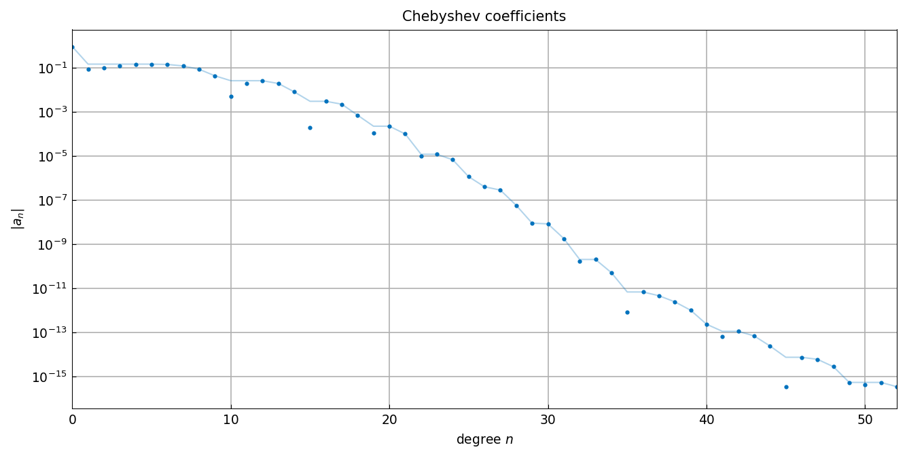

# A Gulf Stream model

*Nick Trefethen, November 2010*

[Original MATLAB Chebfun example](https://www.chebfun.org/examples/ode-nonlin/GulfStream.html)

(Chebfun example ode-nonlin/GulfStream.m)

Following a model of Stommel for western boundary currents such as the
Gulf Stream, consider the third-order nonlinear boundary-value problem

$$ u''' - \lambda\bigl((u')^2 - u u''\bigr) - u + 1 = 0,
   \qquad x \in [0, 35], $$

with $\lambda = -0.1$, the *stress-free* (slippery) conditions
$u(0) = u''(0) = 0$, and $u(35) = 1$:

```python
N = Chebop(lambda u: u.diff(3) - lam*(u.diff(1)**2 - u*u.diff(2)) - u + 1,
           domain=(0, 35))
N.lbc = lambda u: [u, u.diff(2)]     # two conditions at the left end
N.rbc = 1
u, info = N.solvebvp(0)
```

The solution rises through a damped oscillation to the interior value
1:



```text
N_residual =
     2.474193006847492e-12
lbc_residuals =
   4.440892098500626e-16  7.940004209672225e-11
rbc_residual =
    4.440892098500626e-16
```

(Published: `4.580588942258870e-10`, `3.3e-14 / 1.34e-10`, and
`-9.77e-15` — our differential-equation residual is two orders
tighter, the boundary residuals comparable.)

The Newton updates, from `info['normDelta']`:



The Chebyshev coefficients show the solution is resolved to machine
precision:



Finally an independent check. The problem has a conserved quantity,

$$ I = \int_0^{35} \bigl[(u'')^2 - 3\lambda\, u u' u''\bigr]\,dx
     = \tfrac12, $$

which the computed solution reproduces:

```text
I =
   0.499999999913175
I_error =
     8.682504715196160e-11
```

(Published: `0.499999999999915` with error `8.482103908136196e-14`.
Ours is three orders looser on this invariant despite the tighter
differential residual — the integrand involves $u''$ squared and a
triple product, so it amplifies whatever error remains in the high
derivatives.)

> **Implementation note.** This page needed a fix: a boundary-condition
> callable returning a *list* — `lambda u: [u, u.diff(2)]`, MATLAB's way
> of imposing two conditions at one endpoint — was previously collapsed
> into a single condition. A third-order problem then received only two
> boundary conditions, its collocation matrix was singular, and Newton
> "converged" to the zero function without complaint.

---

*Replica script: [`examples/ode-nonlin/gulf_stream_replica.py`](https://github.com/ma-gilles/chebfunjax/blob/main/examples/ode-nonlin/gulf_stream_replica.py).
Original example copyright by The University of Oxford and The Chebfun
Developers.*
