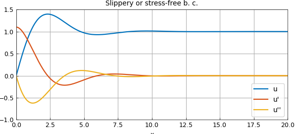
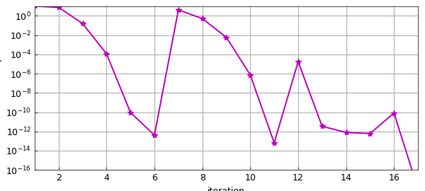
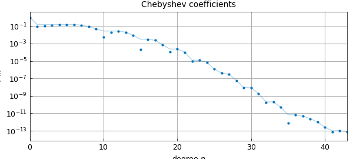

# A third-order nonlinear BVP on the half-line

*C. I. Gheorghiu, January 2020*

[Original MATLAB Chebfun example](https://www.chebfun.org/examples/ode-nonlin/GulfStream.html)

Python translation: [`examples/ode-nonlin/gulf_stream.py`](https://github.com/ma-gilles/chebfunjax/blob/main/examples/ode-nonlin/gulf_stream.py)

A one-layer model of the large-scale circulation in an ocean (the Gulf Stream) was proposed by Ierley and Ruehr in 1986 [1]: $$ u''' -\lambda((u')^2-uu'')-u+1=0, ~~u(0) =0, ~~x\in [0,\infty) $$ for some real $\lambda$. Boundary conditions are given as either $u(0)=u'(0)=0$ (rigid or no-slip) or $u(0)=u''(0)=0$ (slippery or stress-free). In both cases we require $u(\infty) = 1$.

In order to solve the problem in Chebfun we'll need to truncate the domain to something suitable, say $[0, X]$, i.e, to make use of the so-called domain truncation (see for instance our papers [3] and [4]).

An integral result for this problem is fairly useful. It reads $$ I = \int_{0}^{\infty }[(u'')^2 - 3\lambda uu'u'']dx=\frac{1}{2}, $$ and it is obtained multiplying the equation by $u'$, integrating by parts and enforcing the boundary conditions. This result is valid for both types of boundary conditions. Using this integral result we optimise the value of the length $X$ above, and find that the accuracy of the Chebfun result comes close to machine precision.

We can set up the chebop and solve the differential equation with only a few lines of code (see [2] for details).

```matlab
tic
X = 35;
dom = [0, X];
lambda = -0.1;
op  = @(u) diff(u,3) - lambda*( diff(u,1)^2 - u*diff(u,2) ) - u + 1;
lbc = @(u) [u; diff(u,2)];     % stress-free BC
rbc = 1;
N = chebop(op,dom,lbc,rbc);
[u,info] = N\0;
```

Here is what the solution looks like.

```matlab
plot([u diff(u) diff(u,2)])
axis([0 20 -1 1.5])
xlabel('x'), legend('u','u''','u''''','location','southeast')
title('Slippery or stress-free b. c.')
```



The residuals are small:

```matlab
N_residual = norm(N(u))                   % residual of diffl. eq.
lbcu = lbc(u);
lbc_residuals = [lbcu{1}(0) lbcu{2}(0)]   % residuals of left BC
rbc_residual = u(end) - rbc               % residual of right BC
```

```text
N_residual =
     1.475728221374910e-09
lbc_residuals =
   -3.108624468950438e-15  1.227379933799178e-10
rbc_residual =
    3.319566843629218e-13
I =
   0.499999999866599
I_error =
     1.334009014364312e-10
```

The Newton iteration has converged quadratically:

```matlab
semilogy(info.normDelta,'m*-')
ylim([1e-16 1e+01])
xlabel('iteration')
ylabel('norm of Newton update')
%
```



The Chebyshev coefficients of the solution decrease rapidly:

```matlab
plotcoeffs(u)
```



Finally, the integral $I$ comes out with a very small error:

```matlab
I = sum(diff(u,2)^2 - 3*lambda*(u*diff(u)*diff(u,2)))
I_error = abs(I-1/2)
```

```text
(no matching output)
```

We solved the problem for several values of $X$ and found that the minimal error in $I$ occurs with $X\approx 35$.

```matlab
total_time_for_this_example = toc
```

```text
total_time_for_this_example =
   168.365872383117676
```

## References

1. G. R. Ierley and O. G. Ruehr, Analytic and numerical solutions of a nonlinear boundary-layer problem, *Stud. Apl. Math.* 75:1-36 (1986).
2. L. N. Trefethen, A. Birkisson, and T. A. Driscoll, *Exploring ODEs*, SIAM, 2018.
3. C. I. Gheorghiu, Pseudospectral solutions to some singular nonlinear BVPs, *Numer. Algor.* 68 (2015), 1-14, DOI: 10.1007/s11075-014-9834-z.
4. C. I. Gheorghiu, Spectral collocation solutions to systems of boundary layer type, *Numer. Algor.* 73 (2016), 1-14, DOI:10.1007/s11075-015-0083-6

---

*Translated with [chebfunjax](https://github.com/ma-gilles/chebfunjax); prose and MATLAB code from the original example, copyright The University of Oxford and The Chebfun Developers.  Printed outputs and figures are chebfunjax's.*
