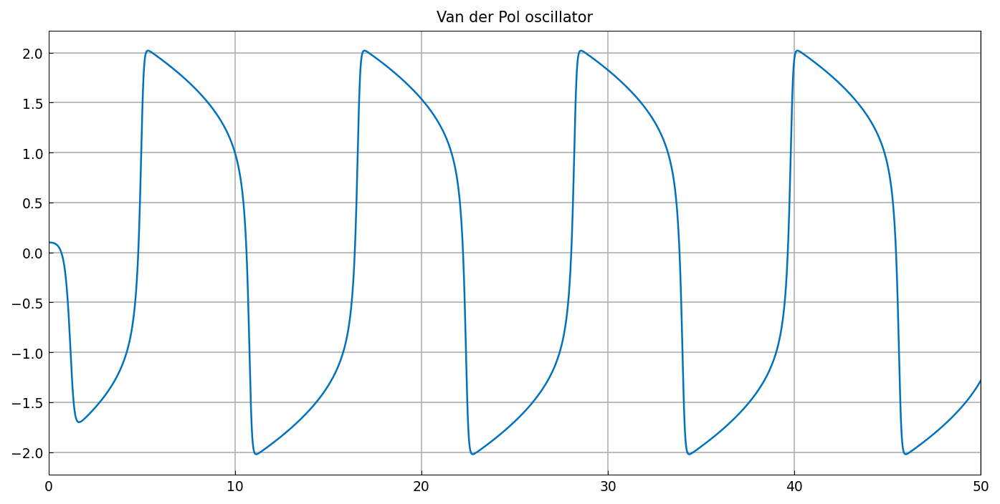
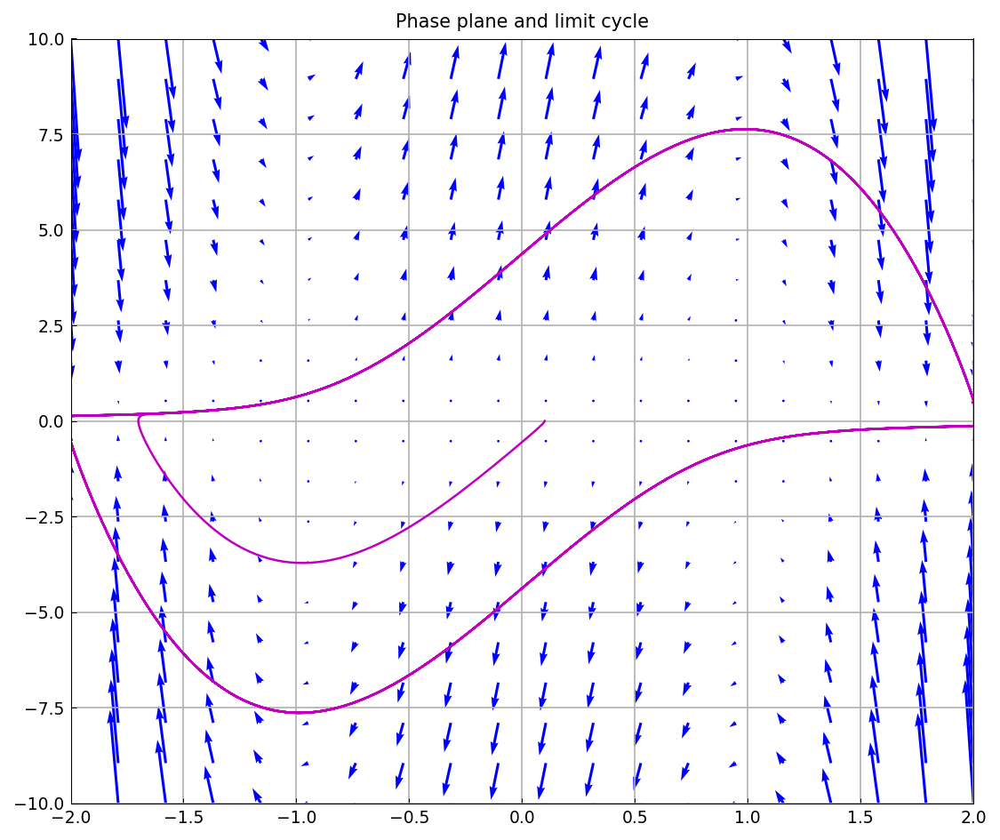
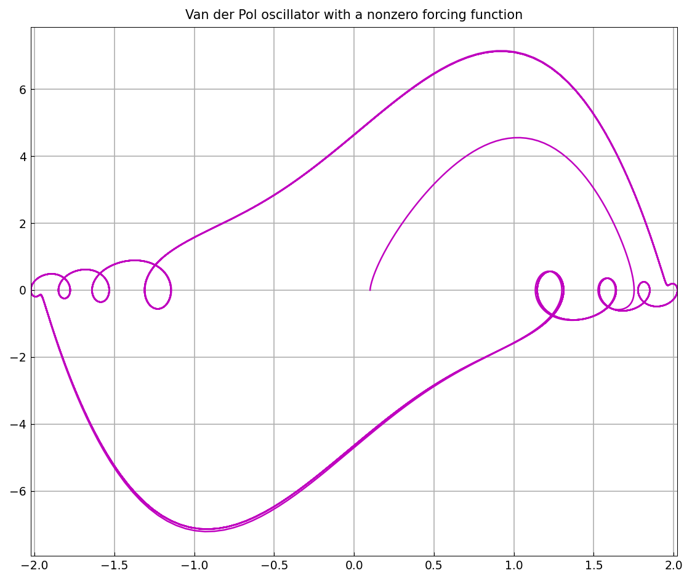
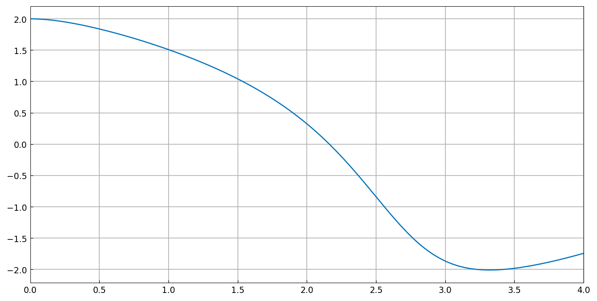

# IVP capabilities of chebop

*Asgeir Birkisson, May 2016*

[Original MATLAB Chebfun example](https://www.chebfun.org/examples/ode-nonlin/IVPCapabilities.html)

(Chebfun example ode-nonlin/IVPCapabilities.m)

Initial-value problems are solved by time marching rather than
collocation. The van der Pol oscillator

$$ u'' - \mu(1-u^2)u' + u = 0, \qquad u(0) = 0.1,\; u'(0) = 0, $$

with $\mu = 5$ on $[0, 50]$ is a stiff relaxation oscillator:

```python
N = Chebop(lambda t, u: u.diff(2) - mu*(1-u**2)*u.diff() + u, domain=(0, 50))
N.lbc = [0.1, 0]
u = N.solve(0)
```

```text
Elapsed time is 33.423806 seconds.
u =
   chebfun column (1 smooth piece)
       interval       length     endpoint values  
[       0,      50]     3546       0.1     -1.3 
vertical scale =   2 
```

(Published: length 3765, same endpoint values 0.1 and −1.3 and the
same vertical scale 2, in 2.0 s. The representation matches; the
timing is the marching solver's, not the discretization's.)



Plotting $u$ against $u'$ over the direction field of the operator —
`N.quiver([-2 2 -10 10])` — shows the trajectory spiralling out from
the initial condition onto the limit cycle:



The same operator with a nonzero forcing function $5\sin 5t$:



Finally, an IVP can be solved by *collocation* instead of marching —
MATLAB's `cheboppref('ivpSolver', @chebcolloc2)`, here
`solve(..., ivp_solver='chebcolloc2')` — for $\mu = 1$ on $[0, 4]$:

```text
Elapsed time is 85.391568 seconds.
```



> **Implementation note.** Initial conditions written as a list,
> `N.lbc = [0.1, 0]` (MATLAB's `[u_0; u_0']`), previously raised inside
> the marching solver, and a broad exception handler silently fell back
> to collocation — which for this stiff problem diverged to a vertical
> scale of 8.4e+04 without satisfying the initial condition at all.

---

*Replica script: [`examples/ode-nonlin/ivp_capabilities_replica.py`](https://github.com/ma-gilles/chebfunjax/blob/main/examples/ode-nonlin/ivp_capabilities_replica.py).
Original example copyright by The University of Oxford and The Chebfun
Developers.*
