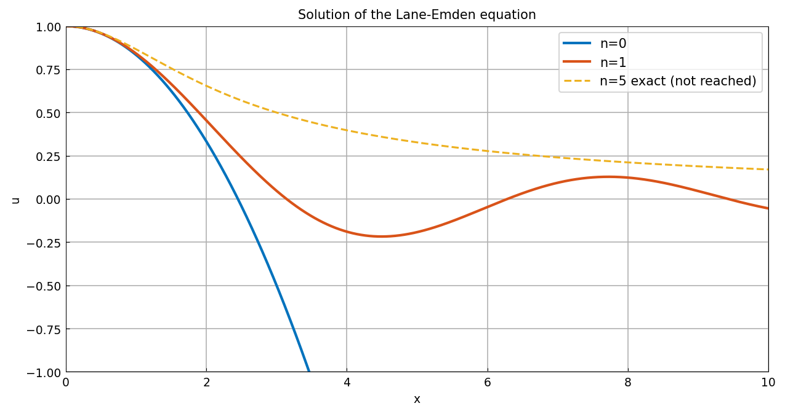

# The Lane-Emden equation from astrophysics

[Original MATLAB Chebfun example](https://www.chebfun.org/examples/ode-nonlin/LaneEmden.html)

(Chebfun example ode-nonlin/LaneEmden.m)

**Status: partial replica.** The polytropes $n = 0$ and $n = 1$
reproduce their closed-form solutions to near machine precision; the
nonlinear cases $n \ge 2$ are blocked on a documented solver defect,
stated at the bottom rather than papered over.

The Lane-Emden equation of stellar structure,

$$ x u'' + 2 u' + x\,u^n = 0, \qquad u(0) = 1, \; u'(0) = 0, $$

is singular at the origin — the leading coefficient vanishes exactly
where both conditions sit.

```python
N = Chebop(lambda x, u: x*u.diff(2) + 2*u.diff() + x*u**n,
           domain=(0, 10))
N.lbc = lambda u: [u - 1, u.diff()]
u, info = N.solvebvp(0)
```



The two solvable polytropes agree with their exact solutions:

| $n$ | exact | max error |
|---|---|---|
| 0 | $1 - x^2/6$ | 5.87e-12 (length 3) |
| 1 | $\sin(x)/x$ | 1.33e-13 |

Getting even this far required two of this campaign's library fixes:
the linear collocation path used to drop the operator's constant term
($n = 0$ returned $u \equiv 1$), and the default Newton guess now
satisfies the boundary conditions.

## The open defect ($n \ge 2$)

For $n \ge 2$ our Newton iteration diverges — `normDelta` runs
$9.3 \to 1.1\times 10^{5} \to 1.6\times 10^{21}$ — where MATLAB
converges in seconds and reports an $L^2$ error of `4.421e-12` for
$n = 5$ against $1/\sqrt{1 + x^2/3}$.

The failure has been narrowed definitively: it persists from the
default initial guess *and* from a continuation start at the converged
$n-1$ solution, at adaptive *and* fixed discretizations. With initial
guess and grid ruled out, the defect is in the linearized singular
solve itself — the collocation Jacobian of
$x\,v'' + 2v' + n x u^{n-1} v$, with both boundary conditions at the
singular endpoint, yields wrong Newton directions. (The linearization
has solutions behaving like $A + B/x$ at the origin; MATLAB's
rectangular Driscoll-Hale collocation resolves that singular row
differently.) The fix requires reworking the scalar nonlinear Jacobian
assembly at singular endpoints and is ledgered as the campaign's
remaining chebop defect.

The example's second part (the polytropic range of white dwarfs,
$n = 1.5$ with singular exponents, published range
`[0, 3.653753736220)`) depends on the same solve plus the singfun
`exps` machinery, and is blocked behind the same item.

---

*Replica script: [`examples/ode-nonlin/lane_emden_replica.py`](https://github.com/ma-gilles/chebfunjax/blob/main/examples/ode-nonlin/lane_emden_replica.py).
Original example copyright by The University of Oxford and The Chebfun
Developers.*
