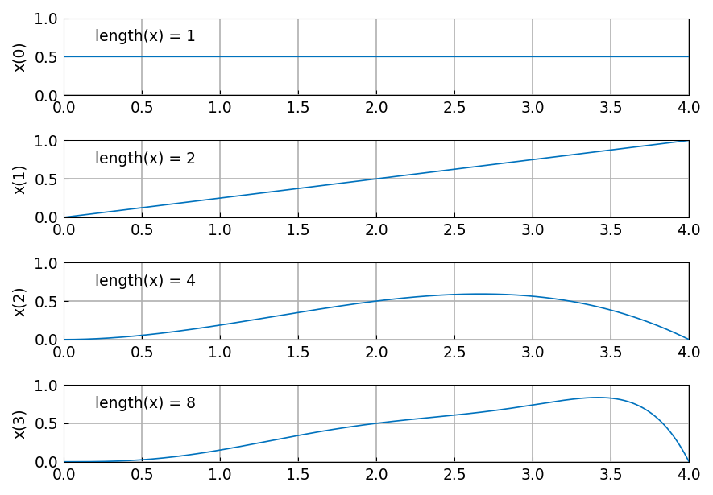
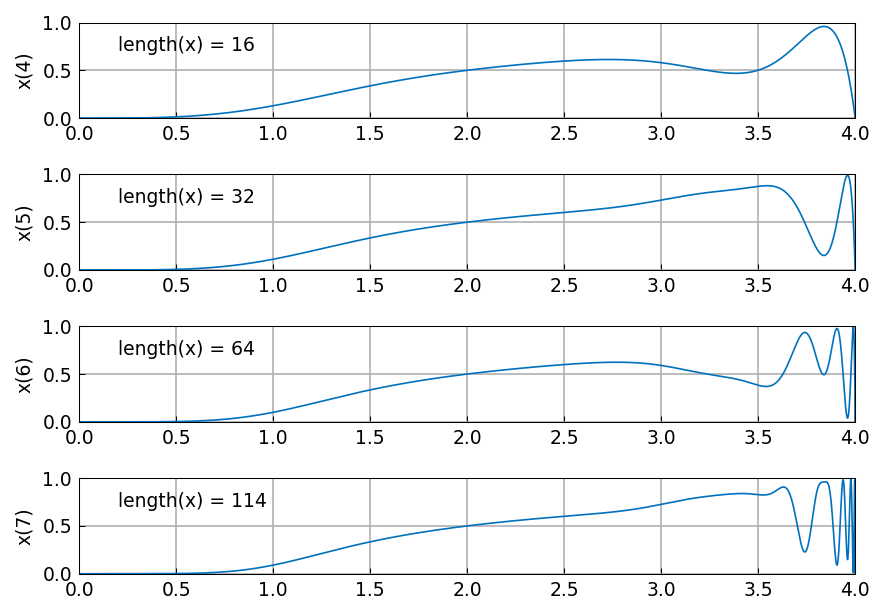
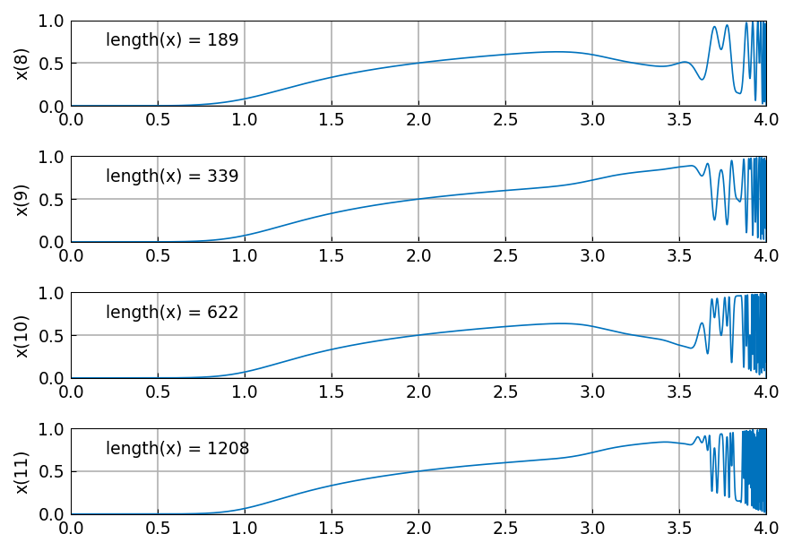
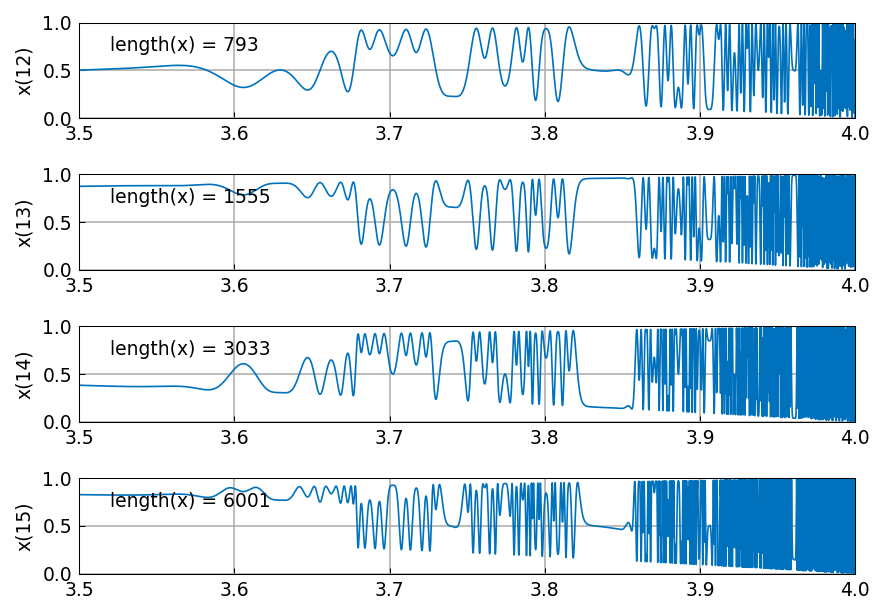
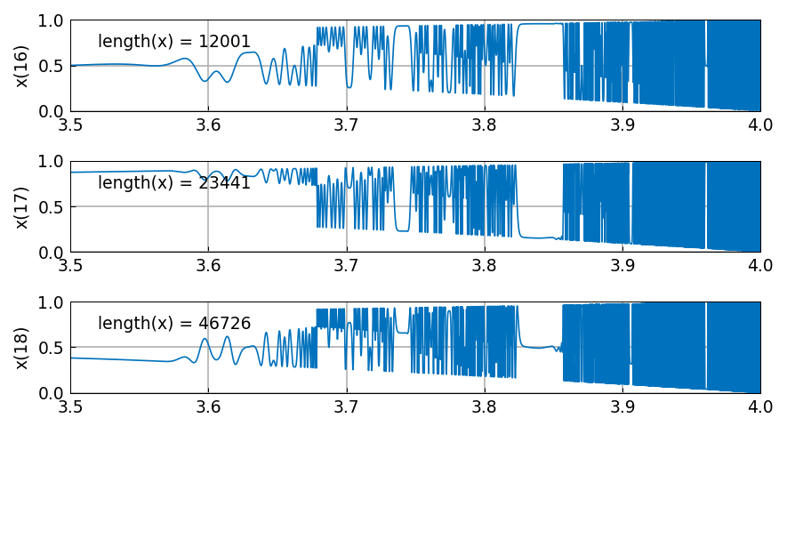
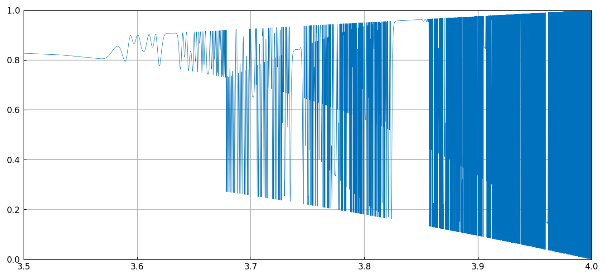
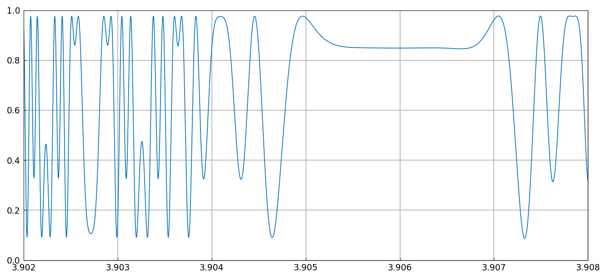

# Logistic map and chaos

*Nick Trefethen, July 2013*

[Original MATLAB Chebfun example](https://www.chebfun.org/examples/ode-nonlin/Logistic.html)

(Chebfun example ode-nonlin/Logistic.m)

This example comes from a presentation by Qiqi Wang at Oxford in June
2013.

The logistic map is the iteration

$$ x_{n+1} = r x_n (1 - x_n), $$

where $r$ is a parameter in the interval $[0,4]$. The map behaves
chaotically for certain larger values of $r$, and as $r$ increases one
has the classical example of period doubling as a route to chaos. A
picture appears on the back cover of Strang's *Introduction to Applied
Mathematics* [1].

Let us start our iteration with the constant value $x = 0.5$ and see how
it evolves for a range of values of $r$. Because $r$ is a chebfun, each
step is carried out on the whole parameter interval at once, and $x_n$ is
a polynomial in $r$ whose degree roughly doubles at every step. Here are
steps 0-3:

```python
r = chebfun(lambda r: r, domain=(0, 4))
x = 0.5 + 0*r
for n in range(4):
    ...
    x = r*x*(1 - x)
```



Here are steps 4-7:



Here are steps 8-11:



Let us zoom in on the region $[3.5,4]$ and look at steps 12-15:



And here are steps 16-18:



The reader can have some fun examining these pictures. Where do we see
period 1, period 2, period 4, chaos? How does this match what is known
about dependence on $r$?

Let us see the final plot more fully:



And let us zoom in on a small interval:



## The lengths, and three bugs they exposed

The `length(x)` printed on each panel is the number of Chebyshev
coefficients Chebfun keeps, and it is a sharp test: it depends on the
exact degree of the polynomial *and* on where the coefficient series is
chopped. Comparing against MATLAB Chebfun run under R2025b:

| $n$ | 0-6 | 7 | 8 | 9 | 10 | 11 | 12* | 13 | 14 | 15 | 16 | 17 | 18 |
|---|---|---|---|---|---|---|---|---|---|---|---|---|---|
| chebfunjax | 1…64 | 114 | 189 | 339 | 622 | 1208 | 793 | 1555 | 3033 | 6001 | 12001 | 23441 | 46726 |
| MATLAB | 1…64 | 108 | 189 | 339 | 677 | 1186 | 793 | 1576 | 3030 | 5961 | 11800 | 23446 | 46690 |

(*the restriction to $[3.5,4]$ happens before step 12.)

Getting here required fixing three separate defects, each of which made
`length()` wrong everywhere it is printed, and none of which produced a
visibly wrong picture:

- `0*r` kept its operand's length instead of collapsing to a length-1
  zero, so `x0 = 0.5 + 0*r` carried a spurious degree and
  $\deg x_{n+1} = 1 + 2\deg x_n$ doubled the error at every step.
  MATLAB's `@chebtech/mtimes.m` zeroes a tech whose vertical scale
  vanishes.
- multiplication did not simplify its result, where
  `@chebtech/times.m` does, so lengths grew as the exact product degree
  rather than the happy one.
- `restrict` did not simplify either. A polynomial restricted to a
  shorter interval is much smoother relative to that interval, so its
  series chops far earlier: step 12 is 793 coefficients on $[3.5,4]$,
  not the 2236 of the unrestricted iterate.

The values that still differ ($n = 7, 10, 11$, and the sub-percent
disagreements after the restriction) sit where the iterate has gone
chaotic and coefficients near machine epsilon decide where the series is
cut — the same regime in which
[SquareCycle](SquareCycle.md) parts company with MATLAB.

> **A note on the published figures.** The numbers on the
> chebfun.org page (`length(x) = 180, 324, 596, 1127` at steps 8-11)
> come from an older Chebfun and are not what MATLAB prints today; the
> table above was measured by running the example under R2025b. The
> curves are of course unchanged.

## References

1. G. Strang, *Introduction to Applied Mathematics*, Wellesley-Cambridge
   Press, 1986.

---

*Replica script: [`examples/ode-nonlin/logistic_replica.py`](https://github.com/ma-gilles/chebfunjax/blob/main/examples/ode-nonlin/logistic_replica.py).
Original example copyright by The University of Oxford and The Chebfun
Developers.*
