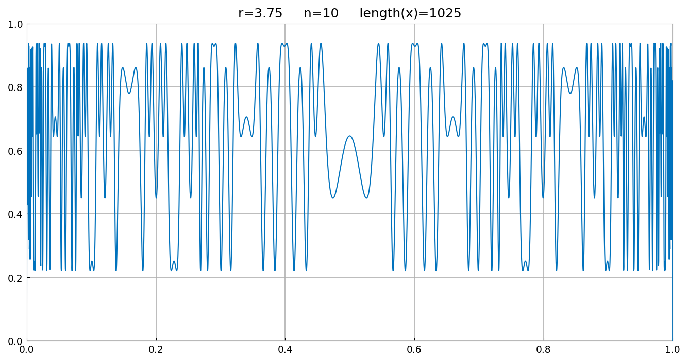
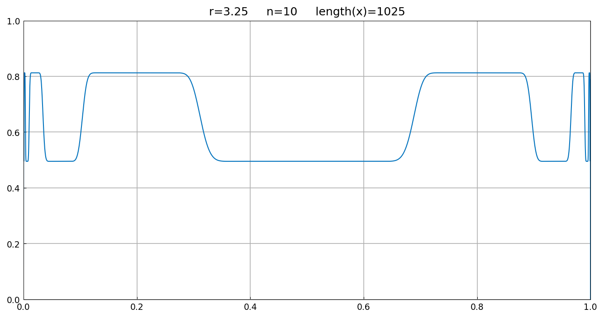
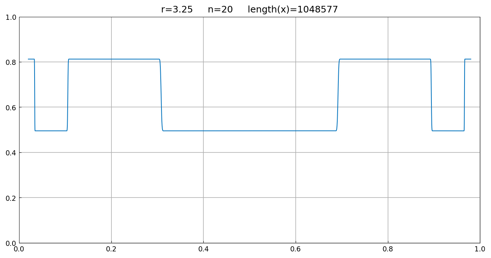
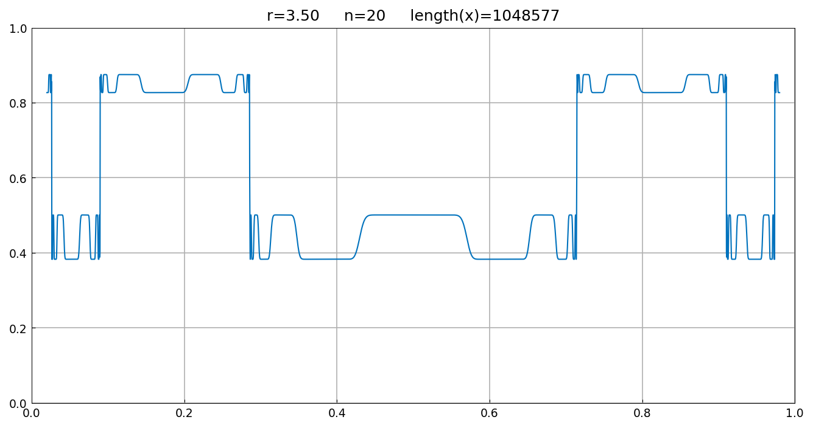

# Logistic map and chaos

*Nick Trefethen, August 2013*

[Original MATLAB Chebfun example](https://www.chebfun.org/examples/ode-nonlin/Logistic2.html)

(Chebfun example ode-nonlin/Logistic2.m)

Iterates of the logistic map $x \mapsto rx(1-x)$ can be composed as
chebfuns; the polynomial degree doubles with each iteration and the
plots reveal the onset of chaos. Ten iterations at $r = 3.75$ (chaotic)
and $r = 3.25$ (period-2):





Twenty iterations at $r = 3.25$ on $[0.02, 0.98]$ — almost all initial
points have settled onto the period-2 cycle, with values matching the
published page to the last digits:



```text
ans =
   0.495265168245477
ans =
   0.812427139446846
```

At $r = 3.5$ the attractor is a period-4 cycle:



```text
ans =
   0.500884210318981
ans =
   0.382819683208549
ans =
   0.874997263532757
ans =
   0.826940706746712
```

(Published: `0.495265168245476 / 0.812427139446847 / 0.500884210318974
/ 0.382819683208548 / 0.874997263532759 / 0.826940706746710` —
13-14-digit agreement, pure floating-point composition either way.)

---

*Replica script: [`examples/ode-nonlin/logistic2_replica.py`](https://github.com/ma-gilles/chebfunjax/blob/main/examples/ode-nonlin/logistic2_replica.py).
Original example copyright by The University of Oxford and The Chebfun
Developers.*
