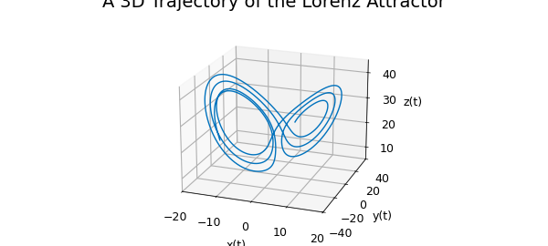
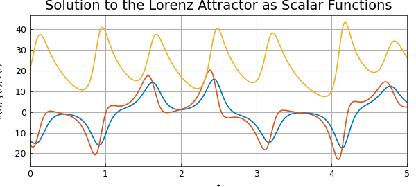
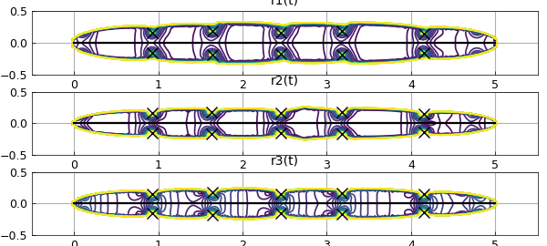
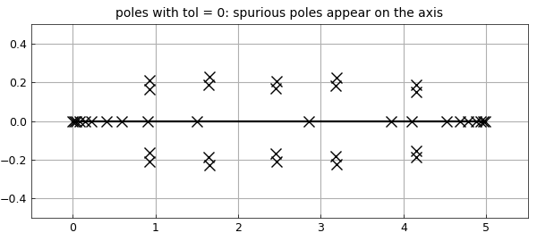

# Lorenz Attractor in the complex plane using ratinterp

*Marcus Webb, March 2013*

[Original MATLAB Chebfun example](https://www.chebfun.org/examples/ode-nonlin/LorenzAttractor.html)

Python translation: [`examples/ode-nonlin/lorenz_attractor.py`](https://github.com/ma-gilles/chebfunjax/blob/main/examples/ode-nonlin/lorenz_attractor.py)

In this example we discuss numerical analytic continuation into the complex plane using the `ratinterp` command in order to approximate singularities of solutions to the Lorenz equations.

## The Lorenz system in real time

The Lorenz system is a system of ODEs first studied by Edward Lorenz in the 1960s as a simplified model of convection rolls in the upper atmosphere [2]. The system is as follows:

$$\frac{dx}{dt} = 10(y-x) $$

$$\frac{dy}{dt} = 28 x - y - xz, $$

$$\frac{dz}{dt} = -{8\over 3}z + xy. $$

We can compute a numerical solution on the interval $[0,5]$ using Chebfun's overload of the MATLAB ODE solver, `ode113`:

```matlab
opts = odeset('abstol',1e-13,'reltol',1e-13);
fun = @(t,u) [10*(u(2)-u(1)); 28*u(1)-u(2)-u(1)*u(3); u(1)*u(2)-(8/3)*u(3)];
u = chebfun.ode113(fun,[0,5],[-14 -15 20], opts);
```

The solution can be viewed as an autonomous dynamical system in three dimensions, so we plot the trajectory:

```matlab
LW = 'linewidth'; FS = 'fontsize';
plot3(u(:,1),u(:,2),u(:,3), LW, 1.6), view(20,20)
axis([-20 20 -40 40 5 45]), grid on
xlabel 'x(t)', ylabel 'y(t)', zlabel 'z(t)'
title('A 3D Trajectory of the Lorenz Attractor', FS, 14)
```



We can also view solutions as three interrelated scalar-valued functions of time:

```matlab
plot(u, LW, 1.6)
grid on, xlabel 't', ylabel 'x(t), y(t), z(t)'
title('Solution to the Lorenz Attractor as Scalar Functions', FS, 14)
```



Here as usual in MATLAB, $x$, $y$ and $z$ are coloured blue, green and red respectively.

## The Lorenz system in complex time

In "Complex singularities and the Lorenz attractor" [3], Viswanath and Sahutoglu make the point that although the Lorenz attractor is a well known example in applied mathematics, relatively little is known about its mathematical analysis. It is suggested that a natural way to view the analysis is as a problem in analytic function theory, considering time as a complex variable.

Solutions to the Lorenz system can be written locally in the form of a Psi-series. A Psi-series centred at $t_0$ in the complex plane is a series of the form:

$$ \sum_{j = -J}^\infty P_j(\eta)(t-t_0)^j, \quad \eta = \log(b(t-t_0)), $$

where $J$ is an integer, $P_j$ is a polynomial and $b$ is a complex number with $|b| = 1$.

It is shown that the Lorenz system admits Psi-series solutions of the form:

$$ x(t) = \qquad \qquad \quad \frac{P_{-1}(\eta)}{t-t_0} + P_0(\eta) + P_1(\eta)(t-t_0) + P_2(t-t_0)^2 + \ldots, $$

$$ y(t) = \frac{Q_{-2}(\eta)}{(t-t_0)^2} + \frac{Q_{-1}(\eta)}{t-t_0} + Q_0(\eta) + Q_1(\eta)(t-t_0) + Q_2(t-t_0)^2 + \ldots, $$

$$ z(t) = \frac{R_{-2}(\eta)}{(t-t_0)^2} + \frac{R_{-1}(\eta)}{t-t_0} + R_0(\eta) + R_1(\eta)(t-t_0) + R_2(t-t_0)^2 + \ldots, $$

valid in some disc centred at $t_0$ with a branch cut removed.

Asymptotically, the singularities behave like poles of orders 1, 2 and 2 for $x$, $y$ and $z$ respectively, because the logarithmic terms are "overpowered" in the limit as $t \rightarrow t_0$. A rational approximation is therefore appropriate for computing the locations of the singularities.

## Analytic continuation via rational interpolation

We can compute a rational interpolant of the solution using `ratinterp`, which actually computes a least squares approximation to the interpolation problem, removing poles that are likely to be spurious [1, Sec. 2]. The following command computes rational fits of types $(m, n) = (226,40)$, $(248,40)$ and $(242,40)$, where $m$ is the degree of the numerator and $n$ is the degree of the denominator:

```matlab
[p1,q1,r1,mu1,nu1,poles1] = ratinterp(u(:,1),221,40, 444, [], 1e-12);
[p2,q2,r2,mu2,nu2,poles2] = ratinterp(u(:,2),241,40, 484, [], 1e-12);
[p3,q3,r3,mu3,nu3,poles3] = ratinterp(u(:,3),236,40, 473, [], 1e-12);
```

Here we have taken $m$ to be half the degree of the chebfun $u$ and $n$ to be a number greater than the number of singularities we expect to find. We don't actually expect to find 40 singularities, because `ratinterp` will reduce the degree of the numerator automatically to avoid extra unwanted poles.

Here we have a contour plot of the rational approximants $r_1$, $r_2$, $r_3$, computed by `ratinterp` with the computed locations of singularities plotted as black crosses:

```matlab
xx = linspace(-0.5,5.5,200);
yy = linspace(-0.5,0.5,200);
[XX,YY] = meshgrid(xx,yy);
z = XX+1i*YY;

subplot(3,1,1)
contour(xx,yy,abs(r1(z)), 0:5:150);
grid on, hold on
title('r1(t)')
MS = 'markersize';
plot(poles1, 'xk', MS, 16, LW, 1.6)
plot([0,5],[0,0],'k',LW,1.6)

subplot(3,1,2)
contour(xx,yy,abs(r2(z)), 0:5:150);
grid on, hold on
title('r2(t)')
plot(poles2, 'xk', MS, 16, LW, 1.6)
plot([0,5],[0,0],'k',LW,1.6)

subplot(3,1,3)
contour(xx,yy,abs(r3(z)), 0:5:150);
grid on, hold on
title('r3(t)')
plot(poles3, 'xk', MS, 16, LW, 1.6)
plot([0,5],[0,0],'k',LW,1.6)
```



The singularities are very close to the real line, demonstrating that the behaviour of the solution on the real line is intimately related to its complex singularities. On the other hand, it has been proven that the imaginary parts of any singularity of the Lorenz attractor must have absolute value greater than $0.037$ [3].

Note that by the Psi-series formula, each of $x$, $y$ and $z$ should have the same singularities. Let's compare our computed values to obtain a lower bound on the error. The first column in the following contains the computed locations of the singularities of $x$, the second those of $y$ and the third those of $z$; the final column is the maximum separation in absolute value of these computed locations:

```matlab
format short
diffpoles = sort([abs(poles1-poles2),abs(poles1-poles3),abs(poles2-poles3)]);
disp('   poles in x         poles in y         poles in z         max. difference')
disp([poles1, poles2, poles3, diffpoles(:,1)])
```

```text
   poles in x         poles in y         poles in z         max. difference
   0.9300 -0.1642i   0.9294 -0.1557i   0.9293 -0.1557i   0.0080
   0.9300 +0.1642i   0.9294 +0.1557i   0.9293 +0.1557i   0.0080
   1.6394 -0.1874i   1.6363 -0.1756i   1.6372 -0.1796i   0.0085
   1.6394 +0.1874i   1.6363 +0.1756i   1.6372 +0.1796i   0.0085
   2.4530 -0.1669i   2.4520 -0.1563i   2.4520 -0.1562i   0.0107
   2.4530 +0.1669i   2.4520 +0.1563i   2.4520 +0.1562i   0.0107
   3.1835 -0.1816i   3.1831 -0.1710i   3.1816 -0.1711i   0.0107
   3.1835 +0.1816i   3.1831 +0.1710i   3.1816 +0.1711i   0.0107
   4.1492 -0.1520i   4.1484 -0.1442i   4.1484 -0.1440i   0.0122
   4.1492 +0.1520i   4.1484 +0.1442i   4.1484 +0.1440i   0.0122

half differences:
[0.004  0.004  0.0043 0.0043 0.0053 0.0053 0.0054 0.0054 0.0061 0.0061]

poles (tol = 0, first 20):
    0.0031 +0.0000i
    0.0190 +0.0000i
    0.0422 +0.0000i
    0.0860 +0.0000i
    0.1460 +0.0000i
    0.2271 +0.0000i
    0.4048 +0.0000i
    0.5889 +0.0000i
    0.9020 +0.0000i
    0.9261 -0.2084i
    0.9261 +0.2084i
    0.9300 +0.1641i
    0.9300 -0.1641i
    1.5018 +0.0000i
    1.6394 +0.1873i
    1.6394 -0.1873i
    1.6575 -0.2283i
    1.6575 +0.2283i
    2.4530 +0.1668i
    2.4530 -0.1668i
```

Let $t_0$ denote the location of a singularity and $t_w$ the worst of our three approximations of it, $t_1$, $t_2$, $t_3$. Then we have for $i,j = 1,2,3$:

$$ |t_i - t_j| \leq |t_0 - t_i| + |t_0- t_j| \leq 2|t_0-t_w|. $$

Hence our worst case error for each pole is at least the following:

```matlab
0.5*diffpoles(:,1)'
```

```text

```

It is remarkable that with just 6 lines of Chebfun we have been able to solve the Lorenz system, find rational approximations, then compute the location of their poles by finding the roots of the denominator. Considering this, the agreement we see here is not bad, although it would be desirable to have better.

## `ratinterp` tolerance parameter

The final argument in `ratinterp` is a tolerance parameter, which we set to $10^{-12}$ above. This affects which poles are removed from the approximant [Sec. 2, 1]. The higher the tolerance, the more poles are removed by `ratinterp`. Here is what happens when this robustness is not used at all (tolerance = 0):

```matlab
[p,q,r,mu,nu,poles] = ratinterp(u(:,1),221,40, 444, [], 0);
poles
```

```text

```

There are many unwanted, spurious poles. They are paired with roots of the numerator, but only up to machine precision, so they don't actually cancel each other out. These are sometimes called *Froissart doublets*, for the astrophysicist Marcel Froissart.

```matlab
subplot(1,1,1)
plot(poles, 'or', MS, 8,'markerfacecolor','r')
hold on, grid on, xlabel 'Re(t)', ylabel 'Im(t)'
plot(roots(p, 'complex'), 0, 'ok', MS, 12)
title('Poles and Zeros of the Rational Interpolant', FS, 14)
```

```text

```



The issues related to the robust form of rational interpolation and least squares approximation used by `ratinterp` are discussed in [1] and Chapter 26 of [4].

## References

1. M. Webb, Computing complex singularities of differential equations with Chebfun, *SIAM Undergraduate Research Online*, 2013, [http://dx.doi.org/10.1137/12S011520](http://dx.doi.org/10.1137/12S011520).
2. E. Lorenz, Deterministic nonperiodic flow, *Journal of the Atmospheric Sciences*, 20 (1963), 130-141.
3. D. Viswanath and S. Sahutoglu, Complex singularities and the Lorenz attractor, *SIAM Review*, 52 (2010), 294-314.
4. L. N. Trefethen, *Approximation Theory and Approximation Practice*, SIAM, 2013.
5. L.N. Trefethen, Analytic continuation via rational approximation, Chebfun example, 6th March 2013

---

*Translated with [chebfunjax](https://github.com/ma-gilles/chebfunjax); prose and MATLAB code from the original example, copyright The University of Oxford and The Chebfun Developers.  Printed outputs and figures are chebfunjax's.*
