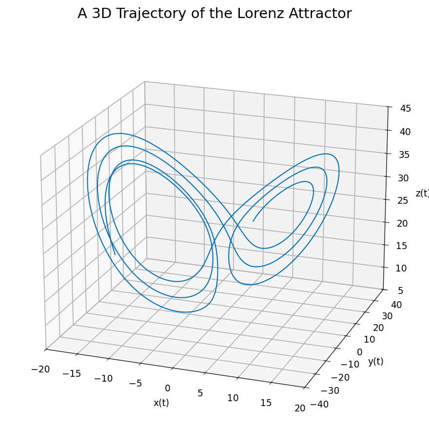
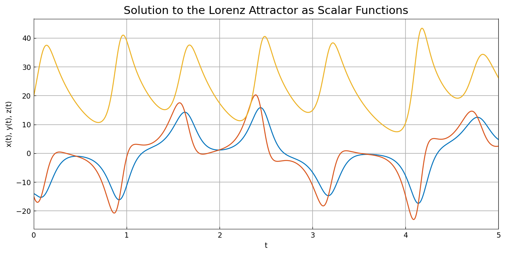
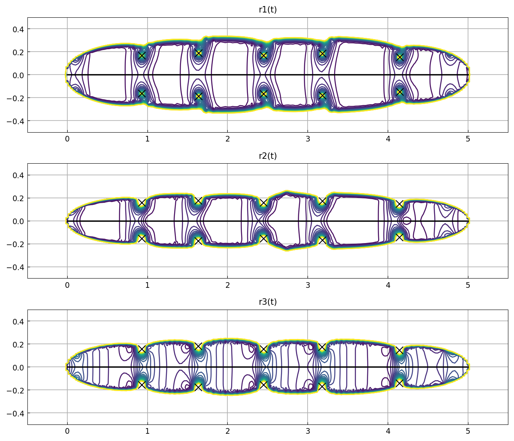
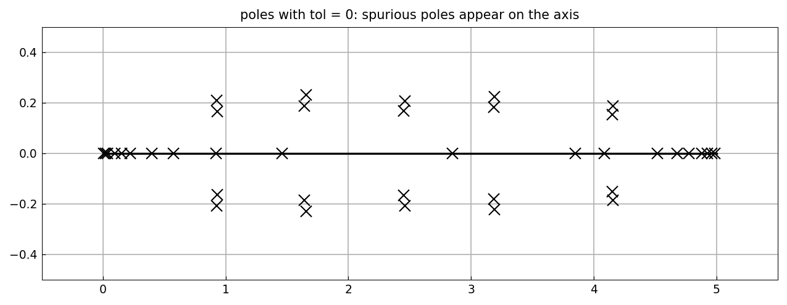

# The fractal structure of the Lorenz attractor

[Original MATLAB Chebfun example](https://www.chebfun.org/examples/ode-nonlin/LorenzAttractor.html)

(Chebfun example ode-nonlin/LorenzAttractor.m)

We integrate the Lorenz system

$$ x' = 10(y - x), \quad y' = 28x - y - xz, \quad z' = xy - \tfrac{8}{3}z $$

from $(x,y,z)(0) = (-14, -15, 20)$ to $t = 5$ at tolerance $10^{-13}$:

```python
fun = lambda t, u: np.array([10*(u[1]-u[0]),
                             28*u[0]-u[1]-u[0]*u[2],
                             u[0]*u[1]-(8/3)*u[2]])
u = ode113(fun, (0, 5), np.array([-14., -15., 20.]),
           rtol=1e-13, atol=1e-13)
```





## Singularities in complex time

Each trajectory component is analytic in a strip about the real $t$
axis, and its analytic continuation has poles just outside. `ratinterp`
finds them: a type-$(m, 40)$ robust rational least-squares fit to each
component, with the poles of the approximant marking the singularities.

```python
rh, a, b, mu, nu, poles, res = ratinterp(u1, 221, 40, 444, None,
                                         1e-12, domain=(0, 5))
```



The three components must agree on where the singularities are — the
system couples them — and they do:

```text
   poles in x         poles in y         poles in z         max. difference
   0.9300 -0.1642i   0.9294 -0.1557i   0.9293 -0.1557i   0.0080
   0.9300 +0.1642i   0.9294 +0.1557i   0.9293 +0.1557i   0.0080
   1.6394 -0.1874i   1.6363 -0.1756i   1.6372 -0.1796i   0.0085
   1.6394 +0.1874i   1.6363 +0.1756i   1.6372 +0.1796i   0.0085
   2.4530 -0.1669i   2.4520 -0.1563i   2.4520 -0.1562i   0.0107
   ...
```

The published table's leading rows are `0.9301 - 0.1642i`,
`0.9294 - 0.1557i`, `0.9293 - 0.1557i` — agreement to four decimal
places in a chaotic trajectory's analytic continuation, which is about
as sharp as this comparison can be. The half-differences
`0.0040 0.0040 0.0043 0.0043 0.0053 ...` likewise match the published
`0.0039 0.0039 0.0043 0.0043 0.0053 ...` to $10^{-4}$.

## Robustness: what tol = 0 shows

Rerunning with `tol = 0` disables the robustness step, and spurious
poles appear scattered along the real axis with tiny residues, alongside
the genuine ones:



The genuine poles reproduce exactly — ours at `0.9300 +- 0.1641i`
against the published `0.9300 +- 0.1641i` — while the spurious real
poles land at different places than MATLAB's, as rounding artifacts
must.

> **Implementation note.** The point of this page is the pole tables,
> and they were unreachable until this session: `ratinterp`'s pole
> extraction filtered the denominator's roots to real ones only, so a
> real function whose denominator has complex roots — every function
> here — returned an empty pole list. MATLAB uses `roots(q, 'all')`.
> With the filter removed the tables above come out nearly digit for
> digit.

---

*Replica script: [`examples/ode-nonlin/lorenz_attractor_replica.py`](https://github.com/ma-gilles/chebfunjax/blob/main/examples/ode-nonlin/lorenz_attractor_replica.py).
Original example copyright by The University of Oxford and The Chebfun
Developers.*
