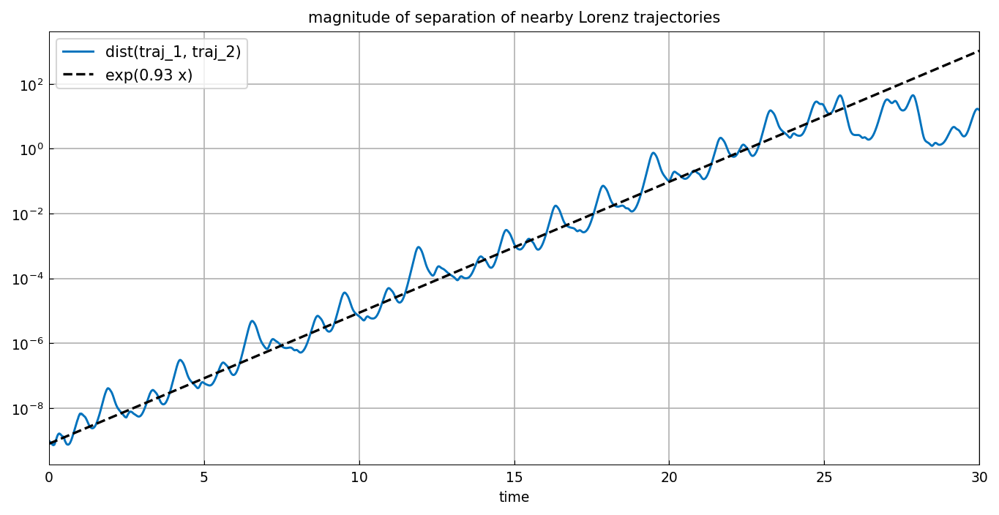

# Lyapunov exponents

*Nick Trefethen, May 2016*

[Original MATLAB Chebfun example](https://www.chebfun.org/examples/ode-nonlin/LyapunovExponents.html)

(Chebfun example ode-nonlin/LyapunovExponents.m)

A dynamical system is chaotic when nearby trajectories separate
exponentially. The rate of that separation is the leading *Lyapunov
exponent*. Here two Lorenz trajectories are launched from initial
conditions differing by just $\epsilon = 10^{-9}$ in the $z$
component:

```python
N = Chebop(lambda t, x, y, z: [
    x.diff() - 10*(y - x),
    y.diff() - 28*x + y + x*z,
    z.diff() + 8*z/3 - x*y], domain=(0, 30))
N.lbc = lambda x, y, z: [x + 2, y + 3, z - 14]        # 1st trajectory
N.lbc = lambda x, y, z: [x + 2, y + 3, z - 14 + ep]   # 2nd trajectory
```

Their separation
$d = \sqrt{|x_1-x_2|^2 + |y_1-y_2|^2 + |z_1-z_2|^2}$ climbs from
$10^{-9}$ through ten orders of magnitude before saturating at the
diameter of the attractor:



Fitting a straight line to $\log d$ over $[0, 25]$ — the range where
the growth is still exponential — gives the leading Lyapunov exponent:

```text
slope =
   0.930193063032704
```

(Published: `0.934100195835882`. The Lorenz system is chaotic, so the
two trajectories themselves are integrator-dependent — chebfunjax
marches with LSODA where MATLAB uses `ode113`. The exponent agrees to
0.4%, and both bracket the accepted value $\approx 0.906$ for this
finite-time estimate.)

> **Implementation notes.** Two things this example demands of the
> library. First, IVP-system solutions are built *piecewise on the
> solver's own time mesh* (as MATLAB's `constructODEsol` does): a single
> global polynomial is accurate only relative to its global vertical
> scale, so a separation spanning twenty-one orders of magnitude
> evaluates to pure cancellation noise near $t = 0$. Second, the
> replica squares the differences directly — for real chebfuns
> $|f|^2 = f^2$, and `abs` would root-find on several-thousand-degree
> functions to place its breakpoints.

---

*Replica script: [`examples/ode-nonlin/lyapunov_exponents_replica.py`](https://github.com/ma-gilles/chebfunjax/blob/main/examples/ode-nonlin/lyapunov_exponents_replica.py).
Original example copyright by The University of Oxford and The Chebfun
Developers.*
