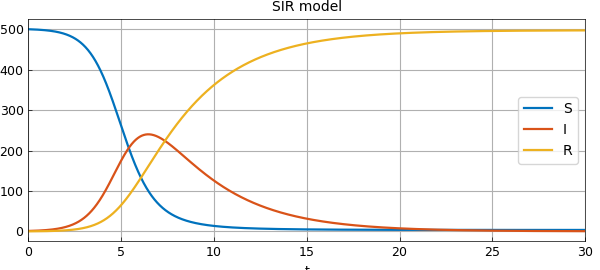
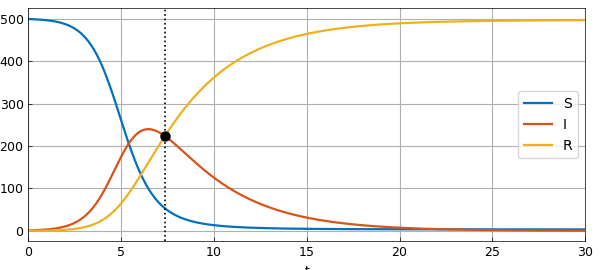
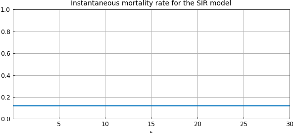

# Modelling infectious disease outbreaks

*Hrothgar, October 2014*

[Original MATLAB Chebfun example](https://www.chebfun.org/examples/ode-nonlin/ModellingDiseases.html)

Python translation: [`examples/ode-nonlin/modelling_diseases.py`](https://github.com/ma-gilles/chebfunjax/blob/main/examples/ode-nonlin/modelling_diseases.py)

Many mathematical models exist for the spread of disease. This is partly because as epidemiology matured, more sophisticated models were developed. It is also because not all diseases spread in the same fashion. In this example we explore one of the best-known models of disease spread, the famous SIR model. The SIR model is called "compartmental" because it groups members of a population into compartments -- for example, "infected" and "uninfected" -- which interact according to a system of differential equations.

The problem posed in this example is an initial value problem, and its solution over a large time interval is made possible by the IVP capabilities released with version 5.1 of Chebfun in December 2014.

## The SIR model

The most famous mathematical model of epidemics is the SIR model. This model groups members of a fixed population as susceptible (S), infected (I), or recovered (R). The dynamics dictate a one-way track: susceptible members may become infected, and infected individuals may recover, but that is all. So beginning with a nonzero number of infected people, after enough time everyone ends up recovered.

The model is a great simplification of how most diseases actually spread: it ignores incubation period; it assumes full contact among the whole population, ignoring geographic constraints; it assumes everyone is equally susceptible to the disease; and it treats the population as being continuous rather than discrete. Nevertheless, its assumptions about immunity make it a good model for measles, mumps, and rubella, which are all highly contagious diseases that infected people eventually develop an immunity to.

The SIR equations are $$ \frac{d S}{d t} = -c I S, $$ $$ \frac{d I}{d t} = c I S - r I, $$ $$ \frac{d R}{d t} = r I. $$ The positive constants $c$ and $r$ are called the contact rate (or transmission rate) and recovery rate, and are determined empirically for a given disease. Looking at them for a while, you'll see that these equations all make sense intuitively. For example, the rate of increase of the population of recovered individuals is proportional to the size of the population of infected individuals.

Here is a chebop for the SIR model.

```matlab
contact_rate  = .003;
recovery_rate = .3;

op = @(x,S,I,R) [ ...
    diff(S) + contact_rate*I*S
    diff(I) - contact_rate*I*S + recovery_rate*I
    diff(R) - recovery_rate*I
    ];

N = chebop(op, [0, 30]);
```

The initial conditions will be that out of population of 501 there is a single infected individual.

```matlab
N.lbc = @(S,I,R) [ ...
        S - 500
        I - 1
        R
    ];
```

We will use chebop's nonlinear backslash syntax to solve the problem.

```matlab
[S,I,R] = N\0;
```

Here is a plot of the solution.

```matlab
plot([S I R])
legend('S','I','R')
title('SIR model')
xlabel('t')
```



So beginning from a small fraction of infected people, eventually the entire population gets the disease and recovers (or dies). Notice that if $I(0)=0$, the solution component for $I$ would be the steady function $I(t)=0$, which is an unstable equilibrium of the system.

What is the largest number of people infected at a particular time?

```matlab
round(max(I))
```

```text
ans =
   240
```

Nearly half the population! At what time is the number of infected people equal to the number of recovered people?

```matlab
t_eq = roots(I-R)
plot([S I R]), legend('S','I','R'), xlabel('t'), hold on
plot(t_eq*[1; 1], ylim(gca), 'k:')
plot(t_eq, I(t_eq), 'k.', 'MarkerSize', 15)
```

```text
t_eq =
   7.355455438402847
```



Chebfun makes such computations remarkably easy.

What about the instantaneous mortality rate? A natural measure of mortality rate is $$ M(t) = \frac{\rho R(t)}{\int_0^t I(\xi) d\xi}, $$ where $0\leq\rho\leq 1$ denotes the average fraction of people who die from the disease. That is, the mortality rate at time $t$ is the number of people who have died from the disease divided by the total number of people who have been infected up to time $t$. Here is the instantaneous mortality rate as a function of time.

```matlab
hold off
rho = .4;                   % 40 percent of infected people die
plot(rho*R/cumsum(I))       % The instantaneous mortality rate
ylim([0 1])
xlabel('t')
title('Instantaneous mortality rate for the SIR model')
```



It turns out that $M(t)$ is constant and equal to $\rho r$, the product of $\rho$ with the recovery rate.

For this model, it is perhaps unsurprising that the instantaneous mortality rate is constant. But it is important to note that in reality that is not always the case. In the case of the 2014 Ebola epidemic in West Africa, for instance, other factors are at play to make the transmission rate $c$ variable, actually an increasing function of time. When the transmission rate $c$ is increasing so $dc(t)/dt > 0$, the disease spreads increasingly fast and the the instantaneous mortality rate actually *decreases*. Once the infection levels peak, however, the mortality rate skyrockets.

## References

1. Daley, D. J. & Gani, J. *Epidemic Modeling: An Introduction.* NY: Cambridge University Press (2005).
2. [Wikipedia: Compartmental models in epidemiology](https://en.wikipedia.org/wiki/Compartmental_models_in_epidemiology).

---

*Translated with [chebfunjax](https://github.com/ma-gilles/chebfunjax); prose and MATLAB code from the original example, copyright The University of Oxford and The Chebfun Developers.  Printed outputs and figures are chebfunjax's.*
