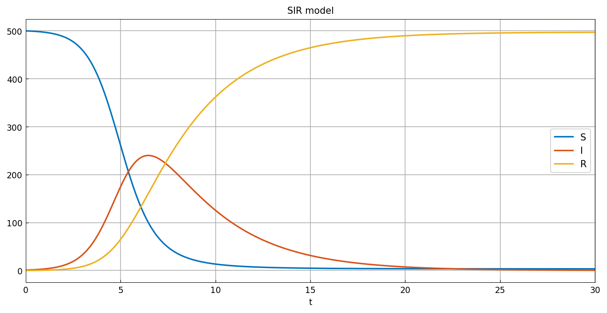
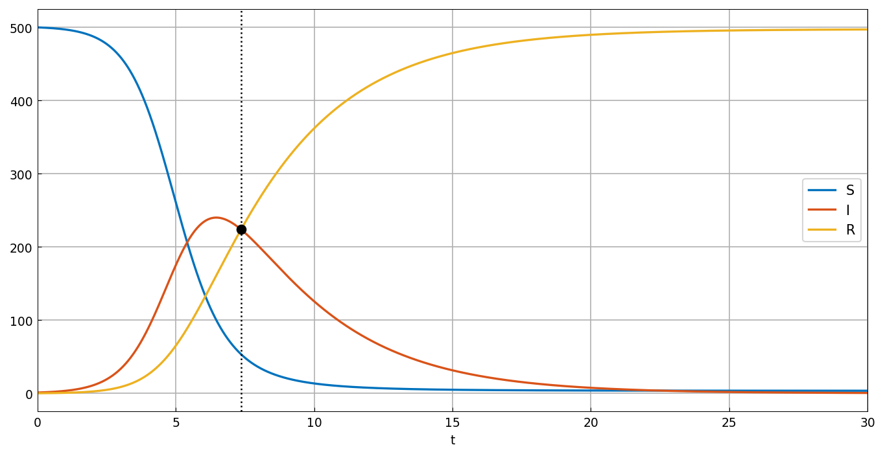
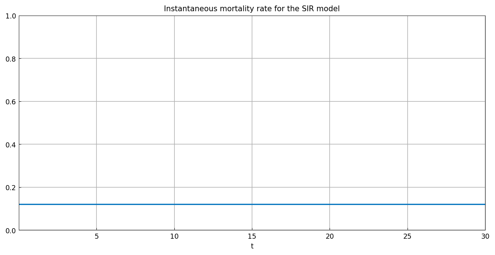

# Modelling diseases

*Toby Driscoll, November 2014*

[Original MATLAB Chebfun example](https://www.chebfun.org/examples/ode-nonlin/ModellingDiseases.html)

(Chebfun example ode-nonlin/ModellingDiseases.m)

The SIR model splits a population into susceptible, infected and
recovered groups:

$$ S' = -\beta IS, \qquad I' = \beta IS - \gamma I,
   \qquad R' = \gamma I, $$

with contact rate $\beta = 0.003$, recovery rate $\gamma = 0.3$, and
$S(0) = 500$, $I(0) = 1$, $R(0) = 0$:

```python
N = Chebop(lambda x, S, I, R: [
    S.diff() + contact_rate*I*S,
    I.diff() - contact_rate*I*S + recovery_rate*I,
    R.diff() - recovery_rate*I], domain=(0, 30))
N.lbc = lambda S, I, R: [S - 500, I - 1, R]
S, I, R = N.solve(0)
```



The epidemic peaks at

```text
ans =
   240
```

infected individuals — matching the published value exactly. The time
at which the infected and recovered populations are equal is a root of
$I - R$:

```text
t_eq =
   7.355455438457509
```

(Published: `7.355455438450330` — agreement to eleven digits.)



Finally, if 40% of infected people die, the instantaneous mortality
rate is $\rho R / \int I$:



The curve is flat at $0.12$, and exactly so: the model gives
$R' = \gamma I$ with $R(0) = 0$, hence $R = \gamma\int I$ and
$\rho R / \int I = \rho\gamma = 0.4 \times 0.3$ identically. That the
computed ratio is constant to plotting accuracy is a check that the
solver's `cumsum` and its solution of the $R$ equation agree.

---

*Replica script: [`examples/ode-nonlin/modelling_diseases_replica.py`](https://github.com/ma-gilles/chebfunjax/blob/main/examples/ode-nonlin/modelling_diseases_replica.py).
Original example copyright by The University of Oxford and The Chebfun
Developers.*
