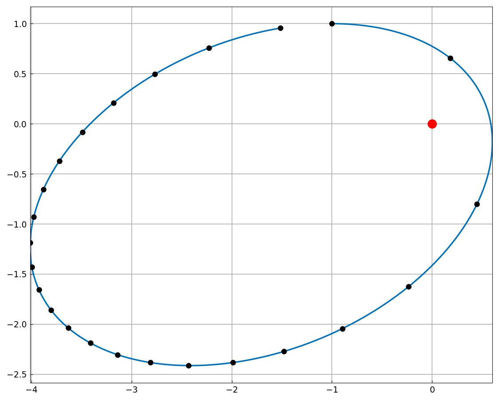
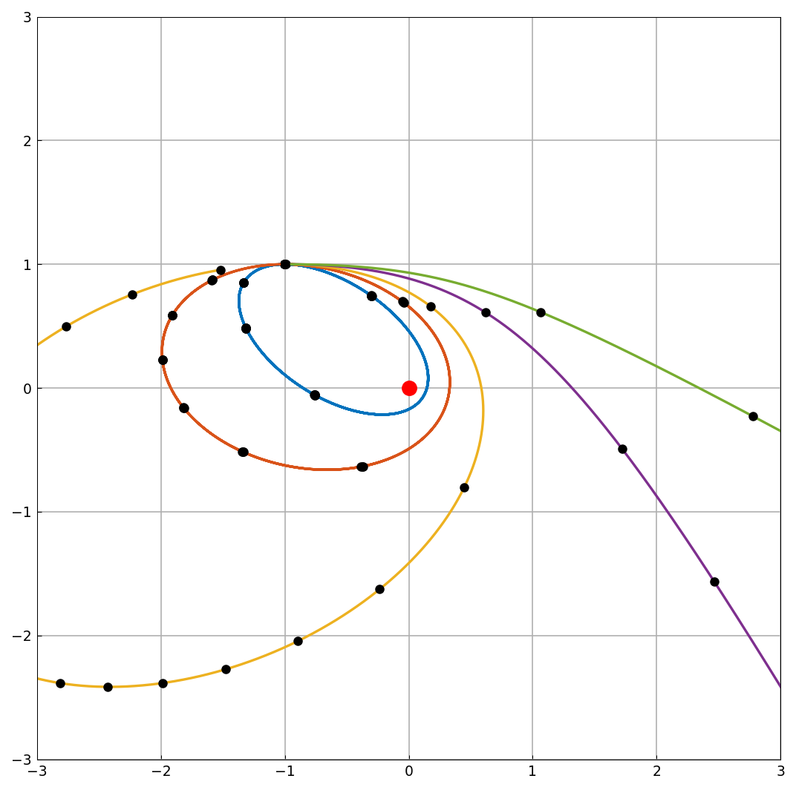
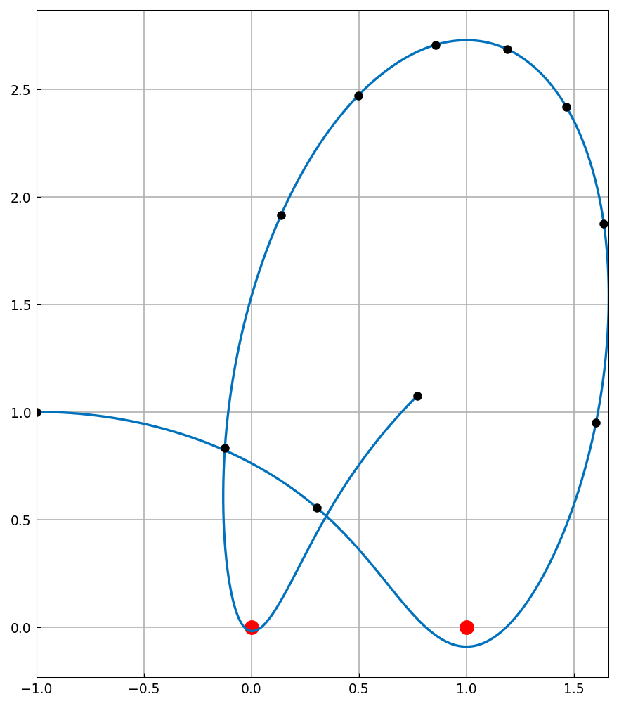
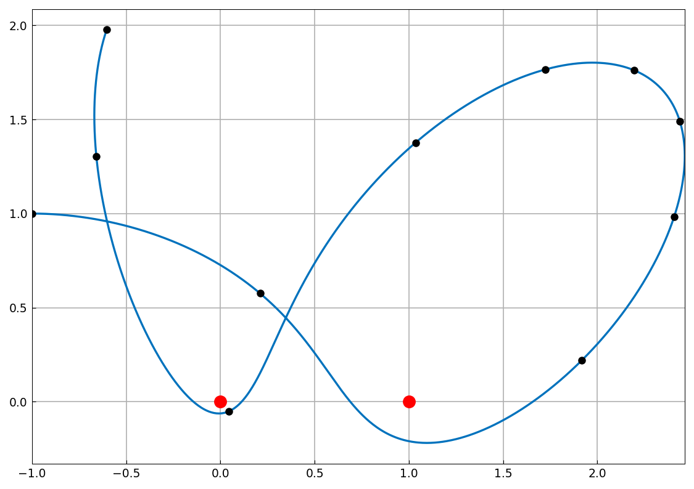

# Orbiting around fixed masses

*Nick Trefethen, May 2011*

[Original MATLAB Chebfun example](https://www.chebfun.org/examples/ode-nonlin/Orbits.html)

(Chebfun example ode-nonlin/Orbits.m)

Planar orbits are naturally posed in the complex plane: a body at
position $u(t) \in \mathbb{C}$ attracted to a fixed mass at the origin
obeys

$$ u'' = -\frac{u}{|u|^3}, $$

integrated here with `ode113` from $u(0) = -1 + i$ and $u'(0) = v$.
The dots mark integer times:



Varying the initial speed $v = 0.5, 0.75, 1, 1.5, 2$ traces a family
of ellipses, parabolas and hyperbolas:



With *two* fixed masses, at $0$ and $1$,

$$ u'' = -\frac{u}{|u|^3} - \frac{u-1}{|u-1|^3}, $$

the motion is far richer. At $v = 1$:



and at $v = 0.9$ the body swings very close past the left mass:



The arc length of that orbit and its closest approach to a mass:

```text
orbit_length =
  10.646554656349863
closeness =
   0.062124928789848
```

(Published: `10.646554662628876` and `0.062124928768419` — nine and
ten digits of agreement respectively, which is about as much as a
near-singular passage of this kind preserves.)

> **Implementation note.** Two gaps in the ODE solvers had to be closed
> for this page. Vector-valued problems were unimplemented — `ode45` and
> `ode113` now return one chebfun per component, indexed `uv[k]` where
> MATLAB writes `uv(:,k)`. And a complex initial state was silently cast
> to `float64`, discarding the imaginary part: the orbit then started
> from the wrong point and fell into the singularity, reported only as
> an opaque step-size failure.

---

*Replica script: [`examples/ode-nonlin/orbits_replica.py`](https://github.com/ma-gilles/chebfunjax/blob/main/examples/ode-nonlin/orbits_replica.py).
Original example copyright by The University of Oxford and The Chebfun
Developers.*
