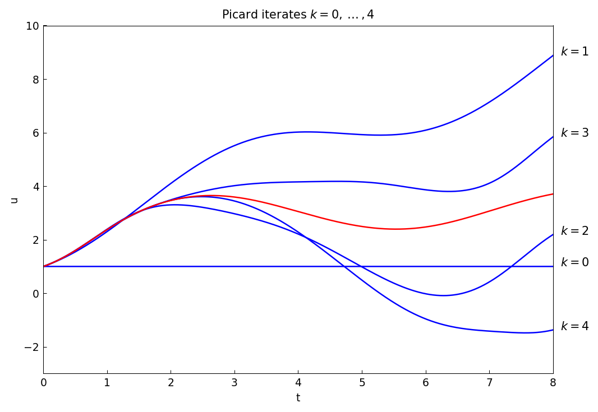
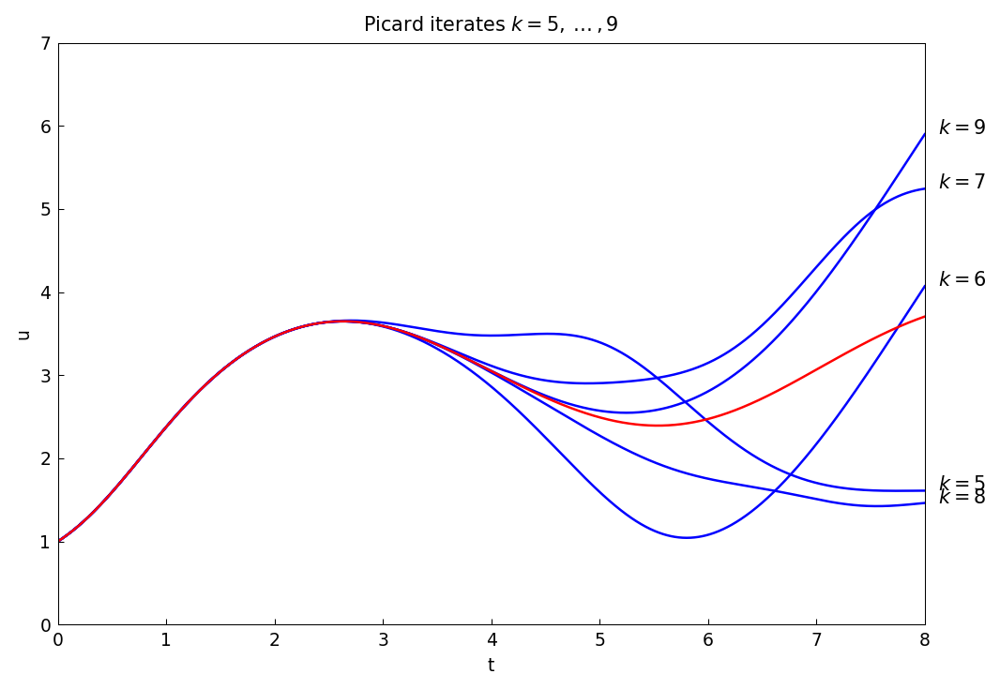
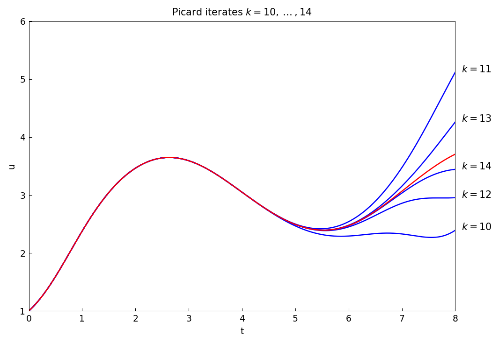
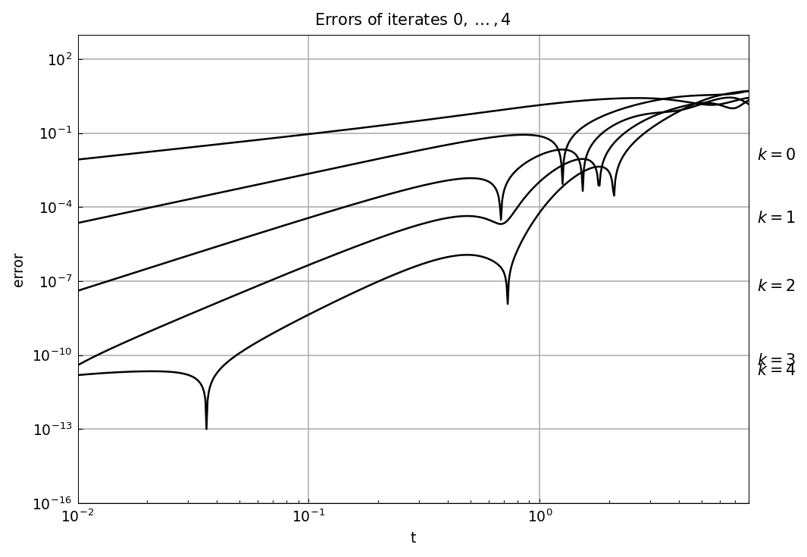

# Picard iteration for ODE existence proof

*Nick Trefethen, January 2016*

[Original MATLAB Chebfun example](https://www.chebfun.org/examples/ode-nonlin/Picard.html)

(Chebfun example ode-nonlin/Picard.m)

In the theory of ODEs there is a basic theorem of existence and
uniqueness that is the foundation for everything (see, e.g., [1]).

**Theorem.** *If $f$ is continuous with respect to $t$ and Lipschitz
continuous with respect to $u$, the first-order IVP*

$$ u' = f(t,u), \quad t \in [0,d], \qquad u(0) = u_0 $$

*has a unique solution.*

This theorem applies to systems as well as scalars, and since a
higher-order equation can be written as a system of first-order
equations, it covers higher-order ODEs too.

The standard proof is based on Picard (= Picard-Lindelöf) iteration, and
it can be illustrated using `cumsum`. The proof starts from noting that
the ODE is equivalent to

$$ u(t) = u_0 + \int_0^t f(s, u(s))\,ds, $$

and considers successively

$$ u^{(0)} = u_0, \quad
   u^{(1)} = u_0 + \int_0^t f(s, u^{(0)}(s))\,ds, \quad
   u^{(2)} = u_0 + \int_0^t f(s, u^{(1)}(s))\,ds, $$

and so on. One can prove that this process converges to the unique
solution.

Let us see the iteration in action for

$$ u' = \sin(u) + \sin(t), \quad t \in [0,8], \quad u(0) = 1. $$

```python
d, u0 = 8.0, 1.0
t = chebfun(lambda t: t, domain=(0, d))
L = Chebop(lambda t, u: u.diff() - u.sin(), domain=(0, d))
L.lbc = u0
uexact = L.solve(t.sin())

u = u0 + 0*t
f = lambda u, t: u.sin() + t.sin()
for k in range(5):
    ...
    u = u0 + f(u, t).cumsum()
```

This first plot shows iterates $k = 0,\dots,4$, with the exact solution
in red:



A second plot shows $k = 5,\dots,9$:



A third shows $k = 10,\dots,14$:



These plots show vividly the kind of convergence one can expect from a
Picard iteration: starting at the initial condition, sweeping slowly
across the domain. There is a numerical method based on this idea,
called *waveform relaxation*, but one can see immediately from the
pictures that it is unlikely to be efficient over long time intervals.

To see the convergence quantitatively, here are the errors of iterates
$0,\dots,4$ against $t$ on a log-log plot. The zeroth iterate has
accuracy $O(t)$, the first $O(t^2)$, and so on:



Fitting each curve over $t \in [0.012, 0.1]$ confirms the orders, and
the magnitudes agree with the published figure:

| $k$ | fitted order | expected | error at $t = 0.012$ |
|---|---|---|---|
| 0 | $t^{1.032}$ | $t^1$ | 1.03e-02 |
| 1 | $t^{2.003}$ | $t^2$ | 3.33e-05 |
| 2 | $t^{2.960}$ | $t^3$ | 7.15e-08 |
| 3 | $t^{3.970}$ | $t^4$ | 9.76e-11 |
| 4 | $t^{2.532}$ | $t^5$ | 1.79e-11 |

> **Why $k = 4$ falls short.** The published curve for $k = 4$ reaches
> about $10^{-14}$ at $t = 10^{-2}$; ours flattens at $1.8\times
> 10^{-11}$. The floor is not the iteration but the reference solution
> it is measured against: our `uexact` has
> $\lVert u' - \sin u - \sin t\rVert_\infty = 3.6\times 10^{-9}$ and
> $u(0) - 1 = 7.8\times 10^{-12}$, so no iterate can appear more
> accurate than that. It is not a tolerance setting either —
> `tol = 1e-10`, `1e-12` and `1e-14`, at `n_min = 8` or `64`, all return
> the identical length-58 solution with the same residual. The adaptive
> solve declares convergence while the continuous residual is still
> $3.6\times 10^{-9}$. The same gap shows up in
> [Breakpoints](../ode-linear/Breakpoints.md), where the reported
> solution lengths are the raw collocation sizes because the
> coefficients have not decayed when the loop stops.

## References

1. E. Hairer, S. P. Nørsett and G. Wanner, *Solving Ordinary
   Differential Equations I: Nonstiff Problems*, Springer, 1987.

---

*Replica script: [`examples/ode-nonlin/picard_replica.py`](https://github.com/ma-gilles/chebfunjax/blob/main/examples/ode-nonlin/picard_replica.py).
Original example copyright by The University of Oxford and The Chebfun
Developers.*
