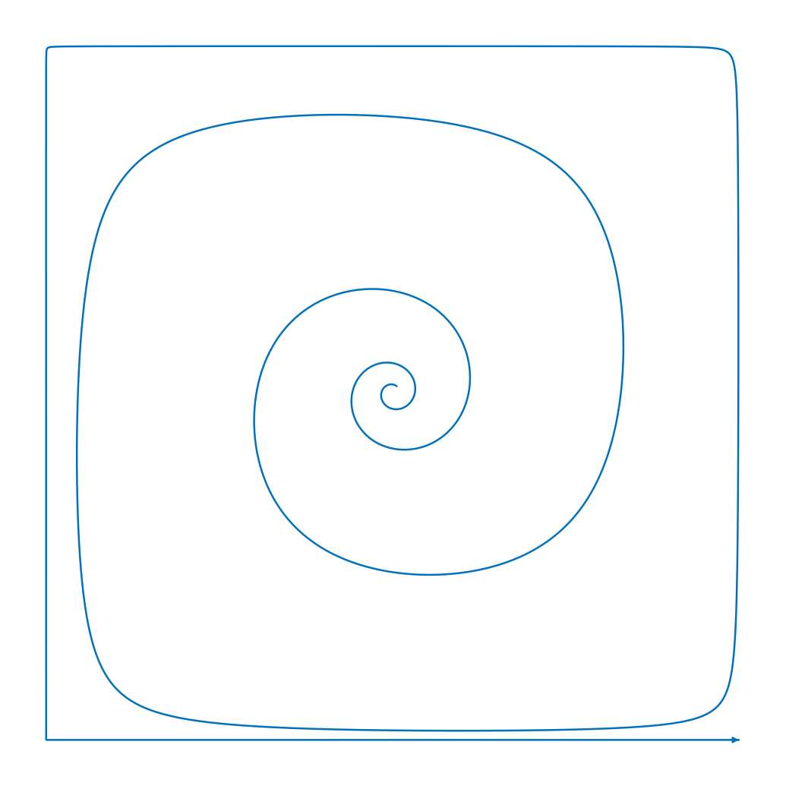
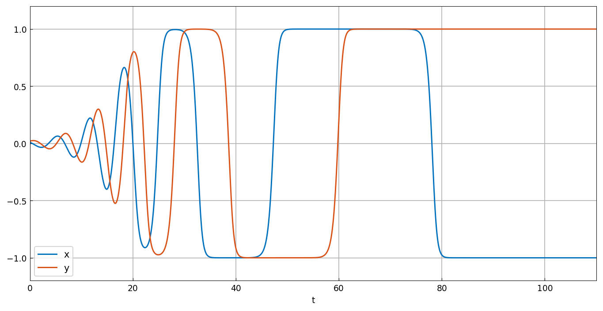
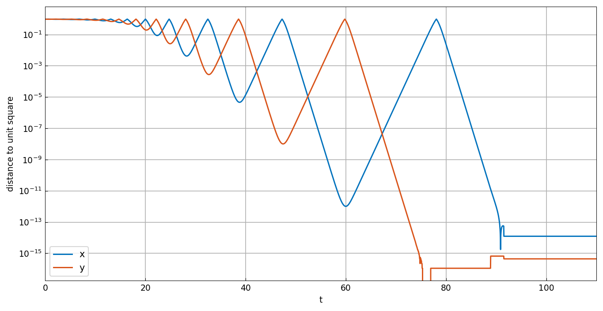

# A square limit cycle

*Nick Trefethen, May 2019*

[Original MATLAB Chebfun example](https://www.chebfun.org/examples/ode-nonlin/SquareCycle.html)

(Chebfun example ode-nonlin/SquareCycle.m)

Tomas Johnson and Warwick Tucker have studied the following challenging
example of a two-variable ODE system whose solutions approach a square
limit cycle containing four saddle points [1]. (More properly this
should be called a *heteroclinic cycle* or a *graphic*.) The system is

$$ x' = (\delta x + y)(x^2 - 1), \qquad y' = (\delta y - x)(y^2 - 1), $$

where $\delta$ is a parameter. Here is a solution with $\delta = -0.2$
plotted in the phase plane. We compute up to $t = 110$ but plot just up
to $t = 50$ to make the curve most attractive:

```python
N = Chebop(lambda t, x, y: [x.diff() + (.2*x - y)*(x**2 - 1),
                            y.diff() + (.2*y + x)*(y**2 - 1)],
           domain=(0, 110))
N.lbc = [.01, .02]
x, y = N.solve(0)
arrowplot(x.restrict(0, 50), y.restrict(0, 50), ax=ax)
```



Here is a plot of the components $x(t)$ and $y(t)$ up to $t = 110$. Note
how the times spent near the saddles get longer as the trajectory comes
closer to them.



Let us examine more closely how close these curves come to $\pm 1$. Here
is a semilogy plot of the quantities $1 - |x|$ and $1 - |y|$:



Down to $10^{-11}$, everything looks clean, but at that point we see
computational trouble. This is the level of Chebfun's tolerances for the
ODE solver. In fact, if we compute further to $t = 150$, one of the
variables erroneously becomes bigger than $1$, whereupon it rapidly
diverges.

Beyond here, one would need higher-precision arithmetic or the more
careful methods developed by Tucker. One might also explore a change of
variables such as $u = \tanh^{-1} x$ and $v = \tanh^{-1} y$.

## Agreement with MATLAB, and where it stops

The transit times are where this solution can be compared sharply, and
they were checked against MATLAB Chebfun run under R2025b rather than
against the published picture. Every zero crossing of $x$ agrees:

| # | chebfunjax | MATLAB | diff |
|---|---|---|---|
| 1 | 0.463686 | 0.463686 | 4.2e-07 |
| 5 | 13.087436 | 13.087400 | 3.6e-05 |
| 9 | 32.465951 | 32.466000 | 4.9e-05 |
| 10 | 47.275380 | 47.275400 | 2.0e-05 |
| 11 | 78.061851 | 78.061600 | 2.5e-04 |

All eleven agree to $2.5\times 10^{-4}$ or better, and the early ones to
the six significant figures MATLAB prints. The first ten crossings of
$y$ agree likewise, to $4.1\times 10^{-5}$.

The eleventh crossing of $y$ is where the two part company: MATLAB has
one at $t = 98.5909$ and we have none. The reason is visible in figure 3.
The lines $x = \pm 1$ and $y = \pm 1$ are *invariant* — $x'$ carries a
factor $x^2 - 1$ — so a coordinate that reaches $\pm 1$ exactly can never
leave. MATLAB's marched solution levels off near $10^{-11}$, its
`ivpAbsTol`, retaining enough deviation to be pushed off the corner for
one more transit; ours falls to $10^{-14}$, close enough to the invariant
line that the departure never grows. Both are past the point the text
above flags as unreliable — by $t = 110$ MATLAB's $|x|$ has itself
overshot $1$ by $1.4\times 10^{-5}$, the erroneous divergence it warns of.

Neither trajectory is the true one, which keeps cycling forever with
ever-longer transits. Selecting a different integrator does not fix this
so much as relabel it: `ivp_method='ode45'` restores an eleventh $y$
crossing, but places it at $t = 104.77$ rather than $98.59$. Past
$t \approx 85$ the answer is set by rounding noise rather than by the
ODE, so the replica keeps the library's default solver and reports the
difference instead of tuning it away.

## References

1. T. Johnson and W. Tucker, Automated computation of robust normal
   forms of planar analytic vector fields, arXiv:0810.5282, 2008.
2. L. N. Trefethen, A. Birkisson, and T. A. Driscoll, *Exploring ODEs*,
   SIAM, 2018, freely available at
   <https://people.maths.ox.ac.uk/trefethen/ExplODE/>.
3. M. W. Hirsch, S. Smale, and R. L. Devaney, *Differential Equations,
   Dynamical Systems, and an Introduction to Chaos*, 3rd ed., Elsevier,
   2013.
4. L. N. Trefethen, A nonlinear system of Guckenheimer and Holmes,
   <https://www.chebfun.org/examples/ode-nonlin/GuckenheimerHolmes.html>,
   February 2015.

---

*Replica script: [`examples/ode-nonlin/square_cycle_replica.py`](https://github.com/ma-gilles/chebfunjax/blob/main/examples/ode-nonlin/square_cycle_replica.py).
Original example copyright by The University of Oxford and The Chebfun
Developers.*
