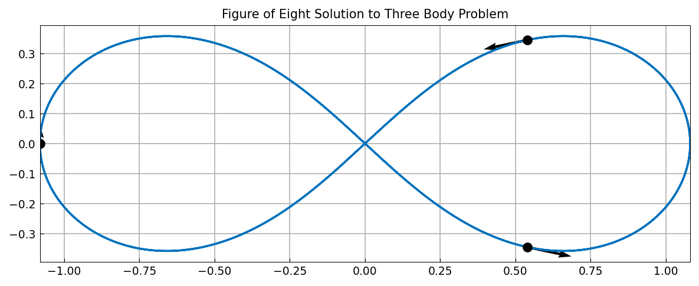
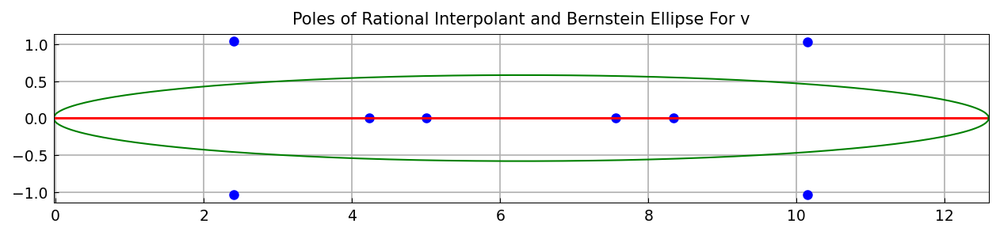
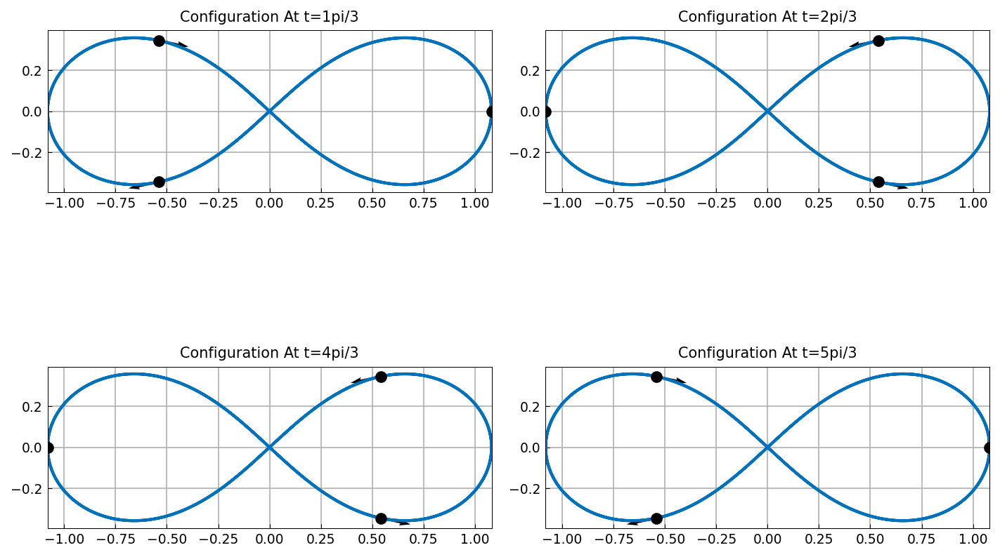
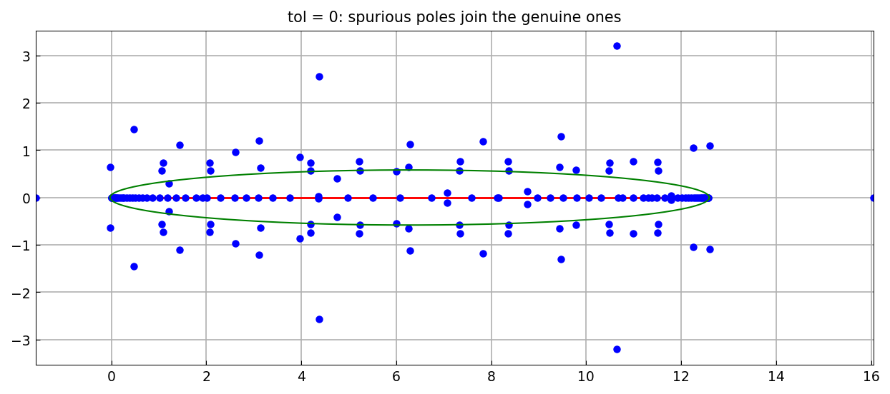

# The three-body problem

[Original MATLAB Chebfun example](https://www.chebfun.org/examples/ode-nonlin/ThreeBodyProblem.html)

(Chebfun example ode-nonlin/ThreeBodyProblem.m)

The figure-of-eight choreography of Chenciner and Montgomery: three
equal masses chase each other around a single figure-eight curve.
Complex arithmetic makes the planar problem a six-component complex
system, integrated by `ode113` at tolerance $10^{-13}$ over two periods
$[0, 4\pi]$:



## Rational approximation and complex-time singularities

`ratinterp` computes a robust rational approximant to the third body's
trajectory $v(t)$ and, with it, the poles of its analytic continuation:

```python
rh, p, q, mu, nu, poles = ratinterp(v, 151, 150, None, None,
                                    1e-12, domain=(0, 4*np.pi))[:6]
```

```text
mu =
   151
nu =
     8
max|rh - v| =
     4.862210936522478e-10
```

MATLAB reports `mu = 151`, `nu = 8` and error `4.859387063525114e-10` —
the reduced rational **type matches exactly** and the approximation
error agrees to four significant digits.

```text
poles =
   2.408849 +1.034848i     real(poles)*3/pi = 2.3003
   4.234441 +0.000000i                        4.0436
   4.999971 +0.000000i                        4.7746
   7.563256 +0.000000i                        7.2224
   8.337070 +0.000000i                        7.9613
   10.148881 +1.032949i                       9.6915
```



Here the two computations part company in an instructive way. MATLAB's
pole real parts, in units of $\pi/3$, land on
`1.998 2.781 3.999 4.997 7.002 8.000 9.218 10.001` — near-integers
marking the close encounters at $t = c\pi/3$. Ours land elsewhere,
though both sets share the orbit's time-reversal symmetry (each list is
symmetric about $6$). Both approximants fit $v$ equally well — the
errors agree to four digits — but eight poles fitting to $5\times
10^{-10}$ are determined by the trajectory's components *below* that
level, where our DOP853-based `ode113` and MATLAB's Adams integrator
legitimately differ. The same phenomenon appears in
[LorenzAttractor](LorenzAttractor.md)'s `tol = 0` run, where only the
genuine poles are stable.

## Configurations along the orbit



## Robustness: tol = 0

Rerunning with `tol = 0` disables the SVD robustness step: the type
stays at the requested $(157, 156)$ and 156 poles appear, most of them
spurious:



> **Implementation note.** This page is what drove the completion of
> `ratinterp`'s complex-data chain, a sequence of four defects fixed
> across this campaign: the numerator branches realified their data; the
> pole extraction filtered out complex roots; the Z matrix was realified
> before the denominator SVD, forcing a real denominator whose poles
> came in spurious conjugate pairs; and finally the constant-numerator
> case went through `np.full_like`, which inherits the evaluation
> points' real dtype and silently dropped the imaginary part. Before
> these fixes this page's central computation returned error
> $3.6\times 10^{-1}$ and an empty pole list.

---

*Replica script: [`examples/ode-nonlin/three_body_problem_replica.py`](https://github.com/ma-gilles/chebfunjax/blob/main/examples/ode-nonlin/three_body_problem_replica.py).
Original example copyright by The University of Oxford and The Chebfun
Developers.*
