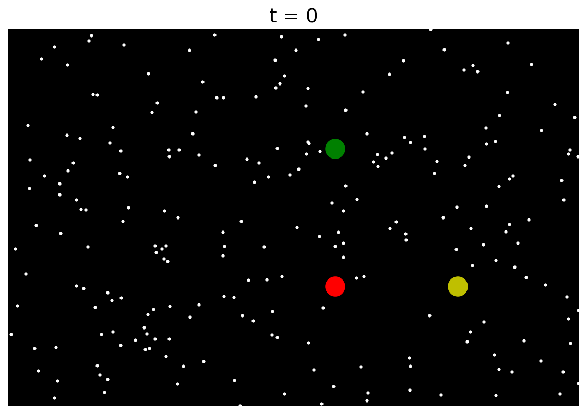
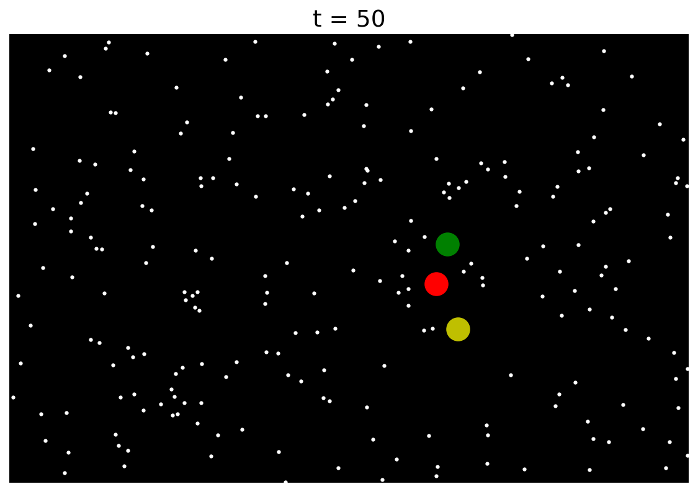
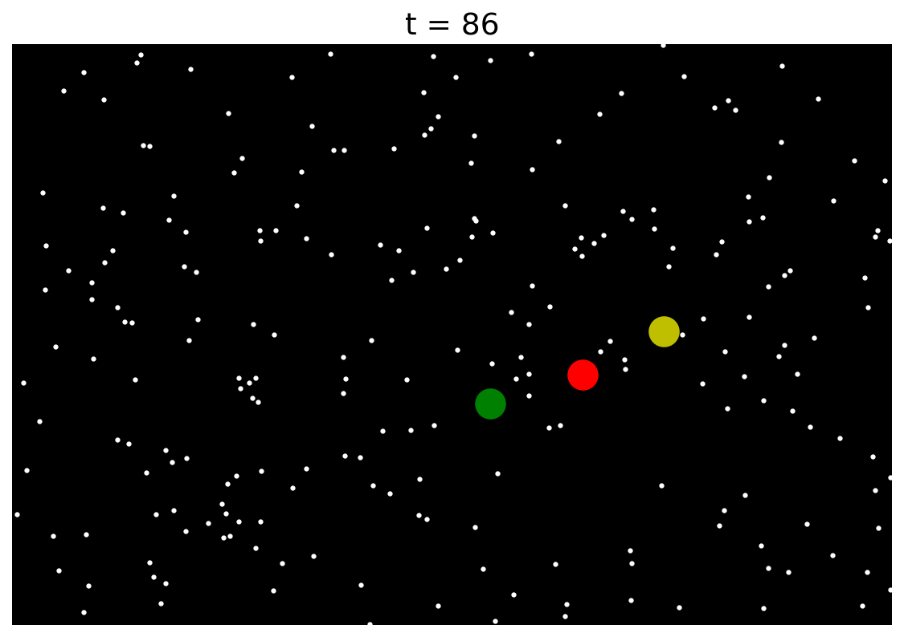
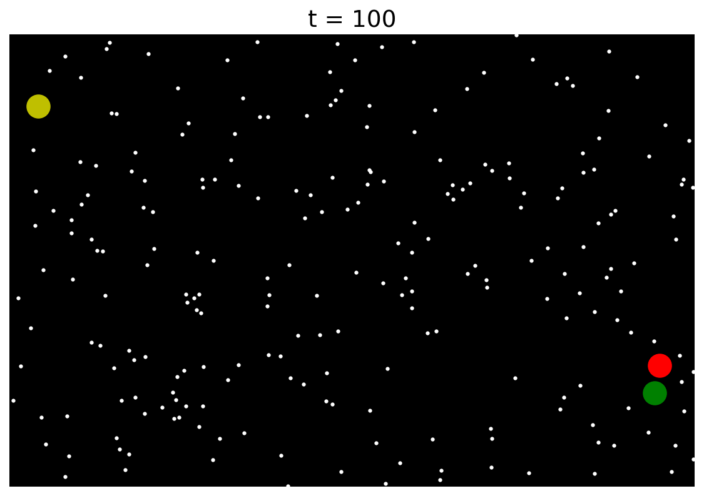

# Pythagorean planets

*Behnam Hashemi and Nick Trefethen, December 2014*

[Original MATLAB Chebfun example](https://www.chebfun.org/examples/ode-nonlin/ThreePlanets.html)

(Chebfun example ode-nonlin/ThreePlanets.m)

When three or more bodies interact gravitationally according to Newton's
laws, the resulting orbits can be wonderfully complicated. This example
explores a special case in which the initial configuration has the three
planets stationary at the positions of a 3-4-5 right triangle, attracting
each other with pairwise $1/r^2$ forces.

Complex arithmetic is used for brevity, so each body is a single complex
unknown. We solve over a time interval of length 100, and the solution
reveals a beautiful property: the orbit is chaotic for $t < t_c \approx
86$, but at $t = t_c$ the system *self-ionizes*. After this point one
planet goes off in one direction and the other two go off as a pair in
the opposite direction. Such a thing could never happen with just two
planets, but with three it is possible: energy and momentum are
conserved. Thus this dynamical system illustrates the phenomenon of
*transient chaos*.

Here is the initial condition:



Now we solve the problem to time $t = 100$:

```python
def planetfun(t, x, y, z):
    forceYX = (y - x)/abs(y - x)**3
    forceZX = (z - x)/abs(z - x)**3
    forceZY = (z - y)/abs(z - y)**3
    return [x.diff(2) - forceYX - forceZX,
            y.diff(2) + forceYX - forceZY,
            z.diff(2) + forceZX + forceZY]

N = Chebop(planetfun, domain=(0, 100))
N.lbc = lambda x, y, z: [x - x0, y - y0, z - z0,
                         x.diff(), y.diff(), z.diff()]
x, y, z = N.solve(0)
```

Here is a typical configuration for $t < t_c$:



Here is how it looks at the critical moment:



Of course, this problem really looks best as a movie. The final frame
shows the system after it has split into two subsystems, drifting apart
forever:



The self-ionization is unmistakable in the positions. Through $t = 86$
the three bodies stay within a couple of units of each other; by $t =
100$ the yellow planet has left towards the upper left while red and
green depart together towards the lower right, matching the published
final frame:

```text
t =   0:  x =  0.000000+0.000000j  y =  3.000000+0.000000j  z =  0.000000+4.000000j
t =  50:  x =  0.773937+1.383275j  y =  1.220696+0.261181j  z =  1.005367+2.355544j
t =  86:  x =  1.063295+1.245819j  y =  2.340751+2.054387j  z = -0.404045+0.699795j
t = 100:  x =  5.255711-0.545739j  y = -7.410319+5.759570j  z =  5.154608-1.213831j
```

Because the orbit is chaotic before $t_c$, individual positions cannot
agree with MATLAB's digit for digit over this interval — but the
conserved quantities can, and they are the sharp test here. The three
masses are equal and released from rest, so the centre of mass cannot
move and the total momentum must stay zero:

```text
centre of mass at t=0   : 1.000000000000+1.333333333333j
centre of mass at t=100: 1.000000000000+1.333333333333j
drift                   : 2.834e-13
```

> **Implementation note.** This example needed a solver path we did not
> have. MATLAB reduces a system that is not first order to first order
> with `treeVar.toFirstOrder` and marches it with `ode113`; our system
> marcher recovered the right-hand side by evaluating the operator on
> *constant* chebfuns, which makes every derivative vanish, so three
> coupled second-order equations fell through to collocation and ground
> to a halt — a fifth of this interval did not finish in 900 seconds.
> The state now carries each unknown's derivative tower, and stays
> complex end to end: the previous path cast through `float`, which
> would have discarded the imaginary part of every position. Writing
> the invariant tests then turned up a second gap — `diff` could not
> differentiate a piecewise complex chebfun at all.
>
> One difference from the published page: its output carries the warning
> `Function not resolved using 65537 pts`, because MATLAB represents each
> trajectory as a single global polynomial. We build each body on the
> solver's own time mesh instead, so the pieces stay low degree
> (lengths 3943, 3856, 3741) and no such warning arises. The published
> figures also show no stars; the code plots 250 of them, but they are
> lost in that page's downscaled renders.

## References

1. L. N. Trefethen, Ten digit algorithms, unpublished essay,
   <https://people.maths.ox.ac.uk/trefethen/tda.html>, 2005.

---

*Replica script: [`examples/ode-nonlin/three_planets_replica.py`](https://github.com/ma-gilles/chebfunjax/blob/main/examples/ode-nonlin/three_planets_replica.py).
Original example copyright by The University of Oxford and The Chebfun
Developers.*
