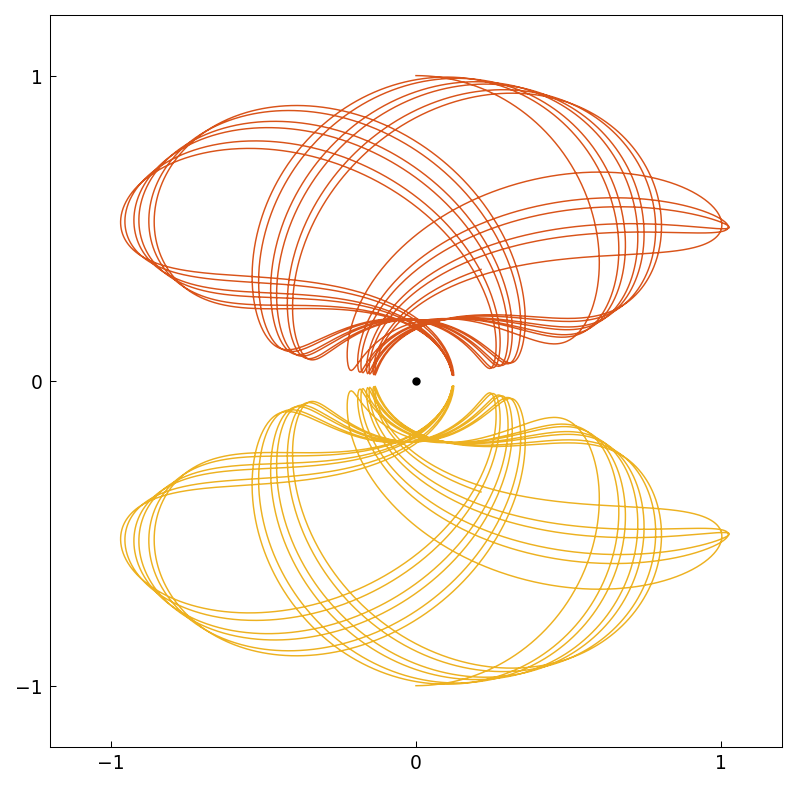
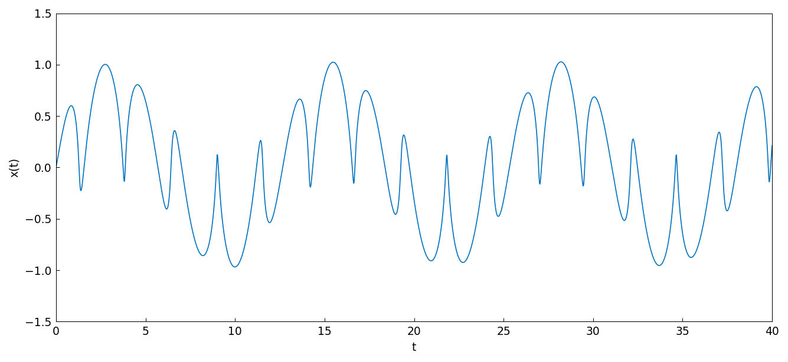
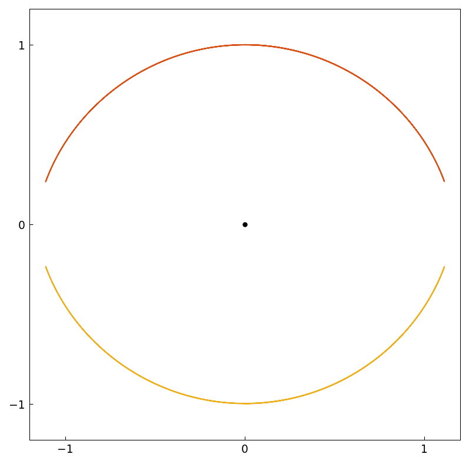
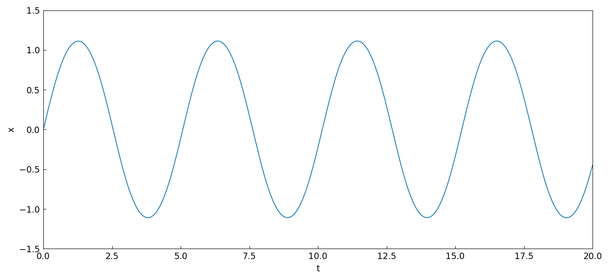
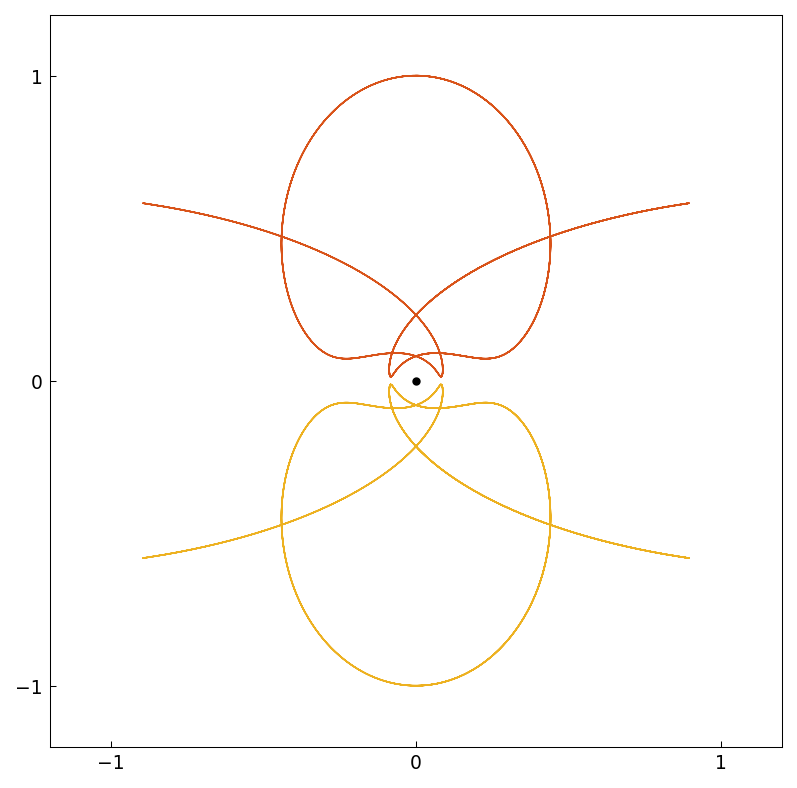
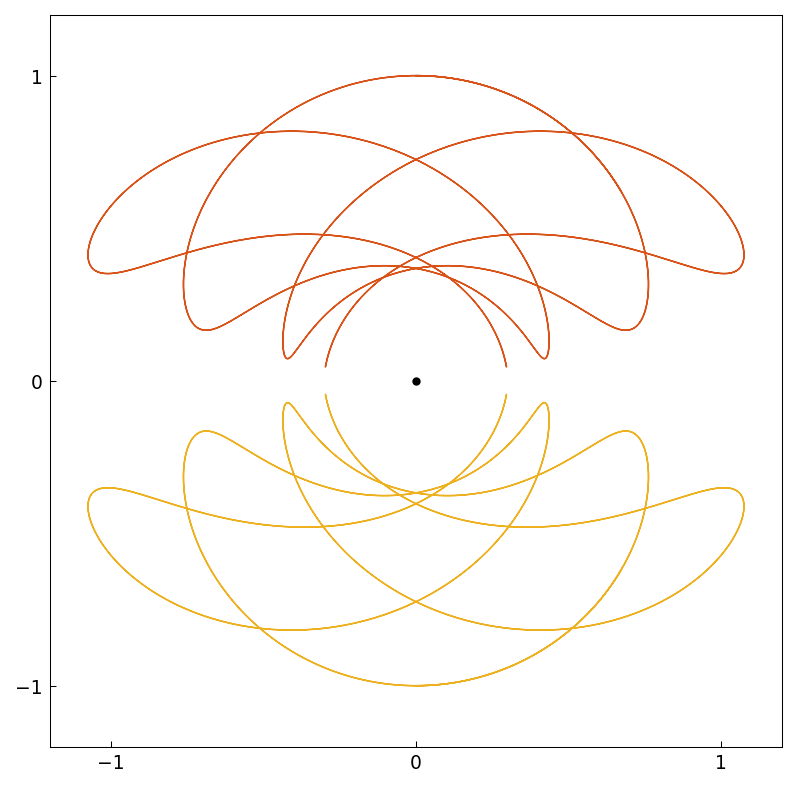
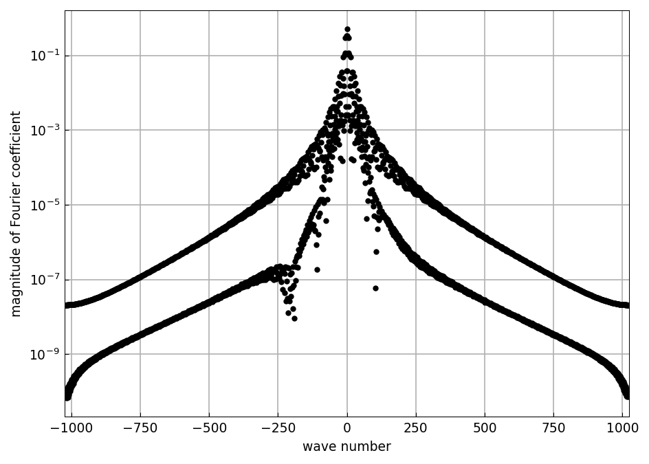
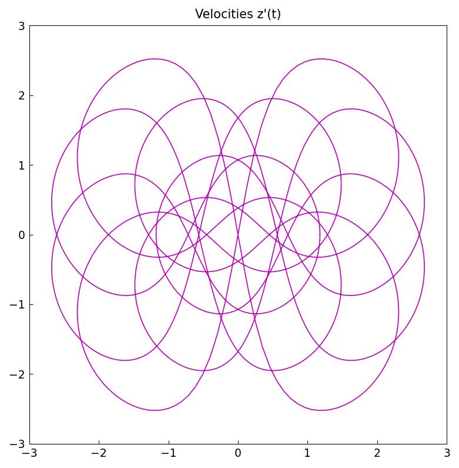
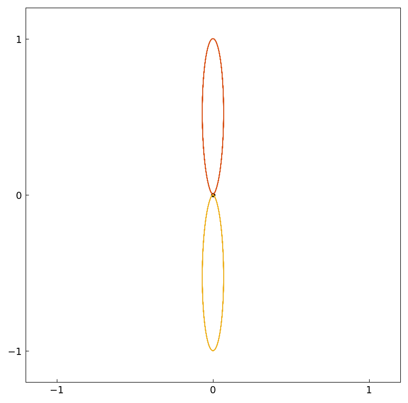
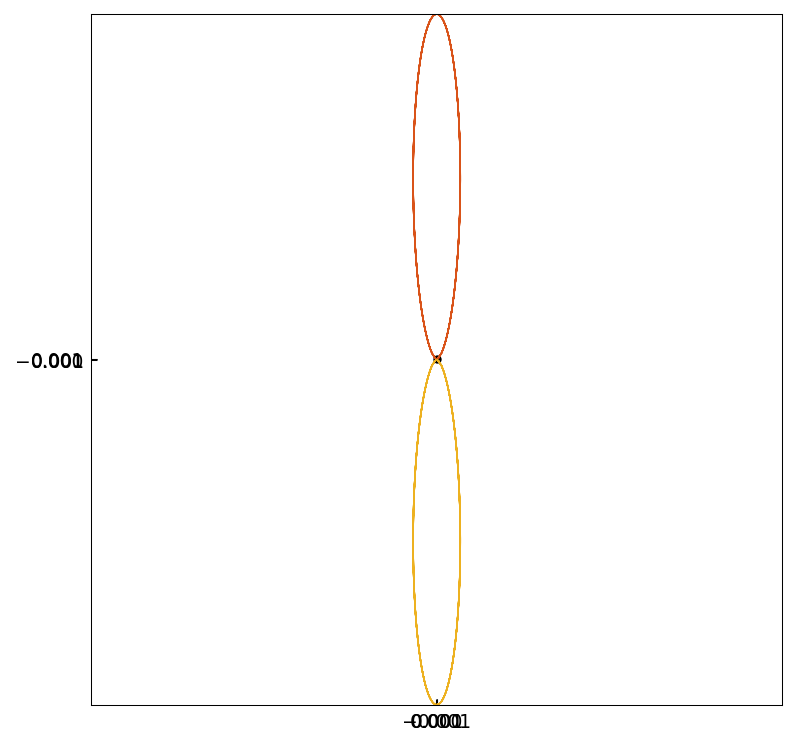

# Two electrons orbiting symmetrically about a nucleus

*Jeremy Fleury and Nick Trefethen, June 2016*

[Original MATLAB Chebfun example](https://www.chebfun.org/examples/ode-nonlin/TwoElectrons.html)

(Chebfun example ode-nonlin/Electrons.m)

## 1. Typical trajectories

Here is a variation on the familiar $n$-body problem suggested by
Charlie Peskin of New York University. Suppose $n$ electrons of charge
$-1$ are flying around a nucleus of infinite mass and charge $+n$. What
do the trajectories look like? For $n = 1$ it is trivial, just a
circular orbit. For $n \ge 2$ one sees all kinds of disordered and
chaotic trajectories. Here we consider a very special configuration
with $n = 2$, in which the two electrons are exactly symmetrical about
a line of reflection.

Complex arithmetic is used for convenience, with the nucleus at the
origin. Because of the symmetry only one particle needs to be tracked,
so we have a scalar complex nonlinear second-order IVP:

$$ z'' = \frac{-2z}{|z|^3} + \frac{z - \bar z}{|z - \bar z|^3},
   \qquad z(0) = i, \quad z'(0) = V > 0. $$

```python
N = Chebop(lambda t, z: z.diff(2) + 2*z/abs(z)**3
           - 0.25j*z.imag()/z.imag()**3, domain=(0, 40))
N.lbc = [1j, V]
z = N.solve(0)
```

Here is a typical trajectory over a time interval of length 40, with
$V = 1$ — the electron and its mirror image:



Though it is not periodic, this orbit has a great deal of regularity, as
we can see by plotting the $x$ component against $t$:



## 2. Periodic orbits

For certain values of $V$ the orbit closes up. With $V = 1.446$ the
trajectory is periodic, and the period can be read off from the spacing
of successive local minima of $x$:





```text
T =
  5.080062613545856
```

With $V = 0.783$ the orbit is periodic with a longer period, measured
here from where $x$ crosses $0.9\max(x)$ on the way up:



```text
T =
  8.458857959236209
```

With $V = 1.17745$ the orbit very nearly closes after five loops:



```text
T =
 19.316951130029594
ans =
  0.000259559520623+1.000001669452144j
```

The point $z(T)$ should be $i$ if the period were exact. One Newton step,
$T \leftarrow T - \mathrm{Re}\,z(T)/V$, sharpens it:

```text
T =
 19.316730687955090
ans =
  0.000000000551644+1.000001626932055j
```

The real part has dropped from $2.6\times 10^{-4}$ to $5.5\times
10^{-10}$.

One period, represented as a trig chebfun, has rapidly decaying Fourier
coefficients:



and here are the velocities $z'(t)$ around that period:



Finally, with $V = 0.13220442$ the electrons stay very close to the
nucleus, and the orbit is tiny — the second plot zooms in by a factor of
a thousand:





## Agreement with MATLAB

Every printed value reproduces:

| quantity | chebfunjax | MATLAB | difference |
|---|---|---|---|
| $T$, $V=1.446$ | 5.080062613545856 | 5.080062614623902 | 1.1e-09 |
| $T$, $V=0.783$ | 8.458857959236209 | 8.458858025795347 | 6.7e-08 |
| $T$, $V=1.17745$ | 19.316951130029594 | 19.316951164127765 | 3.4e-08 |
| $z(T)$ | 0.000259559520623+1.000001669452144i | 0.000259560053314+1.000001673080860i | 5.3e-10 |
| $T$ refined | 19.316730687955090 | 19.316730721600852 | 3.4e-08 |
| $z(T)$ refined | 0.000000000551644+1.000001626932055i | 0.000000000552367+1.000001630560596i | 7.2e-13 |

The refined $z(T)$ is the sharpest of these: a quantity that only exists
because the orbit nearly closes, agreeing at the $10^{-13}$ level.

> **Implementation note.** This example needed complex support in the
> scalar IVP marcher, which worked in `float64` and so could not
> represent $z$ at all. Scalar complex problems now reduce to first
> order and march through the same path as
> [ThreePlanets](ThreePlanets.md), with one wrinkle: for a single
> unknown a list boundary condition means *successive derivatives*
> (`N.lbc = [1i; V]` is $z(0)=i$, $z'(0)=V$), which is a different
> convention from the one-value-per-unknown form used for systems.
>
> Two differences from the original. Building the trig representation
> adaptively from the piecewise solution drives the jitted evaluator
> through hundreds of distinct array shapes until XLA aborts, so the
> replica samples onto an equispaced grid and constructs the Trigtech
> from values; and the coefficient plot therefore shows the full
> spectrum with its noise floor rather than a series truncated at
> `eps = 1e-6`.

---

*Replica script: [`examples/ode-nonlin/two_electrons_replica.py`](https://github.com/ma-gilles/chebfunjax/blob/main/examples/ode-nonlin/two_electrons_replica.py).
Original example copyright by The University of Oxford and The Chebfun
Developers.*
