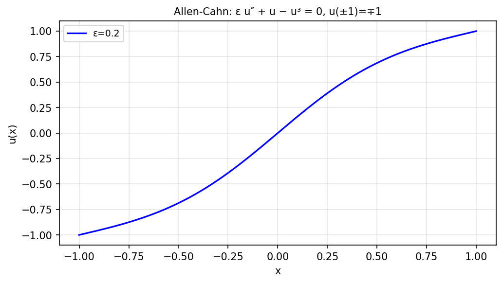

# An Allen-Cahn equation with continuation

*Nick Trefethen, November 2010*

[Chebfun example](https://www.chebfun.org/examples/ode-nonlin/AllenCahn.html)

## Overview

Solves the Allen-Cahn equation

$$\varepsilon u'' + u - u^3 = 0, \quad u(-1) = -1, \; u(1) = 1$$

by continuation in $\varepsilon$. As $\varepsilon \to 0$, the solution
develops an increasingly sharp transition layer connecting $u = -1$ to $u = 1$.

```python
from chebfunjax.operators.chebop import Chebop

dom = (-1.0, 1.0)
for eps in [0.3, 0.1, 0.05, 0.02]:
    N = Chebop(lambda x, u: eps * u.diff(2) + u - u**3, domain=dom)
    N.lbc = -1.0; N.rbc = 1.0
    u = N.solve(0.0)
```



