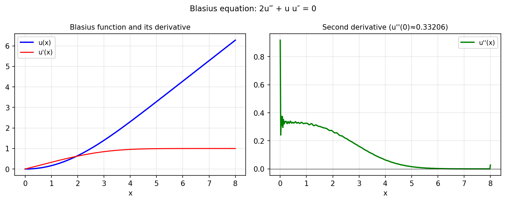

# Blasius function

*Hrothgar, June 2014*

[Chebfun example](https://www.chebfun.org/examples/ode-nonlin/blasius.html)

## Overview

Solves the Blasius boundary layer equation:

$$2f''' + f f'' = 0, \quad f(0) = 0, \; f'(0) = 0, \; f'(\infty) = 1$$

The Blasius constant is $f''(0) \approx 0.33206$. The solution is computed
on a truncated domain $[0, 8]$.

```python
from chebfunjax.operators.chebop import Chebop

dom = (0.0, 8.0)
N = Chebop(lambda x, f: 2.0 * f.diff(3) + f * f.diff(2), domain=dom)
N.lbc = [0.0, 0.0]   # f(0)=0, f'(0)=0
N.rbc = 1.0          # f'(8)=1
f = N.solve(0.0)
```



