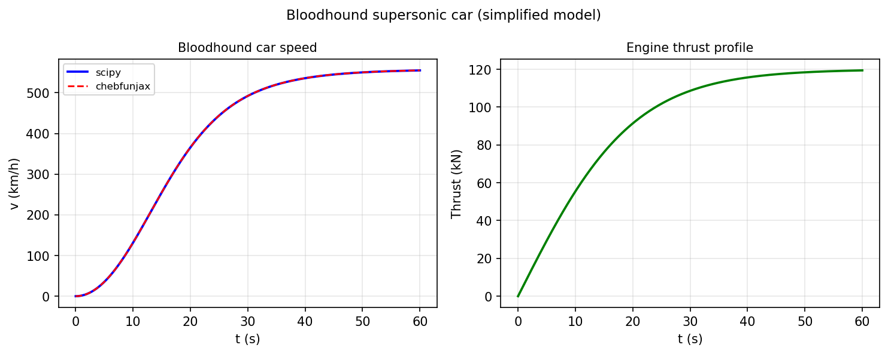

# Bloodhound supersonic car

*Tanya Morton, January 2013*

[Chebfun example](https://www.chebfun.org/examples/ode-nonlin/bloodhound.html)

## Overview

Models the acceleration of the Bloodhound SSC supersonic car:

$$m v v' = F(v) - b v^2$$

where $F(v)$ is thrust and $b v^2$ is aerodynamic drag.
The model predicts the time to reach supersonic speed.

```python
from scipy.integrate import solve_ivp

m = 6500.0  # kg
b = 0.05    # drag coefficient

def thrust(v):
    if v < 200: return 1.0e5 * (1 - v/200)
    return 8.0e4

def car_rhs(t, v_arr):
    v = v_arr[0]
    return [(thrust(v) - b*v**2) / (m * v) if v > 0.1 else 1.0]
```



