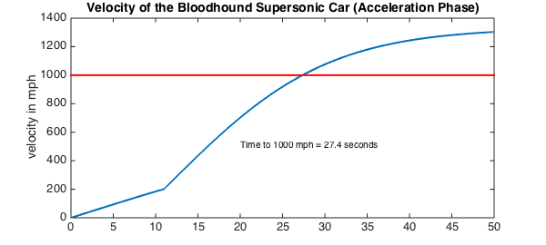
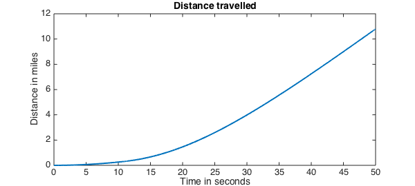

<!-- Generated by scripts/sync_chebfun_examples.py. -->
<!-- Source: https://www.chebfun.org/examples/ode-nonlin/Bloodhound.html -->

<h1>Bloodhound supersonic car</h1>
<h2>Tanya Morton, January 2013 in <a href='../'>ode-nonlin</a><a href='/examples/ode-nonlin/Bloodhound.m'>download</a>&middot;<a href='//github.com/chebfun/examples/blob/master/ode-nonlin/Bloodhound.m'>view on GitHub</a></h2>

This script solves the equation of motion for the acceleration phase of the Bloodhound supersonic car using Chebfun.

The car is powered by a jet engine and a rocket and aims to reach a speed in excess of 1000 mph. More details on the project can be found at the website <a href="http://www.bloodhoundssc.com/">http://www.bloodhoundssc.com/</a>.

Mathematically, the problem takes the form of an initial value ODE

$$ a(t)v' + b(t)v + cv^2 = d(t), \qquad t \in [0,50],~~ v(0) = 0 . $$

Here $a$ is a piecewise linear function and $b$ and $d$ are piecewise constants. The break occurs at the discontinuity caused by the rocket ignition.

One can vary the parameters of the run, such as the rocket start time or the mass of the car, to see the effect on the time taken to reach 1000 miles per hour.

Define the domain.

<pre class="mcode-input">dom = [0 50];
RocketStart = 11;      % in seconds</pre>

Compute the mass.

<pre class="mcode-input">MassOriginal = 6500;   % in kg
JetThrust = 80;        % in kN
RocketThrust = 115;    % in kN
JSFC = 0.0005*102;     % in kg/(kN*h) Jet Specific Fuel Consumption
RSFC = 102/220;        % Rocket Specific Fuel Consumption</pre>

The mass satisfies

$$ \mathrm{mass} = \mathrm{original}
                   - \mathrm{(jet~fuel~burned)}
                   - \mathrm{(rocket~fuel~burned)} $$

<pre class="mcode-input">mass = @(t) MassOriginal - (JSFC*JetThrust*t) - ...   % in kg, t in seconds
    (RSFC*RocketThrust.*(t-RocketStart).*(t&gt;RocketStart));</pre>

Create a chebfun for mass to capture the piecewise linear behaviour.

<pre class="mcode-input">cmass = chebfun(mass, dom, 'splitting', 'on');</pre>

Create chebfuns or anonymous functions for the forces.

<pre class="mcode-input">thrust = @(t) 1000*(JetThrust + RocketThrust.*(t&gt;RocketStart)); % in N</pre>

Create a chebfun for thrust to capture the piecewise constant behavior.

<pre class="mcode-input">cthrust = chebfun(thrust, dom, 'splitting', 'on');</pre>

Drag:

<pre class="mcode-input">aerodrag = @(v) (175./289).*v.^2; % in N
surfacedrag = (2/5)*cmass*9.81;   % in N</pre>

Create a chebop to represent the differential equation. Newton's 2nd law (variable mass):

$$ \frac{d(mv)}{dt} = \mathrm{thrust} - \mathrm{drag}, $$
$$ m \frac{dv}{dt} + \frac{dm}{dt} v = \mathrm{thrust} - \mathrm{drag}. $$

<pre class="mcode-input">N = chebop(@(t,v) cmass.*diff(v) + diff(cmass).*v - cthrust + ...
    aerodrag(v) + surfacedrag, dom);</pre>

Set up the right-hand side of the differential equation so that $ N(v) = \mathrm{rhs} $.

<pre class="mcode-input">rhs = 0;</pre>

Assign boundary conditions to the chebop.

<pre class="mcode-input">N.bc = @(t,v) v(0);</pre>

Define an initial solution.

<pre class="mcode-input">N.init = chebfun(@(t) t, dom);</pre>

Solve the problem using backslash.

<pre class="mcode-input">u = N\rhs;
u_mph = u/0.44704; % convert to mph for plotting</pre>

<pre class="mcode-output">Warning: Newton iteration failed.
Please try supplying a better initial guess via the .init field
of the chebop. 
</pre>

Find where the solution is equal to 1000 mph.

<pre class="mcode-input">t1000 = find(u == 447); % number of seconds when we hit 1000 mph</pre>

Plot the solution.

<pre class="mcode-input">figure
plot(u_mph,'LineWidth',2);
hold on
plot([0 50],[1000 1000],'r', 'LineWidth', 2); % 1000 mph line
hold on;
text(20, 500, ['Time to 1000 mph = ' num2str(t1000, 3) ' seconds']);
title('Velocity of the Bloodhound Supersonic Car (Acceleration Phase)')
ylabel('velocity in mph')</pre>

Integrate to find the distance.

<pre class="mcode-input">s = cumsum(u);
s_miles = s/1609;     % convert to miles to plot
figure
plot(s_miles,'LineWidth',2); title('Distance travelled')
xlabel('Time in seconds'),   ylabel('Distance in miles')</pre>

        

    

