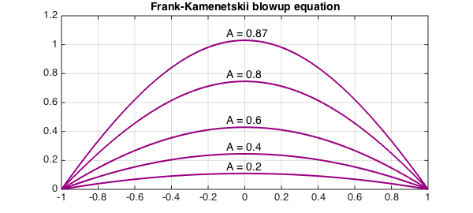

<!-- Generated by scripts/sync_chebfun_examples.py. -->
<!-- Source: https://www.chebfun.org/examples/ode-nonlin/BlowupFK.html -->

<h1>Blowup equation (Frank-Kamenetskii)</h1>
<h2>Nick Trefethen, September 2010 in <a href='../'>ode-nonlin</a><a href='/examples/ode-nonlin/BlowupFK.m'>download</a>&middot;<a href='//github.com/chebfun/examples/blob/master/ode-nonlin/BlowupFK.m'>view on GitHub</a></h2>

The Frank-Kamenetskii or "spontaneous combustion" equation is the PDE

$$ {\partial u\over \partial t} =
{\partial^2u\over \partial x^2} + A\exp(u). $$

On the interval $[-1,1]$ with zero initial and boundary conditions, solutions to this equation blow up to infinity in finite time if $A$ is bigger than about $0.878$.  For smaller $A$, solutions converge to a steady state.

Here we compute some of these steady-state solutions, which are solutions of the ODE boundary value problem

$$ u''+A\exp(u)=0,\qquad  u(-1)=u(1)=0. $$

<pre class="mcode-input">N = chebop([-1 1]);
N.bc = 'dirichlet';
FS = 'fontsize';
for A = [.2 .4 .6 .8 .87]
  N.op = @(u) diff(u,2) + A*exp(u);
  u = N\0;
  plot(u,'color',[.6 0 .5],'linewidth',2), grid on, hold on
  text(-.1,max(u)+.04,['A = ' num2str(A)],FS,14)
end
axis([-1 1 0 1.2])
title('Frank-Kamenetskii blowup equation',FS,14)</pre>

<h3 id="references">References</h3>
<ol>
<li>H. Fujita, On the nonlinear equations $\Delta u + \exp(u) = 0$ and $dv/dt    = \Delta v + \exp(v)$, <em>Bulletin of the American Mathematical Society</em>,    75 (1969), 132-135.</li>
</ol>

        

