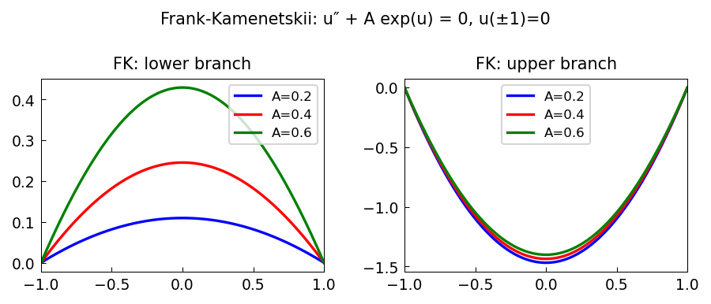

# Blowup equation (Frank-Kamenetskii)

*Nick Trefethen, September 2010*

[Chebfun example](https://www.chebfun.org/examples/ode-nonlin/BlowupFK.html)

## Overview

Solves the Frank-Kamenetskii equation from combustion theory:

$$u'' + A e^u = 0, \quad u(-1) = u(1) = 0$$

For $A < A_c \approx 0.8785$, two solutions exist (a lower and an upper
branch). At $A = A_c$, the solutions merge; for $A > A_c$ there is no solution.

```python
from chebfunjax.operators.chebop import Chebop

dom = (-1.0, 1.0)
for A in [0.3, 0.6, 0.8]:
    N = Chebop(lambda x, u: u.diff(2) + A * jnp.exp(u), domain=dom)
    N.lbc = 0.0; N.rbc = 0.0
    u_lower = N.solve(0.0)  # u0=0 converges to lower branch
```



