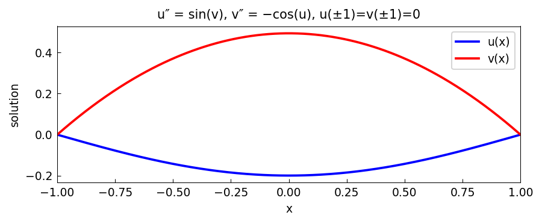

# System of two nonlinear BVPs

*Asgeir Birkisson and Toby Driscoll, September 2010*

[Chebfun example](https://www.chebfun.org/examples/ode-nonlin/BVPSystem.html)

## Overview

Solves the coupled nonlinear system:

$$u'' = \sin(v), \quad v'' = -\cos(u), \quad x \in [-1, 1]$$

with $u(-1) = u(1) = 0$, $v(-1) = -1$, $v(1) = 1$.
Solved by Picard-type iteration between the two equations.

```python
from chebfunjax.operators.chebop import Chebop

dom = (-1.0, 1.0)
v_old = cj.chebfun(lambda x: x, domain=dom)
for _ in range(30):
    Nu = Chebop(lambda x, u: u.diff(2), domain=dom)
    Nu.lbc = 0.0; Nu.rbc = 0.0
    u = Nu.solve(jnp.sin(v_old(x)))
    Nv = Chebop(lambda x, v: v.diff(2), domain=dom)
    v = Nv.solve(-jnp.cos(u(x)))
```



