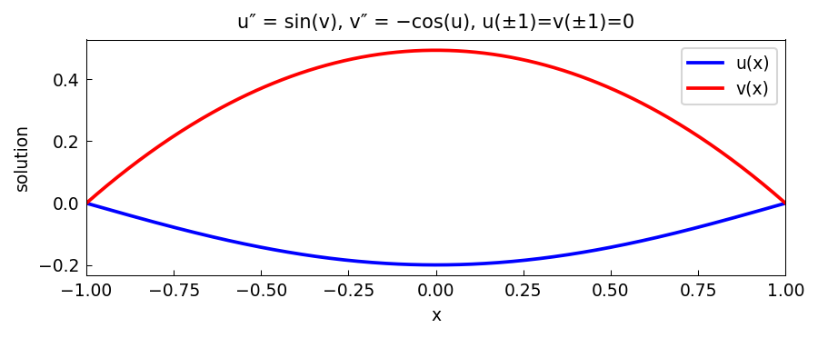
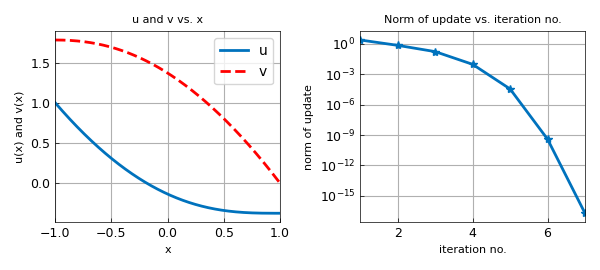
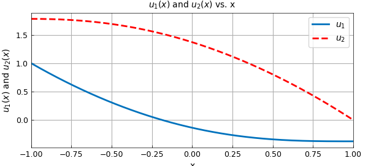

# System of two nonlinear BVPs

*Asgeir Birkisson and Toby Driscoll, September 2010*

[Chebfun example](https://www.chebfun.org/examples/ode-nonlin/BVPSystem.html)

## Overview

Solves the coupled nonlinear system:

$$u'' = \sin(v), \quad v'' = -\cos(u), \quad x \in [-1, 1]$$

with $u(-1) = u(1) = 0$, $v(-1) = -1$, $v(1) = 1$.
Solved by Picard-type iteration between the two equations.

```python
import numpy as np

def diffmat(x):
    N = len(x)
    c = np.ones(N); c[0] = c[-1] = 2.0
    c *= (-1.0)**np.arange(N)
    X = x[:, None] - x[None, :]
    D = (c[:, None]/c[None, :]) / (X + np.eye(N))
    return D - np.diag(D.sum(axis=1))

# coupled nonlinear BVP u'' = v u, v'' = u^2 - 1 by Newton
n = 200
base = np.cos(np.pi * np.arange(n) / (n - 1))[::-1]
xs = (base + 1) / 2
D2 = (diffmat(base) * 2.0) @ (diffmat(base) * 2.0)
u, v = 1 - xs, xs.copy()
for _ in range(40):
    F = np.concatenate([D2 @ u - v*u, D2 @ v - u**2 + 1])
    J = np.block([[D2 - np.diag(v), -np.diag(u)],
                  [-np.diag(2*u), D2]])
    for pos, idx in ((0, 0), (n-1, n-1), (n, n), (2*n-1, 2*n-1)):
        J[pos] = 0.0; J[pos, idx] = 1.0
    F[0], F[n-1] = u[0] - 1, u[-1]
    F[n], F[2*n-1] = v[0], v[-1] - 1
    duv = np.linalg.solve(J, -F)
    u, v = u + duv[:n], v + duv[n:]
    if np.max(np.abs(duv)) < 1e-12:
        break
print(f"u(1/2) = {np.interp(0.5, xs, u):.6f}, "
      f"v(1/2) = {np.interp(0.5, xs, v):.6f}")
```




## Figures (chebfun.org parity)




