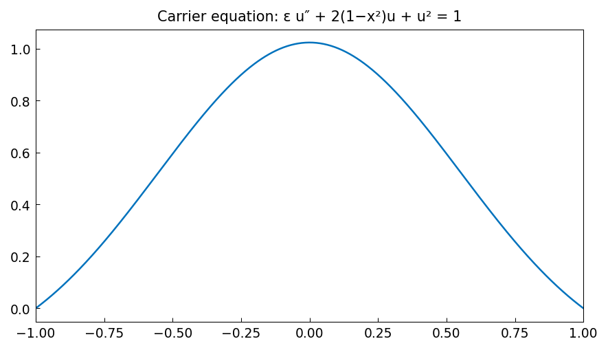

# Carrier equation

*Asgeir Birkisson, October 2010*

[Chebfun example](https://www.chebfun.org/examples/ode-nonlin/carrierequation.html)

## Overview

Solves Carrier's equation, a nonlinear BVP with multiple solutions:

$$\varepsilon u'' + 2(1 - x^2)u + u^2 = 1, \quad u(-1) = u(1) = 0$$

Different initial guesses lead to different solutions with varying numbers
of interior oscillations.

```python
from chebfunjax.operators.chebop import Chebop

dom = (-1.0, 1.0)
eps = 0.01
N = Chebop(
    lambda x, u: eps * u.diff(2) + 2.0*(1.0 - x**2)*u + u**2,
    domain=dom)
N.lbc = 0.0; N.rbc = 0.0
u = N.solve(1.0)
```



