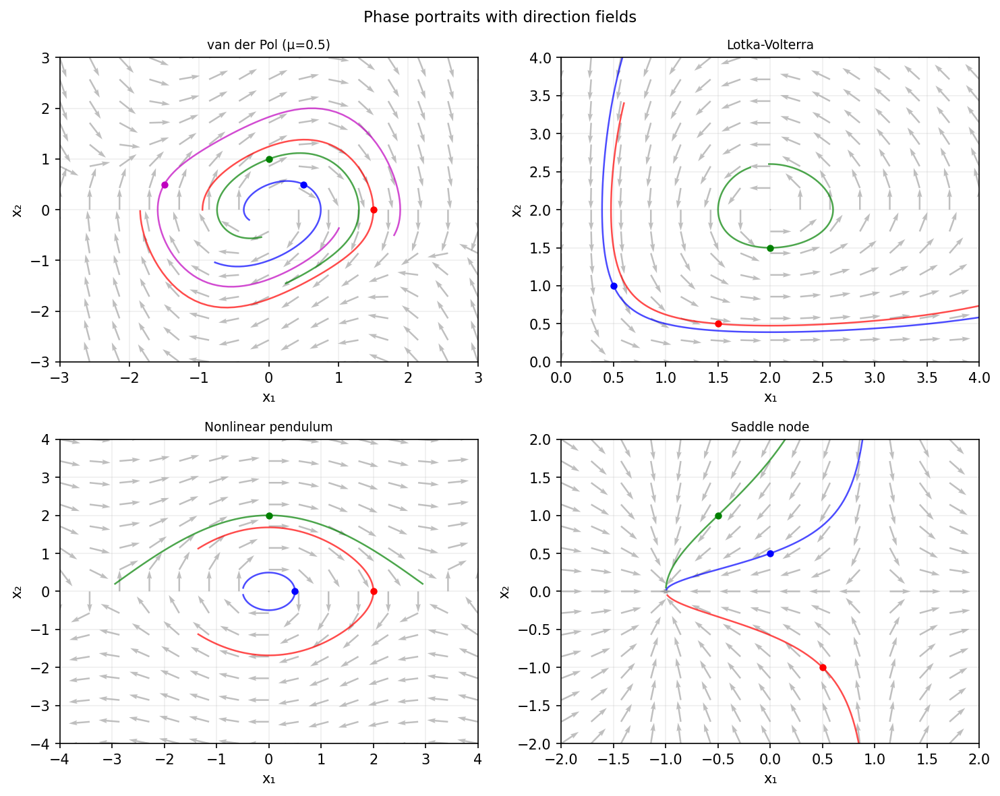

# Phase portraits with chebop/quiver

*Asgeir Birkisson, November 2015*

[Chebfun example](https://www.chebfun.org/examples/ode-nonlin/chebopquiver.html)

## Overview

Draws phase portraits for four classic nonlinear ODE systems:
van der Pol oscillator, Lotka-Volterra predator-prey, pendulum, and
a saddle-node bifurcation. Trajectories are computed via scipy and
displayed alongside vector field quiver plots.

```python
from scipy.integrate import solve_ivp

# Van der Pol: x' = y, y' = mu*(1-x^2)*y - x
def van_der_pol(t, xy, mu=1.0):
    x, y = xy
    return [y, mu*(1-x**2)*y - x]

sol = solve_ivp(van_der_pol, [0, 20], [2, 0], rtol=1e-8)
```



