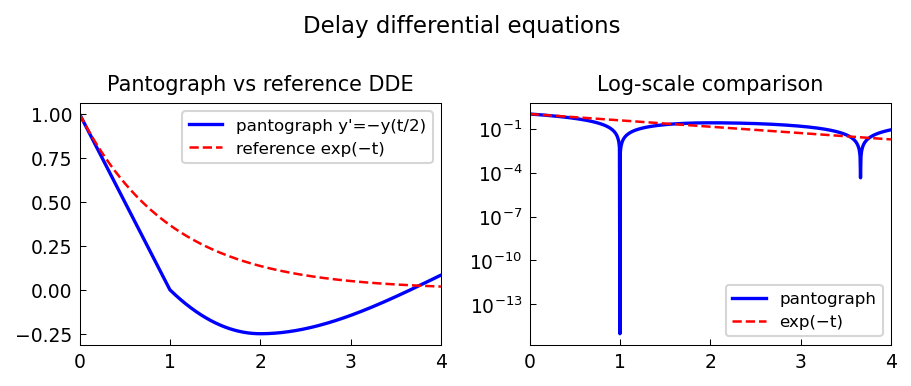

# Delay differential equations in Chebfun

*Nick Hale, June 2022*

[Chebfun example](https://www.chebfun.org/examples/ode-nonlin/DelayDifferentialEquations.html)

## Overview

Solves delay differential equations (DDEs) including the pantograph equation

$$y'(t) = -y(t/2), \quad y(0) = 1$$

whose exact solution is $y(t) = \sum_{k} c_k t^{\alpha_k}$.
Implemented via forward Euler stepping with interpolation for the delayed term.

```python
import numpy as np

dt = 1e-4
T = 4.0
t_arr = np.arange(0, T + dt, dt)
y_arr = np.ones(len(t_arr))
for i in range(1, len(t_arr)):
    t_delay = t_arr[i-1] / 2.0
    y_delay = np.interp(t_delay, t_arr[:i], y_arr[:i])
    y_arr[i] = y_arr[i-1] - dt * y_delay
```



