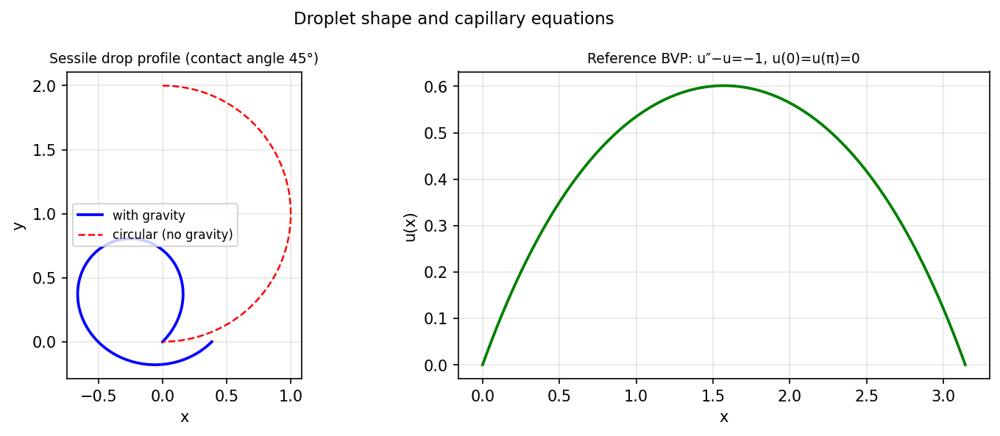

# A droplet sitting on a surface

*Ray Treinen and Nick Trefethen, October 2022*

[Chebfun example](https://www.chebfun.org/examples/ode-nonlin/droplets.html)

## Overview

Models a sessile droplet on a flat surface via the capillary equation.
The droplet shape satisfies:

$$\kappa = \frac{y''}{(1 + y'^2)^{3/2}} = \frac{y - P}{\text{Bo}^{-1}}$$

where $\kappa$ is the mean curvature, $P$ is the pressure, and Bo is the Bond number.

```python
from scipy.integrate import solve_ivp

# Parametric form: (x(s), y(s)) arc-length parametrized
def capillary_rhs(s, state, Bo=1.0, P=0.3):
    x, y, psi = state
    kappa = Bo * y - P
    return [np.cos(psi), np.sin(psi), kappa]
```



