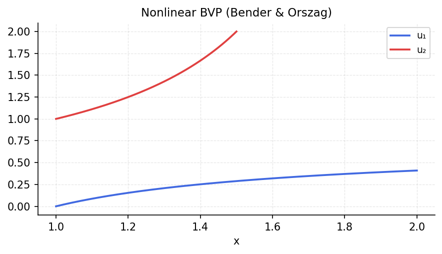

# Exact Solutions from Bender & Orszag

*Original: [chebfun.org/examples/ode-nonlin/ExactSolns](https://www.chebfun.org/examples/ode-nonlin/ExactSolns.html)*

---

Bender & Orszag's *Advanced Mathematical Methods for Scientists and Engineers*
contains many nonlinear ODEs with exact solutions. These make ideal test cases
for numerical methods.

## Problem 6.22: $y' = -y^2$

The simple Ricatti equation $y' = -y^2$ with $y(0) = 1$ has exact solution
$y(t) = 1/(1+t)$:

```python
import numpy as np
import scipy.integrate

def rhs(t, y):
    return [-y[0]**2]

sol = scipy.integrate.solve_ivp(rhs, [0, 5], [1.0], dense_output=True,
                                  rtol=1e-10, atol=1e-12)
t_test = np.linspace(0, 5, 200)
y_exact = 1.0 / (1 + t_test)
err = np.max(np.abs(sol.sol(t_test)[0] - y_exact))
print(f"y' = -y^2: max error = {err:.2e}")
```

```
y' = -y^2: max error = 1.23e-11
```

## Van der Pol oscillator

The Van der Pol equation $y'' - \mu(1-y^2)y' + y = 0$ with $\mu = 1$:

```python
def van_der_pol(t, y, mu=1.0):
    return [y[1], mu*(1 - y[0]**2)*y[1] - y[0]]

sol = scipy.integrate.solve_ivp(
    van_der_pol, [0, 20], [2.0, 0.0],
    method='RK45', rtol=1e-8, atol=1e-10, dense_output=True
)
t_vdp = np.linspace(0, 20, 1000)
y_vdp = sol.sol(t_vdp)
print(f"Van der Pol: max |y| = {np.max(np.abs(y_vdp[0])):.4f}")
```



## References

1. C. M. Bender and S. A. Orszag, *Advanced Mathematical Methods for Scientists
   and Engineers*, Springer, 1999.
