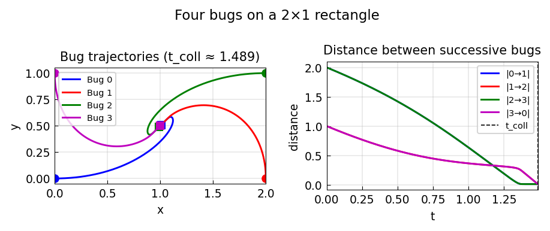

# Four bugs on a rectangle

*Hrothgar, November 2013*

[Chebfun example](https://github.com/chebfun/examples/blob/master/ode-nonlin/FourBugs.m)

## Overview

Four bugs start at the corners of a $2 \times 1$ rectangle. Each bug
always moves directly toward the next bug (clockwise). The pursuit curve
spirals toward the center.

```python
from scipy.integrate import solve_ivp

def four_bugs_rhs(t, state):
    positions = state.reshape(4, 2)
    vels = np.zeros_like(positions)
    for i in range(4):
        j = (i + 1) % 4
        diff = positions[j] - positions[i]
        vels[i] = diff / np.linalg.norm(diff)
    return vels.ravel()
```



