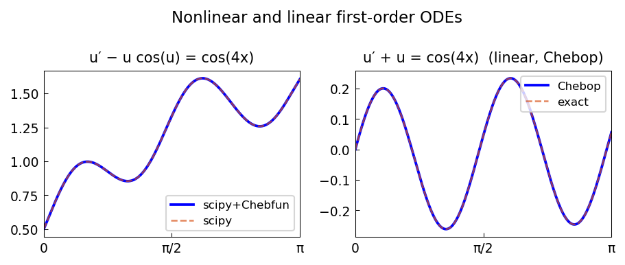

# Nonlinear periodic ODE

*Hadrien Montanelli, December 2014*

[Chebfun example](https://www.chebfun.org/examples/ode-nonlin/fouriernonlin.html)

## Overview

Solves the nonlinear periodic ODE

$$u' - u\cos(u) = \cos(4x), \quad u \text{ periodic on } [0, 2\pi]$$

using Fourier spectral collocation with `N.bc = "periodic"`.

```python
from chebfunjax.operators.chebop import Chebop

dom = (0.0, 2.0 * np.pi)
N = Chebop(
    lambda x, u: u.diff() - u * jnp.cos(u),
    domain=dom)
N.bc = "periodic"
u = N.solve(lambda x: jnp.cos(4*x))
```



