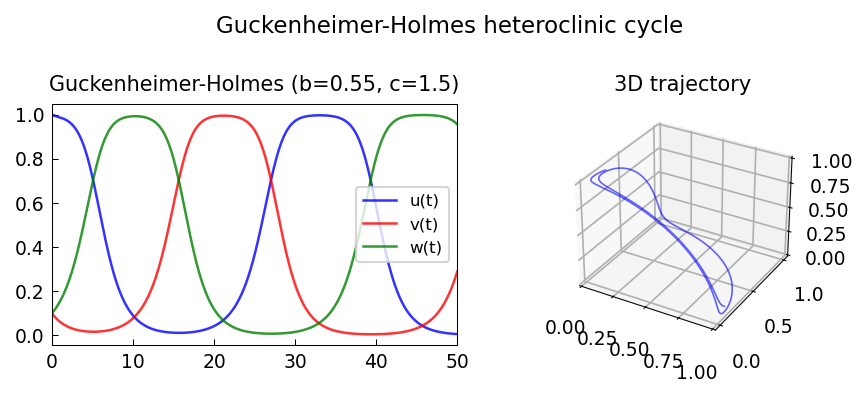

# A nonlinear system of Guckenheimer and Holmes

*Nick Trefethen, February 2015*

[Chebfun example](https://www.chebfun.org/examples/ode-nonlin/GuckenheimerHolmes.html)

## Overview

Studies a 3D nonlinear ODE system from Guckenheimer and Holmes that
exhibits a heteroclinic cycle connecting three saddle equilibria.
The system is numerically integrated to show the spiral structure.

```python
from scipy.integrate import solve_ivp

def gh_system(t, u, rho=0.1, alpha=0.5, beta=2.0):
    x, y, z = u
    return [
        x * (1 - x**2 - alpha*y**2 - beta*z**2),
        y * (1 - y**2 - alpha*z**2 - beta*x**2),
        z * (1 - z**2 - alpha*x**2 - beta*y**2),
    ]
```



