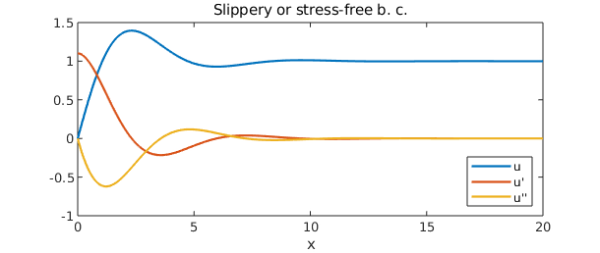
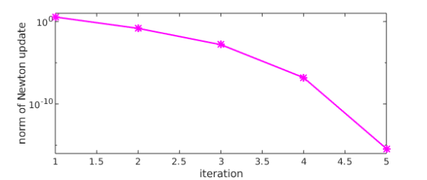
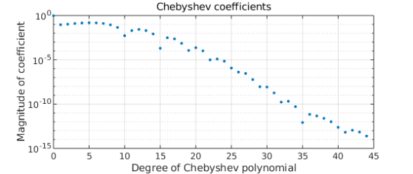

<!-- Generated by scripts/sync_chebfun_examples.py. -->
<!-- Source: https://www.chebfun.org/examples/ode-nonlin/GulfStream.html -->

<h1>A third-order nonlinear BVP on the half-line</h1>
<h2>C. I. Gheorghiu, January 2020 in <a href='../'>ode-nonlin</a><a href='/examples/ode-nonlin/GulfStream.m'>download</a>&middot;<a href='//github.com/chebfun/examples/blob/master/ode-nonlin/GulfStream.m'>view on GitHub</a></h2>

A one-layer model of the large-scale circulation in an ocean (the Gulf Stream) was proposed by Ierley and Ruehr in 1986 [1]: $$ u''' -\lambda((u')^2-uu'')-u+1=0, ~~u(0) =0, ~~x\in [0,\infty) $$ for some real $\lambda$. Boundary conditions are given as either $u(0)=u'(0)=0$ (rigid or no-slip) or $u(0)=u''(0)=0$ (slippery or stress-free). In both cases we require $u(\infty) = 1$.

In order to solve the problem in Chebfun we'll need to truncate the domain to something suitable, say $[0, X]$, i.e, to make use of the so-called domain truncation (see for instance our papers [3] and [4]).

An integral result for this problem is fairly useful. It reads $$ I = \int_{0}^{\infty }[(u'')^2 - 3\lambda uu'u'']dx=\frac{1}{2}, $$ and it is obtained multiplying the equation by $u'$, integrating by parts and enforcing the boundary conditions. This result is valid for both types of boundary conditions. Using this integral result we optimise the value of the length $X$ above, and find that the accuracy of the Chebfun result comes close to machine precision.

We can set up the chebop and solve the differential equation with only a few lines of code (see [2] for details).

<pre class="mcode-input">tic
X = 35;
dom = [0, X];
lambda = -0.1;
op  = @(u) diff(u,3) - lambda*( diff(u,1)^2 - u*diff(u,2) ) - u + 1;
lbc = @(u) [u; diff(u,2)];     % stress-free BC
rbc = 1;
N = chebop(op,dom,lbc,rbc);
[u,info] = N\0;</pre>

Here is what the solution looks like.

<pre class="mcode-input">plot([u diff(u) diff(u,2)])
axis([0 20 -1 1.5])
xlabel('x'), legend('u','u''','u''''','location','southeast')
title('Slippery or stress-free b. c.')</pre>

The residuals are small:

<pre class="mcode-input">N_residual = norm(N(u))                   % residual of diffl. eq.
lbcu = lbc(u);
lbc_residuals = [lbcu{1}(0) lbcu{2}(0)]   % residuals of left BC
rbc_residual = u(end) - rbc               % residual of right BC</pre>

<pre class="mcode-output">N_residual =
     4.580588942258870e-10
lbc_residuals =
   1.0e-09 *
   0.000033013148830   0.133907788023016
rbc_residual =
    -9.769962616701378e-15
</pre>

The Newton iteration has converged quadratically:

<pre class="mcode-input">semilogy(info.normDelta,'m*-')
ylim([1e-16 1e+01])
xlabel('iteration')
ylabel('norm of Newton update')
%</pre>

The Chebyshev coefficients of the solution decrease rapidly:

<pre class="mcode-input">plotcoeffs(u)</pre>

Finally, the integral $I$ comes out with a very small error:

<pre class="mcode-input">I = sum(diff(u,2)^2 - 3*lambda*(u*diff(u)*diff(u,2)))
I_error = abs(I-1/2)</pre>

<pre class="mcode-output">I =
   0.499999999999915
I_error =
     8.482103908136196e-14
</pre>

We solved the problem for several values of $X$ and found that the minimal error in $I$ occurs with $X\approx 35$.

<pre class="mcode-input">total_time_for_this_example = toc</pre>

<pre class="mcode-output">total_time_for_this_example =
   3.629420000000000
</pre>

<h3 id="references">References</h3>
<ol>
<li>

G. R. Ierley and O. G. Ruehr, Analytic and numerical solutions of a nonlinear boundary-layer problem, <em>Stud. Apl. Math.</em> 75:1-36 (1986).

</li>
<li>

L. N. Trefethen, A. Birkisson, and T. A. Driscoll, <em>Exploring ODEs</em>, SIAM, 2018.

</li>
<li>

C. I. Gheorghiu, Pseudospectral solutions to some singular nonlinear BVPs, <em>Numer. Algor.</em> 68 (2015), 1-14, DOI: 10.1007/s11075-014-9834-z.

</li>
<li>

C. I. Gheorghiu, Spectral collocation solutions to systems of boundary layer type, <em>Numer. Algor.</em> 73 (2016), 1-14, DOI:10.1007/s11075-015-0083-6

</li>
</ol>

        

    

