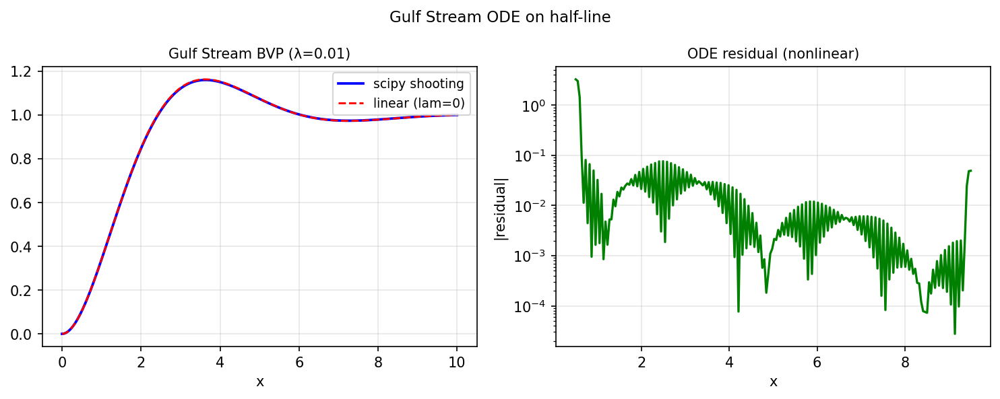

# A third-order nonlinear BVP on the half-line

*C. I. Gheorghiu, January 2020*

[Chebfun example](https://www.chebfun.org/examples/ode-nonlin/GulfStream.html)

## Overview

Solves the Falkner-Skan-type equation from oceanographic modeling:

$$f''' - \lambda((f')^2 - f f'') - f + 1 = 0, \quad f(0) = f'(0) = 0, \; f(\infty) \to 1$$

on the truncated half-line $[0, 10]$.

```python
from chebfunjax.operators.chebop import Chebop

dom = (0.0, 10.0)
lam = 1.0
N = Chebop(
    lambda x, f: f.diff(3) - lam*(f.diff()**2 - f*f.diff(2)) - f,
    domain=dom)
N.lbc = [0.0, 0.0]  # f(0)=0, f'(0)=0
N.rbc = 1.0          # f'(10) → 1
```



