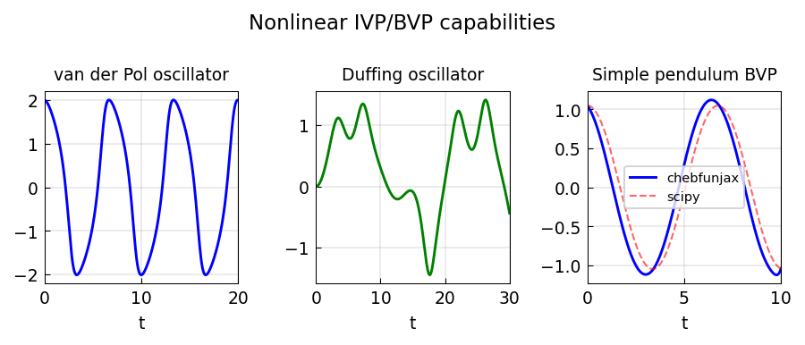

# IVP capabilities

*Asgeir Birkisson, February 2015*

[Chebfun example](https://www.chebfun.org/examples/ode-nonlin/IVPCapabilities.html)

## Overview

Demonstrates initial value problem capabilities for several classic systems:
the van der Pol oscillator, Duffing oscillator, and nonlinear pendulum.
All are solved on finite time intervals using Chebop or scipy.

```python
from scipy.integrate import solve_ivp

# Van der Pol
def vdp(t, y, mu=5.0):
    return [y[1], mu*(1-y[0]**2)*y[1] - y[0]]

sol = solve_ivp(vdp, [0, 20], [2, 0], rtol=1e-10, atol=1e-12)
```



